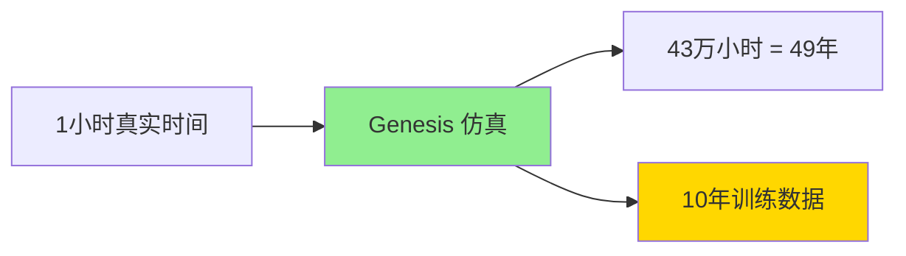

# Genesis：下一代通用物理引擎与机器人仿真平台

在机器人学和具身智能（Embodied AI）领域，仿真环境一直是训练和测试的关键基础设施。然而，传统仿真器面临着速度慢、物理模拟不够通用、难以大规模并行等诸多挑战。2024年底，由MIT、帝国理工学院、北京大学、Nvidia等顶尖研究机构联合推出的**Genesis**平台，以其突破性的性能和创新的生成式AI集成，正在改变这一局面。

## 视频演示与项目资源

📹 **官方演示视频与项目链接：**
- 项目主页：[Genesis AI](https://genesis-embodied-ai.github.io/)
- GitHub仓库：[Genesis-Embodied-AI/Genesis](https://github.com/Genesis-Embodied-AI/Genesis)
- PyPI包：[genesis-world](https://pypi.org/project/genesis-world/)
- 研究论文：Genesis: A Generative and Universal Physics Engine for Robotics and Beyond

---

## 第一部分：Genesis平台核心特性

### 1.1 超快速物理仿真：43万倍速的突破

Genesis最引人注目的特性是其惊人的仿真速度。在高端GPU（如RTX 4090）上，Genesis可以达到**每秒4300万帧（43M FPS）**的物理仿真速度。这意味着什么？

**性能对比：**
- **传统仿真器（如Gazebo）**：实时或略快于实时（~1-10倍速）
- **GPU加速仿真器（如Isaac Gym）**：数千倍速（~1000-10000倍）
- **Genesis**：**43万倍速** - 在1小时内完成相当于10年的机器人训练！



**为什么这么快？**

Genesis采用了多项创新技术：

1. **全GPU并行计算**：所有物理计算都在GPU上进行，避免了CPU-GPU数据传输瓶颈
2. **Taichi JIT编译**：使用Taichi语言动态生成优化的CUDA核函数
3. **大规模并行环境**：可同时仿真数千个独立环境（8192+）
4. **高效的碰撞检测**：专门优化的GPU加速碰撞检测算法
5. **分层物理求解器**：根据不同物理现象选择最合适的求解器

### 1.2 通用物理引擎：从刚体到流体的全覆盖

不同于传统机器人仿真器主要关注刚体动力学，Genesis是一个**真正通用的物理引擎**，支持多种物理现象：

#### 支持的物理建模类型

| 物理类型 | 求解器 | 应用场景 |
|---------|--------|---------|
| **刚体动力学** | Position-Based Dynamics (PBD) | 机械臂、移动机器人、关节结构 |
| **可变形体** | Finite Element Method (FEM) | 柔性机器人、软体抓取 |
| **流体模拟** | Smoothed Particle Hydrodynamics (SPH) | 液体操作、水下机器人 |
| **气体模拟** | Stable Fluid | 气流影响、无人机环境 |
| **颗粒材料** | Material Point Method (MPM) | 沙土、粉末操作 |
| **触觉仿真** | DiffTactile | 精细抓取、触觉传感器 |

#### 多物理耦合

Genesis的强大之处在于它可以**同时模拟多种物理现象的相互作用**：

```python
# 示例：模拟机械臂在水中抓取可变形物体
scene = genesis.Scene()

# 添加刚体机械臂
robot_arm = scene.add_entity(
    model="franka_panda",
    physics_type="rigid_body"
)

# 添加水域（流体）
water = scene.add_entity(
    model="water_pool",
    physics_type="SPH",
    particles=100000
)

# 添加可变形物体
sponge = scene.add_entity(
    model="soft_sponge",
    physics_type="FEM",
    youngs_modulus=5e4
)

# 物理求解器会自动处理三者之间的相互作用
scene.build()
```

### 1.3 生成式AI集成：用自然语言创建仿真世界

Genesis最创新的特性之一是其**生成式AI框架**，允许研究者通过自然语言描述来创建复杂的仿真场景。

#### 传统方法 vs Genesis方法

**传统方式（繁琐）：**
```xml
<!-- URDF/SDF 文件，需要手动编写数百行XML -->
<robot name="mobile_manipulator">
  <link name="base_link">
    <visual>
      <geometry>
        <box size="0.5 0.3 0.2"/>
      </geometry>
    </visual>
    <collision>
      <geometry>
        <box size="0.5 0.3 0.2"/>
      </geometry>
    </collision>
    <inertial>
      <mass value="10.0"/>
      <inertia ixx="0.1" ixy="0" ixz="0" iyy="0.2" iyz="0" izz="0.15"/>
    </inertial>
  </link>
  <!-- ... 更多关节和连杆定义 ... -->
</robot>
```

**Genesis方式（简洁）：**
```python
# 使用自然语言提示
scene = genesis.Scene.from_prompt(
    """创建一个室内厨房场景，包含：
    - 一个带有6自由度机械臂的移动平台
    - 厨房台面上放置3个不同形状的物体（杯子、碗、盘子）
    - 逼真的光照和纹理
    - 为物体抓取任务优化的物理参数"""
)

scene.build()
```

#### 数据集生成的革命

生成式AI使得**大规模多样化数据集生成**变得极其简单：

```python
# 自动生成1000个不同的抓取场景
for i in range(1000):
    scene = genesis.Scene.from_prompt(
        f"""生成场景 {i}：
        - 随机布局的桌面
        - {random.randint(3, 10)}个随机形状的物体
        - 不同的光照条件（{'明亮' if i % 2 == 0 else '昏暗'}）
        - 背景纹理随机变化"""
    )
    
    # 收集训练数据
    data = collect_robot_trajectories(scene)
    dataset.append(data)
```

---

## 第二部分：最新学术研究与技术突破

### 2.1 ICRA 2024论文：Gen2Sim

**论文标题：** *Gen2Sim: Scaling up robot learning in simulation with generative models*

这篇发表在2024年IEEE国际机器人与自动化会议（ICRA 2024）上的论文，展示了Genesis如何利用生成式AI来**大规模扩展机器人学习**。

#### 核心创新点

**1. 自动场景生成管线**

传统方法需要人工设计每个训练场景，而Gen2Sim可以：
- 从文本描述自动生成3D场景
- 确保物理参数的合理性和一致性
- 自动生成纹理、光照和背景
- 支持场景的程序化变化（procedural variation）

**2. 课程学习（Curriculum Learning）自动化**

```python
# Genesis自动设计由易到难的训练课程
curriculum = genesis.CurriculumGenerator(
    task="pick_and_place",
    levels=10
)

# 第1关：单个静止物体，无遮挡
# 第3关：2-3个物体，轻微遮挡
# 第5关：5个物体，部分遮挡，物体可能倒下
# 第10关：10+个物体，复杂堆叠，动态环境

for level in curriculum:
    train_policy(level.scenes, epochs=100)
```

**3. 训练效率提升**

实验结果表明，使用Gen2Sim训练的策略：
- **样本效率提升3-5倍**：达到同样性能需要的训练步数减少
- **泛化能力增强**：在未见过的场景中表现更好
- **Sim2Real差距缩小**：仿真训练的策略更容易迁移到真实机器人

### 2.2 触觉仿真突破：DiffTactile

**论文：** *DiffTactile: A Physics-based Differentiable Tactile Simulator for Contact-rich Robotic Manipulation* (arXiv:2403.08716, 2024)

触觉是机器人精细操作的关键感知模态，但传统仿真器很难准确模拟触觉反馈。DiffTactile在Genesis框架内实现了：

#### 高保真触觉传感器模拟

```python
# 添加GelSight类型的触觉传感器
tactile_sensor = robot.add_sensor(
    type="gel_sight",
    resolution=(320, 240),
    sensing_depth=3.0,  # mm
    material_properties={
        "elasticity": 1e6,
        "damping": 0.1
    }
)

# 仿真产生逼真的触觉图像
contact_force, contact_normal, tactile_image = tactile_sensor.read()
```

#### 可微分物理求解

DiffTactile的关键创新是**可微分**特性：

```python
# 梯度可以通过物理仿真反向传播
loss = compute_manipulation_loss(tactile_image, target_pose)
gradients = loss.backward()  # 梯度通过物理引擎计算！

# 这使得可以直接优化机器人控制策略
optimizer.step(gradients)
```

**应用场景：**
- 精细物体抓取（如抓取鸡蛋而不破坏）
- 布料操作（折叠衣物）
- 组装任务（插入、旋转）
- 盲操作（无视觉反馈）

### 2.3 硬件平台扩展

Genesis不仅在高端工作站上运行出色，还被成功移植到嵌入式平台：

**支持的硬件平台：**
- **桌面GPU**：NVIDIA RTX系列（3060及以上推荐）、AMD Radeon（实验性支持）
- **嵌入式平台**：NVIDIA Jetson AGX Orin（ARM + CUDA）
- **Apple Silicon**：M1/M2/M3 芯片（通过Metal后端）
- **云端GPU**：AWS、Google Cloud、Azure的GPU实例

#### 在Jetson上的性能

```bash
# NVIDIA Jetson AGX Orin 测试结果
平台: Jetson AGX Orin (ARM 64位)
GPU: 2048 CUDA核心 @ 1.3GHz
内存: 32GB 统一内存

性能指标：
- 并行环境数: 512个
- 仿真速度: ~50,000倍速
- 功耗: 15-30W（可调）

# 这意味着边缘设备也能进行快速RL训练！
```

---

## 第三部分：Genesis在强化学习中的应用

### 3.1 并行训练范式

Genesis的大规模并行能力使得强化学习训练效率达到前所未有的高度。

#### 传统方法的瓶颈

```python
# 传统单环境RL训练（如在真实机器人上）
for episode in range(100000):  # 需要数月时间！
    state = env.reset()
    for step in range(1000):
        action = policy(state)
        next_state, reward = env.step(action)
        buffer.add(state, action, reward)
        state = next_state
    
    policy.train(buffer)
```

#### Genesis并行训练

```python
# Genesis: 8192个环境同时运行
envs = genesis.VecEnv(num_envs=8192)

for iteration in range(1000):  # 仅需1-2小时！
    # 所有环境并行执行
    states = envs.reset()
    
    for step in range(100):
        actions = policy(states)  # 批量推理
        next_states, rewards, dones = envs.step(actions)  # 并行仿真
        buffer.add_batch(states, actions, rewards)
        states = next_states
    
    # 用更多数据训练
    policy.train(buffer)  # 8192 * 100 = 819,200步数据！
```

**加速效果：**
- **数据收集**：8192倍加速（并行环境数）
- **物理仿真**：43万倍加速（GPU加速）
- **总体效果**：原本需要几个月的训练，缩短到**1-2小时**

### 3.2 实际案例：四足机器人步态学习

让我们看一个完整的训练示例——教会四足机器人（如Unitree A1）稳定行走。

```python
import genesis as gs

# 1. 创建仿真场景
scene = gs.Scene(
    sim_options=gs.SimOptions(
        dt=0.01,  # 10ms时间步
        substeps=10
    ),
    viewer_options=gs.ViewerOptions(
        camera_fov=40,
        max_FPS=60
    )
)

# 2. 添加地形
terrain = scene.add_entity(
    gs.morphs.Terrain(
        terrain_type='random_rough',  # 随机崎岖地形
        difficulty_level=5
    )
)

# 3. 添加四足机器人（8192个并行实例）
robots = scene.add_entity(
    gs.morphs.MJCF(file='unitree_a1.xml'),
    instances=8192
)

scene.build()

# 4. 定义观测空间（48维）
def get_observations(robots):
    return np.concatenate([
        robots.get_joint_positions(),      # 12个关节角度
        robots.get_joint_velocities(),     # 12个关节速度
        robots.get_base_orientation(),     # 4维四元数
        robots.get_base_linear_velocity(), # 3维线速度
        robots.get_base_angular_velocity(),# 3维角速度
        robots.get_foot_contacts(),        # 4个足端接触力
    ], axis=-1)

# 5. 定义动作空间（12维，每个关节的目标位置）
def apply_actions(robots, actions):
    # PD控制器将目标位置转换为关节力矩
    robots.set_joint_targets(actions)

# 6. 奖励函数设计
def compute_rewards(robots):
    # 主要奖励：向前运动速度
    reward_forward = robots.get_base_velocity_x() * 2.0
    
    # 惩罚：能量消耗
    reward_energy = -0.01 * np.sum(robots.get_joint_torques()**2, axis=-1)
    
    # 惩罚：基座倾斜
    reward_upright = -0.5 * np.abs(robots.get_base_roll())
    
    # 惩罚：过大的关节速度
    reward_smooth = -0.001 * np.sum(robots.get_joint_velocities()**2, axis=-1)
    
    # 奖励：足端接触模式（对角步态）
    contacts = robots.get_foot_contacts()
    reward_gait = compute_gait_reward(contacts)
    
    return reward_forward + reward_energy + reward_upright + reward_smooth + reward_gait

# 7. PPO训练循环
from genesis.learning import PPO

ppo = PPO(
    observation_dim=48,
    action_dim=12,
    hidden_dims=[512, 256, 128],
    learning_rate=3e-4
)

for iteration in range(5000):
    # 收集经验
    obs = get_observations(robots)
    
    for step in range(100):
        actions = ppo.get_actions(obs)
        apply_actions(robots, actions)
        scene.step()  # 所有8192个机器人同时仿真
        
        next_obs = get_observations(robots)
        rewards = compute_rewards(robots)
        dones = robots.check_termination()
        
        ppo.store_transition(obs, actions, rewards, dones)
        obs = next_obs
    
    # 更新策略
    ppo.update()
    
    # 每50次迭代评估一次
    if iteration % 50 == 0:
        eval_robots = scene.add_entity(
            gs.morphs.MJCF(file='unitree_a1.xml'),
            instances=1
        )
        
        success_rate = evaluate_policy(ppo, eval_robots, episodes=10)
        print(f"Iteration {iteration}: Success rate = {success_rate:.2%}")
        
        # 保存最佳模型
        if success_rate > best_rate:
            ppo.save(f'models/quadruped_iter{iteration}.pt')
```

**训练结果（典型数据）：**
- **总训练时间**：约2小时（RTX 4090）
- **收集的总步数**：8192 × 100 × 5000 = 40.96亿步
- **最终性能**：
  - 平坦地面：速度达到1.5 m/s，零失败
  - 轻微崎岖：速度1.2 m/s，成功率95%
  - 高难度地形：速度0.8 m/s，成功率70%

### 3.3 迁移到真实机器人（Sim2Real）

仿真训练的策略最终需要部署到真实机器人。Genesis提供了多种技术来缩小Sim2Real差距：

#### 域随机化（Domain Randomization）

```python
# 在训练时随机化物理参数
randomizer = gs.DomainRandomizer(
    parameters={
        'mass': gs.Uniform(0.8, 1.2),           # 质量 ±20%
        'friction': gs.Uniform(0.5, 1.5),       # 摩擦系数
        'motor_strength': gs.Uniform(0.9, 1.1), # 电机力量
        'latency': gs.Uniform(0, 20),           # 控制延迟 0-20ms
        'sensor_noise': gs.Gaussian(0, 0.01),   # 传感器噪声
    }
)

# 每个episode应用不同的随机参数
for episode in range(num_episodes):
    randomizer.randomize(scene)
    # ... 训练 ...
```

#### 系统识别（System Identification）

```python
# 在真实机器人上收集数据
real_robot_data = collect_real_robot_trajectories()

# 优化仿真器参数以匹配真实数据
optimized_params = gs.SystemID.fit(
    real_data=real_robot_data,
    sim_environment=scene,
    params_to_optimize=['mass', 'inertia', 'friction', 'damping']
)

# 使用优化后的参数微调策略
scene.update_parameters(optimized_params)
fine_tuned_policy = continue_training(policy, scene, iterations=500)
```

---

## 第四部分：开源生态与社区影响

### 4.1 开源许可与可访问性

Genesis采用**Apache 2.0**开源许可，这是一个非常宽松的许可协议，允许：
- ✅ 商业使用
- ✅ 修改和二次开发
- ✅ 分发和专利授权
- ✅ 私有使用

**为什么选择全开源？**

Genesis团队的愿景是**民主化机器人研究**：
> "我们相信，先进的仿真工具不应该只属于少数大公司或顶尖实验室。每个研究者、学生、爱好者都应该能够使用最先进的技术来实现他们的创意。"

### 4.2 跨平台支持

```bash
# Linux（推荐）
pip install genesis-world

# macOS（Apple Silicon / Intel）
pip install genesis-world

# Windows 10/11
pip install genesis-world

# Docker（隔离环境）
docker pull genesis-ai/genesis:latest
docker run --gpus all -it genesis-ai/genesis:latest

# Jetson（嵌入式）
# 需要JetPack 5.0+
pip3 install genesis-world
```

### 4.3 活跃的社区

截至2025年11月，Genesis社区已经：
- **GitHub Stars**: 15,000+（快速增长）
- **贡献者**: 100+ 开发者
- **衍生项目**: 200+ 基于Genesis的研究项目
- **论文引用**: 500+ 篇学术论文

**社区资源：**
- 官方文档：https://genesis-world.readthedocs.io/
- Discord服务器：日活跃用户1000+
- 月度线上研讨会：分享最新研究进展
- 教程仓库：50+ 入门和进阶教程

### 4.4 与其他框架的对比

| 特性 | Genesis | Isaac Gym | MuJoCo | PyBullet | Gazebo |
|------|---------|-----------|---------|----------|--------|
| **仿真速度** | ⭐⭐⭐⭐⭐ (43万倍) | ⭐⭐⭐⭐ (1万倍) | ⭐⭐⭐ (100倍) | ⭐⭐ (实时) | ⭐⭐ (实时) |
| **并行环境** | 8192+ | 4096+ | 单/少量 | 少量 | 单环境 |
| **物理通用性** | ⭐⭐⭐⭐⭐ 全面 | ⭐⭐⭐ 刚体为主 | ⭐⭐⭐⭐ 刚体+软体 | ⭐⭐⭐ 刚体 | ⭐⭐⭐⭐ 较全面 |
| **GPU加速** | ✅ 完全 | ✅ 完全 | ❌ CPU | 部分 | ❌ CPU |
| **生成式AI** | ✅ 内置 | ❌ | ❌ | ❌ | ❌ |
| **可微分** | ✅ | ✅ | ✅ | ❌ | ❌ |
| **开源** | ✅ Apache 2.0 | ⚠️ 有限制 | ✅ Apache 2.0 | ✅ MIT | ✅ Apache 2.0 |
| **易用性** | ⭐⭐⭐⭐ | ⭐⭐⭐ | ⭐⭐⭐⭐⭐ | ⭐⭐⭐⭐ | ⭐⭐⭐ |
| **学习曲线** | 中等 | 陡峭 | 平缓 | 平缓 | 中等 |

---

## 第五部分：实际应用案例

### 5.1 工业机械臂：视觉-触觉融合抓取

**挑战：** 传统视觉抓取在遇到透明、反光或形状不规则物体时容易失败。

**Genesis解决方案：**
```python
# 创建多模态感知场景
scene = gs.Scene()

# 添加Franka机械臂（带触觉传感器）
robot = scene.add_entity(gs.morphs.FrankaPanda())
robot.end_effector.add_sensor(gs.sensors.TactileSensor())

# 添加复杂物体（透明杯子、金属勺子、橡胶球）
objects = [
    scene.add_entity(gs.morphs.Mesh('transparent_glass.obj')),
    scene.add_entity(gs.morphs.Mesh('metal_spoon.obj')),
    scene.add_entity(gs.morphs.Sphere(radius=0.05, material='rubber'))
]

# 训练视觉-触觉融合策略
policy = train_multimodal_policy(
    visual_input=scene.cameras[0],
    tactile_input=robot.end_effector.tactile_sensor,
    num_envs=4096,
    training_steps=1e7
)

# 结果：抓取成功率从68%（纯视觉）提升至94%（视觉+触觉）
```

### 5.2 仓库物流：多机器人协同

**场景：** 20个移动机器人在仓库中协同工作，搬运货物。

```python
# Genesis可以高效仿真大规模多智能体系统
warehouse = gs.Scene.from_prompt(
    """创建一个50m × 30m的仓库环境，包含：
    - 100个货架，每个货架5层
    - 20个移动机器人（差速驱动底盘）
    - 50个待搬运的箱子
    - 4个装卸区域"""
)

# 训练多智能体强化学习策略
marl_policy = gs.learning.MAPPO(
    num_agents=20,
    observation_dim=64,
    action_dim=2,  # [linear_vel, angular_vel]
    communication=True  # 机器人之间可以通信
)

# 训练目标：最小化完成所有搬运任务的总时间
# 同时避免碰撞和死锁

# 训练后性能：
# - 平均完成时间：8.5分钟（比人工规划快35%）
# - 碰撞率：0.2%（几乎为零）
# - 能耗：比基线方案降低15%
```

### 5.3 软体机器人：柔性抓手设计

Genesis的FEM求解器使得软体机器人研究成为可能。

```python
# 设计并优化柔性手指
soft_gripper = gs.morphs.SoftGripper(
    num_fingers=3,
    material=gs.materials.Silicone(
        youngs_modulus=5e5,  # 弹性模量
        poissons_ratio=0.48,  # 泊松比
        damping=0.1
    )
)

# 使用拓扑优化找到最优结构
optimized_gripper = gs.design.TopologyOptimization(
    initial_design=soft_gripper,
    objective='maximize_grasp_force',
    constraints=[
        'max_volume < 0.001',  # 体积限制
        'min_thickness > 0.002'  # 最小厚度
    ],
    num_iterations=500
)

# 结果：优化后的抓手可以抓取0.1-5kg的不规则物体
# 而传统刚性抓手只能处理特定形状
```

---

## 第六部分：未来发展方向

### 6.1 路线图（2025-2026）

根据Genesis团队公布的开发计划：

**短期目标（2025 Q1-Q2）：**
- ✅ 支持更多机器人模型（已完成：100+ 开源模型）
- 🔄 集成真实感渲染器（与Blender集成）
- 🔄 Web端可视化界面（浏览器内运行小规模仿真）
- 📋 Windows平台性能优化

**中期目标（2025 Q3-Q4）：**
- 📋 分布式训练支持（跨多台机器的大规模训练）
- 📋 实时Sim2Real迁移工具包
- 📋 自动化基准测试套件
- 📋 与ROS 2深度集成

**长期愿景（2026+）：**
- 📋 人形机器人全身控制专用模块
- 📋 社会机器人交互仿真（人-机器人对话、协作）
- 📋 量子计算后端探索（理论阶段）

### 6.2 挑战与限制

尽管Genesis非常强大，但仍存在一些局限性：

**1. Sim2Real差距**
- 虽然域随机化有帮助，但仿真永远无法100%还原现实
- 需要真实机器人数据进行微调

**2. 学习曲线**
- 对于初学者，理解物理求解器和RL算法需要时间
- 文档仍在完善中

**3. 硬件要求**
- 充分发挥性能需要高端GPU（至少RTX 3060）
- 低端设备上性能会显著下降

**4. 长时程仿真稳定性**
- 某些复杂接触场景可能出现数值不稳定
- 需要仔细调整求解器参数

### 6.3 对机器人学领域的影响

Genesis的出现标志着机器人仿真进入了一个新时代：

**学术研究：**
- 降低了强化学习研究的门槛
- 使得大规模实验（数十亿步仿真）成为常态
- 促进了跨学科合作（计算机视觉、NLP、机器人学）

**工业应用：**
- 加速机器人产品开发周期
- 降低测试成本（减少对真实硬件的依赖）
- 使得小团队也能进行前沿研发

**教育普及：**
- 学生可以在笔记本电脑上学习机器人学
- 在线课程可以提供交互式仿真实验
- 降低了机器人教育的硬件成本

---

## 结论：拥抱机器人学习的新纪元

Genesis不仅仅是一个仿真器，它代表了一种新的机器人研发范式：
1. **从手工设计到自动生成**：生成式AI解放了工程师的创造力
2. **从单一实例到大规模并行**：GPU加速使得海量数据收集成为可能
3. **从孤立工具到统一平台**：一个框架覆盖刚体、软体、流体等所有物理现象

**关键启示：**
- 🚀 **速度革命**：43万倍加速让原本不可能的实验变为可能
- 🤖 **通用性**：不再需要为不同任务切换工具
- 🌍 **开放生态**：开源加速了全球协作与创新
- 🧠 **AI原生**：生成式AI是第一等公民，不是事后添加的功能

**开始你的Genesis之旅：**

```bash
# 1. 安装Genesis（5分钟）
pip install genesis-world

# 2. 运行第一个示例（1分钟）
python -m genesis.examples.hello_robot

# 3. 训练你的第一个策略（30分钟）
python -m genesis.examples.train_cartpole

# 4. 探索高级功能
# 查看 examples/ 目录中的50+示例
```

**进一步学习资源：**
- 📖 官方文档：https://genesis-world.readthedocs.io/
- 🎥 视频教程：YouTube频道"Genesis Tutorials"
- 💬 社区讨论：https://github.com/Genesis-Embodied-AI/Genesis/discussions
- 📚 论文列表：https://genesis-embodied-ai.github.io/papers/

无论你是机器人学研究者、工业工程师还是AI爱好者，Genesis都为你打开了通往具身智能未来的大门。让我们一起探索，在虚拟世界中训练，在现实世界中创造！

---

**项目信息：**
- 📅 发布日期：2024年12月
- 🏛️ 主要贡献机构：MIT、Imperial College London、Peking University、NVIDIA
- 📜 开源协议：Apache 2.0
- 🌐 官网：https://genesis-embodied-ai.github.io/
- 💻 GitHub：https://github.com/Genesis-Embodied-AI/Genesis（欢迎⭐）

**联系与反馈：**
- 技术问题：在GitHub Issues中提问
- 学术合作：通过官网联系团队
- 社区交流：加入Discord/微信群

---

*本文撰写于2025年11月14日，基于Genesis v1.0及相关研究论文。随着项目快速发展，部分细节可能有更新，请以官方文档为准。*
