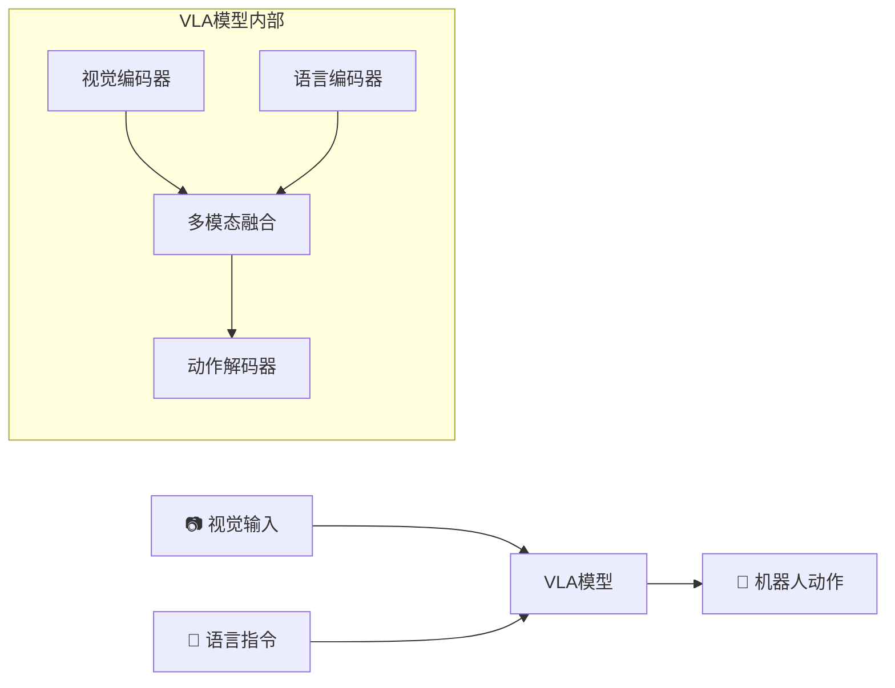
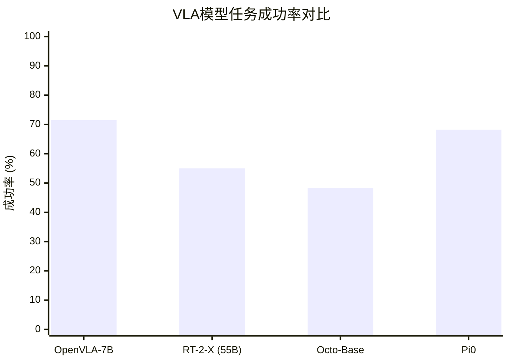
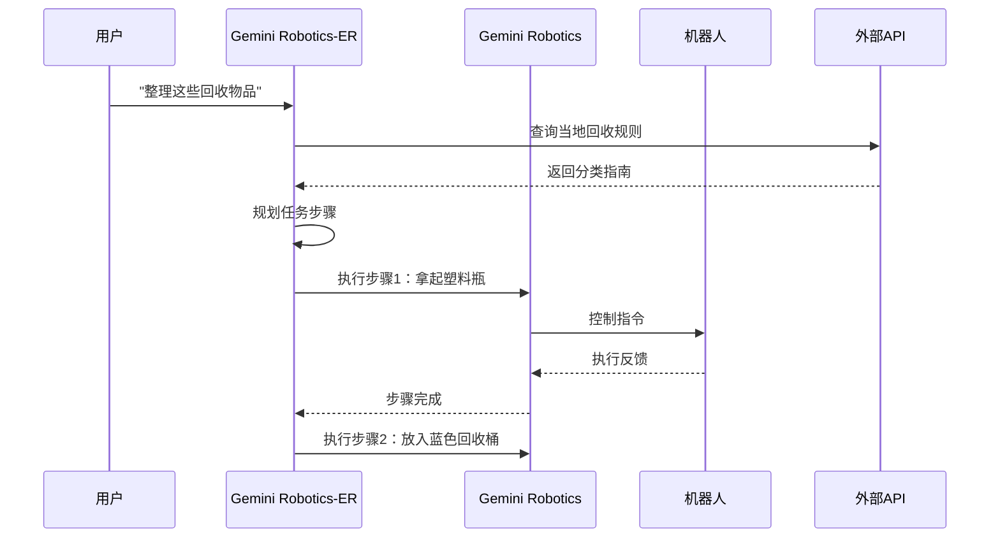
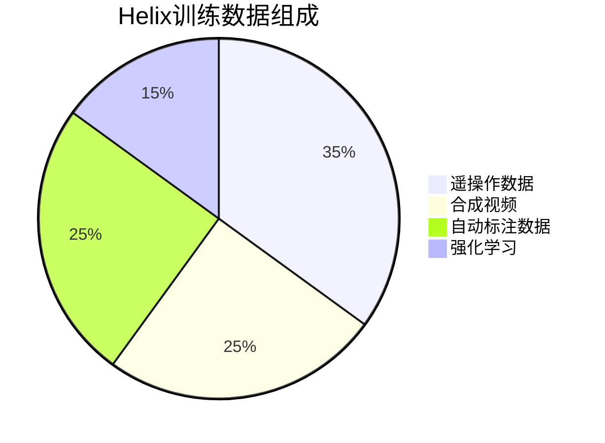
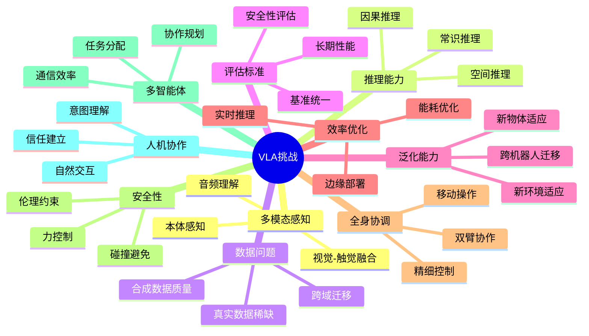
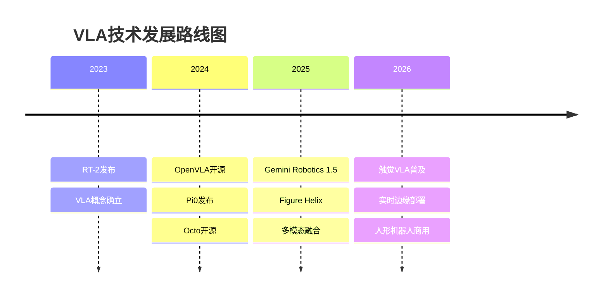

# VLA机器人新发展：主流视觉-语言-动作模型对比与实战教程

在具身智能（Embodied AI）领域，**Vision-Language-Action（VLA）模型**正在引领一场革命性的变革。这些模型将视觉感知、自然语言理解和机器人动作生成统一到一个端到端的框架中，使机器人能够通过简单的语言指令执行复杂任务。本文将深入分析当前主流VLA模型的最新发展，并提供详细的实战教程。

## 目录

1. [什么是VLA模型？](#什么是vla模型)
2. [主流VLA模型对比](#主流vla模型对比)
3. [深度解析：各模型技术特点](#深度解析各模型技术特点)
4. [实战教程：快速上手VLA模型](#实战教程快速上手vla模型)
5. [VLA模型面临的十大挑战](#vla模型面临的十大挑战)
6. [总结与展望](#总结与展望)

---

## 什么是VLA模型？

VLA（Vision-Language-Action）模型是一类新兴的多模态AI系统，它们能够：

1. **视觉感知**：通过摄像头理解周围环境和物体
2. **语言理解**：解析自然语言指令
3. **动作生成**：输出机器人控制命令来执行任务



与传统的模块化机器人系统不同，VLA模型实现了感知、理解、规划和执行的端到端学习，大大简化了机器人系统的复杂度。

---

## 主流VLA模型对比

以下是当前最具影响力的VLA模型对比表：

| 模型 | 开发者 | 参数量 | 开源状态 | 主要特点 | 硬件要求 |
|------|--------|--------|----------|----------|----------|
| **OpenVLA** | Stanford/Berkeley | 7B | ✅ 完全开源 | 开源标杆，支持LoRA微调 | RTX 3060+ (12GB+) |
| **Gemini Robotics 1.5** | Google DeepMind | 未公开 | ⚠️ API访问 | 工具使用、推理透明 | 云端API |
| **Figure Helix** | Figure AI | 未公开 | ❌ 闭源 | 全身人形控制 | 机载嵌入式GPU |
| **π₀ (Pi0)** | Physical Intelligence | 3B基座 | ✅ 开源 | 流匹配动作生成 | RTX 4090+ |
| **RT-2-X** | Google DeepMind | 55B | ❌ 闭源 | Web知识迁移 | 云端TPU |
| **Octo** | Berkeley | 27-93M | ✅ 开源 | 扩散策略、小模型 | RTX 2080+ |

### 性能对比（基于Open X-Embodiment基准）



**关键发现**：
- OpenVLA-7B在29项任务中比RT-2-X高出**16.5%**的成功率，尽管参数量只有后者的1/7
- 开源模型正在赶超闭源商业模型

---

## 深度解析：各模型技术特点

### 1. OpenVLA-7B：开源VLA的标杆


*OpenVLA模型架构示意*

**核心架构**：
- **视觉编码器**：DINOv2 + SigLIP双编码器
- **语言骨干**：Llama-2 7B
- **训练数据**：Open X-Embodiment（97万真实机器人演示）

**技术亮点**：
```python
# OpenVLA采用动作标记化方法
# 将连续动作离散化为语言模型可处理的token
action_tokens = tokenize_actions(
    delta_position=[dx, dy, dz],      # 位置变化
    delta_rotation=[rx, ry, rz],      # 旋转变化  
    gripper_action=open_or_close      # 夹爪动作
)
```

### 2. Gemini Robotics 1.5：将AI代理带入物理世界

Google DeepMind的[Gemini Robotics 1.5](https://deepmind.google/blog/gemini-robotics-15-brings-ai-agents-into-the-physical-world/)代表了VLA模型的一个重要里程碑。

**双模型架构**：
- **Gemini Robotics-ER 1.5**：高级推理引擎，负责规划和工具调用
- **Gemini Robotics 1.5**：VLA执行模型，负责具体动作控制



**创新特性**：
- **透明推理**：生成可审查的"思考轨迹"
- **工具使用**：可调用搜索、API等外部工具
- **多机器人迁移**：一次训练，多种机器人部署

### 3. Figure Helix：人形机器人的通用大脑

[Figure AI的Helix](https://www.figure.ai/news/helix)是专为人形机器人设计的VLA模型。

**突破性能力**：
- **全身控制**：单一神经网络控制手腕、手指、躯干和头部
- **零样本泛化**：无需针对特定物体训练即可操作数千种物品
- **多机协作**：两个机器人可协同完成长horizon任务

**训练数据多样性**：


### 4. π₀ (Pi0)：物理智能的开源先锋

[Physical Intelligence](https://www.physicalintelligence.company/blog/openpi)推出的π₀模型采用了创新的**流匹配（Flow Matching）**技术。

**技术差异化**：
- **连续动作流**：不同于离散token，直接生成连续轨迹
- **精细操作**：更适合需要高精度的任务
- **开源生态**：完整的训练和推理代码

```python
# Pi0使用流匹配进行动作生成
# 相比传统扩散模型，训练更稳定，推理更快
flow_trajectory = pi0.generate_trajectory(
    visual_observation=camera_image,
    language_instruction="将杯子放到盘子上",
    horizon=32  # 预测未来32步动作
)
```

---

## 实战教程：快速上手VLA模型

### 教程1：OpenVLA快速入门

#### 系统要求
- **GPU**：NVIDIA RTX 3060+ (12GB+ VRAM)
- **Python**：3.10+
- **OS**：Ubuntu 22.04 / Windows 11 / macOS

#### 安装步骤

```bash
# 1. 创建虚拟环境
conda create -n openvla python=3.10 -y
conda activate openvla

# 2. 安装PyTorch (根据CUDA版本选择)
pip install torch torchvision torchaudio --index-url https://download.pytorch.org/whl/cu121

# 3. 克隆并安装OpenVLA
git clone https://github.com/openvla/openvla.git
cd openvla
pip install -e .

# 4. 安装Flash Attention（可选，提升速度）
pip install flash-attn --no-build-isolation
```

#### 运行推理

```python
from transformers import AutoModelForVision2Seq, AutoProcessor
from PIL import Image
import torch

# 加载模型和处理器
processor = AutoProcessor.from_pretrained(
    "openvla/openvla-7b", 
    trust_remote_code=True
)
model = AutoModelForVision2Seq.from_pretrained(
    "openvla/openvla-7b",
    attn_implementation="flash_attention_2",
    torch_dtype=torch.bfloat16,
    low_cpu_mem_usage=True,
    trust_remote_code=True
).to("cuda:0")

# 加载机器人相机图像
image = Image.open("robot_camera.png")

# 构建提示词
prompt = "In: What action should the robot take to pick up the red block?\nOut:"

# 预处理输入
inputs = processor(prompt, image).to("cuda:0", dtype=torch.bfloat16)

# 预测动作 (返回7-DoF动作向量)
action = model.predict_action(
    **inputs, 
    unnorm_key="bridge_orig",  # 根据你的机器人选择
    do_sample=False
)

print(f"预测动作: {action}")
# 输出示例: [0.02, -0.01, 0.05, 0.0, 0.0, 0.1, 1.0]
# [dx, dy, dz, rx, ry, rz, gripper]
```

#### LoRA微调（低资源）

```python
from openvla.training import train_lora

# 使用LoRA进行高效微调
train_lora(
    base_model="openvla/openvla-7b",
    dataset_path="./my_robot_data",
    output_dir="./openvla-finetuned",
    lora_rank=32,
    learning_rate=2e-5,
    num_epochs=10
)
```

---

### 教程2：Pi0模型实战

#### 环境准备

> **注意**：Pi0模型已于2025年初开源。请访问[官方GitHub仓库](https://github.com/Physical-Intelligence/openpi)确认最新安装说明。

```bash
# 1. 克隆仓库（包含子模块）
git clone --recurse-submodules https://github.com/Physical-Intelligence/openpi.git
cd openpi

# 2. 使用uv包管理器安装（推荐）
pip install uv
uv sync

# 或使用传统pip
python -m venv venv
source venv/bin/activate
pip install -e .
```

#### 使用LeRobot集成

```bash
# 安装LeRobot与Pi0支持
pip install "lerobot[pi]@git+https://github.com/huggingface/lerobot.git"
```

#### 训练自定义任务

```bash
# 使用LeRobot脚本进行微调
CUDA_VISIBLE_DEVICES=0 python src/lerobot/scripts/train.py \
    --policy.path=lerobot/pi0 \
    --dataset.repo_id=your_username/your_dataset \
    --output_dir=outputs/train/my_pi0 \
    --job_name=pi0_custom \
    --policy.device=cuda \
    --task="pick up the apple and place it in the bowl" \
    --wandb.enable=true
```

#### 推理示例

```python
from lerobot.common.policies.pi0.policy import PI0Policy
from PIL import Image
import torch

# 加载微调后的模型
policy = PI0Policy.from_pretrained("outputs/train/my_pi0/checkpoints/best")
policy = policy.to("cuda")
policy.eval()

# 准备观测数据
observation = {
    "image": torch.from_numpy(camera_image).permute(2, 0, 1).unsqueeze(0).to("cuda"),
    "instruction": "pick up the red cube"
}

# 生成动作
with torch.no_grad():
    action = policy.select_action(observation)

print(f"动作输出: {action}")
```

---

### 教程3：Gemini Robotics-ER API使用

Gemini Robotics-ER 1.5可通过Google AI Studio和Gemini API访问。

#### API设置

```python
import os
import google.generativeai as genai
from PIL import Image
import base64

# 配置API密钥（推荐使用环境变量）
# 在终端设置: export GOOGLE_API_KEY="your-api-key"
genai.configure(api_key=os.getenv("GOOGLE_API_KEY"))

# 使用Gemini Robotics-ER进行空间推理
model = genai.GenerativeModel("gemini-1.5-pro-latest")

# 加载机器人视角图像
image = Image.open("robot_scene.jpg")

# 空间推理请求
response = model.generate_content([
    "作为一个机器人助手，分析这个场景并规划如何整理桌面上的物品。",
    "请列出详细的动作步骤，每个步骤包括：",
    "1. 目标物体及其位置",
    "2. 抓取策略",
    "3. 放置目标位置",
    image
])

print(response.text)
```

#### 规划与执行示例

```python
# 使用Gemini进行任务规划
planning_prompt = """
你是一个机器人任务规划器。根据以下场景描述，生成一个结构化的动作计划：

场景：厨房台面上有3个物品 - 一个红色杯子、一个蓝色碗、一个绿色盘子。
任务：将杯子放入碗中。

请输出JSON格式的动作序列。
"""

response = model.generate_content(planning_prompt)
action_plan = json.loads(response.text)

# 动作计划示例输出：
# {
#   "steps": [
#     {"action": "approach", "target": "red_cup", "position": [0.2, 0.1, 0.15]},
#     {"action": "grasp", "gripper_width": 0.06},
#     {"action": "lift", "height": 0.1},
#     {"action": "move_to", "target": "blue_bowl", "position": [0.3, -0.1, 0.2]},
#     {"action": "place", "gripper_width": 0.08}
#   ]
# }
```

---

## VLA模型面临的十大挑战

根据最新的[研究综述（arXiv:2511.05936）](https://arxiv.org/html/2511.05936v1)，VLA模型发展面临以下核心挑战：



### 重点挑战解析

1. **多模态融合**：当前模型主要依赖视觉，触觉、力反馈等模态的集成仍不成熟

2. **Sim2Real差距**：仿真训练的策略难以直接迁移到真实机器人

3. **实时性要求**：VLA模型推理延迟（100ms+）难以满足高速操作需求

4. **长horizon任务**：多步骤任务的规划和执行仍是难题

---

## 总结与展望

### VLA技术发展趋势



### 关键建议

**对于研究者**：
- 优先尝试OpenVLA和Pi0等开源模型
- 关注多模态融合和Sim2Real迁移研究
- 参与Open X-Embodiment数据集贡献

**对于开发者**：
- 从OpenVLA的LoRA微调开始
- 利用Genesis等仿真平台进行快速迭代
- 关注边缘部署优化（如NVIDIA Jetson）

**对于企业**：
- 评估Gemini Robotics API的商业应用
- 关注Figure和Physical Intelligence的产品化进展
- 建立机器人数据采集能力

### 资源汇总

| 资源类型 | 链接 |
|---------|------|
| OpenVLA GitHub | [github.com/openvla/openvla](https://github.com/openvla/openvla) |
| Pi0 (openpi) GitHub | [github.com/Physical-Intelligence/openpi](https://github.com/Physical-Intelligence/openpi) |
| Gemini API文档 | [ai.google.dev/gemini-api](https://ai.google.dev/gemini-api) |
| Figure Helix介绍 | [figure.ai/news/helix](https://www.figure.ai/news/helix) |
| VLA挑战综述 | [arxiv.org/abs/2511.05936](https://arxiv.org/abs/2511.05936) |
| Awesome VLA Robotics | [github.com/Jiaaqiliu/Awesome-VLA-Robotics](https://github.com/Jiaaqiliu/Awesome-VLA-Robotics) |

---

## 参考文献

1. Kim, M., et al. "OpenVLA: An Open-Source Vision-Language-Action Model." arXiv:2406.09246, 2024.
2. Google DeepMind. "Gemini Robotics 1.5 brings AI agents into the physical world." 2025.
3. Figure AI. "Helix: A Vision-Language-Action Model for Generalist Humanoid Control." 2025.
4. Physical Intelligence. "π₀: A Vision-Language-Action Flow Model for General Robot Control." 2024.
5. Team OXE. "Open X-Embodiment: Robotic Learning Datasets and RT-X Models." 2024.
6. "10 Open Challenges Steering the Future of Vision-Language-Action Models." arXiv:2511.05936, 2025.

---

*本文撰写于2025年12月6日，基于最新公开的研究论文和官方发布信息。随着VLA领域的快速发展，建议持续关注各项目的官方更新。*

**联系与讨论**：
- 欢迎在GitHub Issues中提问技术问题
- 加入HuggingFace社区讨论VLA研究进展
- 关注各开源项目的Discord/Slack频道获取最新动态
