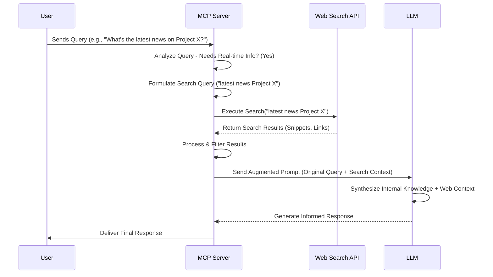
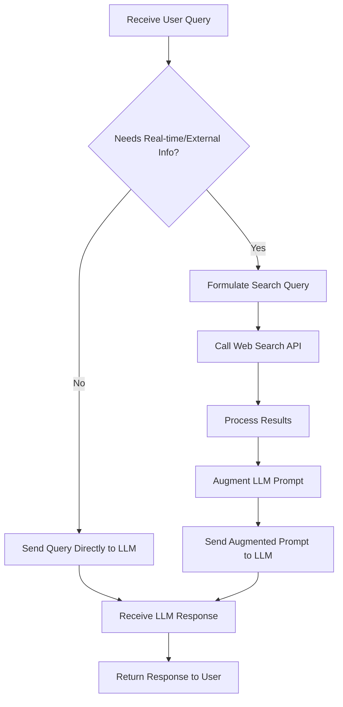

# Bridging the Knowledge Gap: How MCP Server Leverages Web Search and LLMs

Large Language Models (LLMs) like GPT-4, Claude, and Llama have revolutionized how we interact with information. Their ability to understand context, generate human-like text, and perform complex reasoning tasks is remarkable. However, they have a fundamental limitation: their knowledge is typically frozen at the time of their last training run. They lack access to real-time information and can sometimes "hallucinate" or invent facts when faced with queries beyond their training data.

Enter the **MCP Server (Master Control Program Server)** - a conceptual orchestrator designed to augment LLMs by dynamically fetching and incorporating up-to-date information from the web. This post explores how such a system could work, integrating an LLM with a web search tool to provide more accurate, timely, and reliable responses.

## The Challenge: Static Knowledge vs. Dynamic World

LLMs are trained on massive datasets, but this data represents a snapshot in time. Ask about today's news, the latest stock prices, or the score of a game that just finished, and a standard LLM will likely tell you it doesn't have real-time access or might provide outdated information. This "knowledge cutoff" is a significant barrier for applications requiring current data.

Furthermore, when pushed outside their knowledge base, LLMs might generate plausible-sounding but incorrect information (hallucinations). Relying solely on the LLM's internal knowledge can be risky for tasks demanding high factual accuracy.

## The MCP Server: An Orchestration Hub

Imagine the MCP Server as the central nervous system connecting the user, the LLM, and external tools like web search. Its primary roles in this context are:

1.  **Query Analysis:** Determining if a user's request likely requires information beyond the LLM's static knowledge.
2.  **Tool Invocation:** Formulating appropriate search queries and calling the web search API.
3.  **Information Synthesis:** Processing search results and presenting them effectively to the LLM.
4.  **Response Generation:** Managing the interaction with the LLM to generate a final, informed response for the user.

## The Workflow: Integrating Web Search

Here’s a potential workflow for how the MCP Server could integrate web search with an LLM:

1.  **User Query:** The user sends a request to the system (interfaced via the MCP Server).
2.  **Analysis & Decision:** The MCP Server analyzes the query. It might use simple heuristics (keywords like "latest," "today," "current score") or even consult the LLM itself (meta-reasoning) to decide if external information is needed.
3.  **Search Query Formulation:** If web search is deemed necessary, the MCP Server transforms the user's natural language query into one or more effective search engine queries. This might involve keyword extraction or query rewriting.
4.  **Web Search Execution:** The MCP Server calls a web search API (like Google Search API, Bing Search API, or specialized search providers) with the formulated queries.
5.  **Result Processing:** The search API returns a list of results (URLs, titles, snippets). The MCP Server needs to:
    *   Filter irrelevant results.
    *   Extract concise, relevant information from the snippets or potentially fetch and summarize content from top-ranking pages (though this adds complexity and latency).
    *   Handle potential inconsistencies or conflicting information from different sources.
6.  **Context Augmentation:** The MCP Server constructs a new prompt for the LLM. This prompt includes:
    *   The original user query.
    *   The processed, relevant information retrieved from the web search.
    *   Clear instructions for the LLM to use the provided context to answer the query accurately and cite the sources if possible.
7.  **LLM Generation:** The LLM processes the augmented prompt, synthesizing its internal knowledge with the fresh information from the web search results to generate a comprehensive and up-to-date response.
8.  **Final Response:** The MCP Server receives the LLM's response and delivers it to the user.

### Visualizing the Flow

Here's a Mermaid sequence diagram illustrating the process:

## Key Concepts and Relevant Research

This approach is closely related to the concept of **Retrieval-Augmented Generation (RAG)**. RAG models were explicitly designed to combine pre-trained language models with external retrieval mechanisms (like search) to improve knowledge-intensive tasks.

*   **Paper Reference:** Lewis, P., Perez, E., Piktus, A., Petroni, F., Karpukhin, V., Goyal, N., ... & Kiela, D. (2020). *Retrieval-Augmented Generation for Knowledge-Intensive NLP Tasks*. Advances in Neural Information Processing Systems, 33, 9459-9474. (Often cited as the foundational RAG paper).

Another relevant area is **Tool Use by LLMs**. Researchers are actively exploring how LLMs can learn to autonomously use external tools (calculators, search engines, code interpreters) to overcome their limitations.

*   **Paper Reference:** Schick, T., Dwivedi-Yu, J., Dessì, R., Raileanu, R., Lomeli, M., Zettlemoyer, L., Cancedda, N., & Scialom, T. (2023). *Toolformer: Language Models Can Teach Themselves to Use Tools*. arXiv preprint arXiv:2302.04761.
*   **Paper Reference:** Parisi, A., Garcia, A., & Riedl, M. (2022). *TALM: Tool Augmented Language Models*. arXiv preprint arXiv:2205.12255.

The MCP Server acts as the orchestrator facilitating this tool use, specifically for web search in this scenario.

## Technical Considerations & Challenges

Implementing such a system involves several hurdles:

*   **Latency:** Adding a web search step inevitably increases the time taken to generate a response. Optimizing search execution and result processing is crucial.
*   **Cost:** Both LLM API calls and potentially commercial search API calls incur costs. Efficient query formulation and result caching can help manage this.
*   **Reliability:** Web search results can be noisy, biased, or contain misinformation. The MCP Server needs robust mechanisms to filter, rank, and potentially cross-reference information for trustworthiness.
*   **Prompt Engineering:** Crafting the augmented prompt for the LLM is critical. It must clearly instruct the LLM on how to use the provided context without letting it override the LLM's general reasoning capabilities inappropriately.
*   **Complexity:** Managing the state, handling errors from the search API, and ensuring smooth interaction between components adds complexity to the system architecture.

### Decision Logic Example

Here's a simple Mermaid flowchart for the decision-making part within the MCP Server:

## Benefits of the MCP Server + Web Search Approach

*   **Timeliness:** Access to up-to-the-minute information.
*   **Accuracy:** Reduced risk of hallucinations by grounding responses in real-world data.
*   **Verifiability:** Potential to cite sources from search results, increasing user trust.
*   **Broader Scope:** Answers questions beyond the LLM's training data cutoff.

## Conclusion

Integrating web search capabilities via an orchestrator like the conceptual MCP Server significantly enhances the power and reliability of LLMs. By dynamically fetching and incorporating real-time information, we can overcome the static knowledge limitations inherent in pre-trained models. While challenges in latency, cost, and reliability exist, the RAG and Tool Use paradigms demonstrate this is a promising and actively developing field. Systems like the MCP Server represent the next step in creating AI assistants that are not only fluent and context-aware but also consistently informed by the current state of the world.

***

**References:**

1.  Lewis, P., et al. (2020). Retrieval-Augmented Generation for Knowledge-Intensive NLP Tasks. *NeurIPS 2020*.
2.  Schick, T., et al. (2023). Toolformer: Language Models Can Teach Themselves to Use Tools. *arXiv:2302.04761*.
3.  Parisi, A., Garcia, A., & Riedl, M. (2022). TALM: Tool Augmented Language Models. *arXiv:2205.12255*.

***