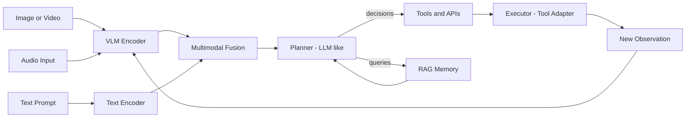
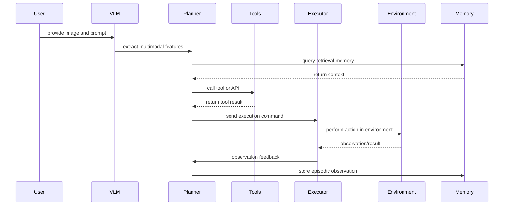

# Vision–Language Agents (VLA): Bridging LLMs and VLMs

This talk explains the relationship between LLMs (Large Language Models), VLMs (Vision–Language Models), and VLAs (Vision–Language Agents), with emphasis on how VLAs use perceptual inputs, multimodal reasoning, and action grounding to perform complex tasks.

## Motivation

- LLMs excel at text-based reasoning and generation.
- VLMs fuse visual perception with language understanding (image captioning, visual question answering).
- VLAs combine VLM perception with agentic reasoning and tool use, enabling goal-directed behavior over multimodal inputs.

*Figure: Conceptual illustration of artificial intelligence and multimodal perception.*

## Core concepts

- LLM: Powerful text-only reasoning, knowledge encoding, planning and dialogue.
- VLM: Joint visual + text encoder/decoder (e.g., CLIP, Flamingo-style, Gemini with vision).
- VLA: Orchestrates perception (VLM), reasoning (LLM-like planner), memory, and action (tools, APIs, robotic controls).

## VLA architecture (high level)

*Figure: Example imagery showing perception inputs for a VLA.*

## How VLAs differ from VLM+LLM pipelines

1. Tight closed-loop: VLAs run perception, plan, act, observe, and re-plan in a loop rather than one-shot inference.
2. Tool integration: VLAs embed adapters to call vision models, search engines, APIs, or device drivers.
3. Memory & grounding: VLAs store episodic observations and use RAG for long-horizon tasks.
4. Safety & prompts: VLAs require grounding constraints to avoid hallucinated actions.

## Example use-cases

*Figure: Robotic pick-and-place is a canonical VLA use-case.*

- Vision-guided web automation: inspect page screenshot, extract form fields, and fill using a browser automation tool.
- Robotic pick-and-place: perceive scene, plan grasp, call motion controller, verify via vision, iterate.
- Multimodal assistants: summarize a slide deck, generate follow-up actions, and schedule tasks.

## Practical notes for implementation

- Choose a VLM for perception (CLIP, BLIP, Flamingo derivatives) depending on latency/accuracy tradeoffs.
- Use an LLM or instruction-tuned multimodal model as planner; consider model cost and streaming.
- Implement a tool adapter layer to standardize calls to APIs and hardware.
- Add observation validators and a confirmation step before destructive actions.

## Recommended mermaid diagram (for slides)

## In-Depth: Research, Benchmarks, and Open Challenges

### Recent Research Directions

- **Embodied AI & World Models**: VLAs are central to embodied AI, where agents interact with the world. The frontier is now in building implicit "world models" that allow VLAs to predict the outcomes of their actions, enabling more sophisticated planning. Notable projects include Google's RT-2, DeepMind's RoboCat, and the OpenVLA framework.
- **Multimodal Chain-of-Thought (CoT) & Self-Correction**: To improve reliability, VLAs now leverage multimodal CoT prompting to "think out loud" about visual and textual evidence before acting. Advanced agents can self-critique their plans and correct mistakes based on new observations, creating robust feedback loops.
- **Tool and API Ecosystems**: Research is moving beyond single-tool use to complex API orchestration. VLAs are being trained to navigate documentation, select from thousands of potential APIs, and compose them to fulfill complex user requests. Projects like Gorilla and Toolformer are pioneering this space.
- **Efficient Architectures for Real-Time Use**: To run on edge devices (like robots or AR glasses), research focuses on creating smaller, faster VLAs. Techniques include knowledge distillation, model quantization, and modular designs where a small, fast model handles simple tasks and calls a larger model only when necessary.
- **Long-Horizon Task Planning**: Breaking down complex, multi-step goals (e.g., "plan a vacation") into a sequence of executable actions remains a key focus. This involves integrating memory, planning, and dynamic adaptation as the state of the world changes.

### Benchmarks

- **OpenVLA**: An open-source framework and collection of models (based on Llama and CLIP) for reproducible research in robotic manipulation, providing a standardized evaluation for real-world tasks.
- **ALFRED**: A benchmark for instruction-following in simulated home environments, testing navigation, object interaction, and long-horizon planning.
- **WebArena**: A realistic and reproducible benchmark for web automation, where agents must complete complex tasks on live websites based on high-level instructions.
- **GAIA (General AI Assistants)**: A challenging benchmark from Meta that tests an agent's ability to use a wide range of tools (web browser, code interpreter, file system) to answer complex, multi-step questions that often require information from multiple sources.
- **VIMA**: A benchmark focused on generalization for robotic manipulation, testing an agent's ability to perform tasks with novel objects and instructions.

### Open Challenges

- **Robustness and Generalization**: Agents often fail when faced with novel environments or objects that differ slightly from their training data. Improving out-of-distribution performance is critical for real-world deployment.
- **Grounded Evaluation and Safety**: It is difficult to create benchmarks that capture the full complexity and safety implications of real-world interaction. An agent might complete a task but do so in an unsafe or unintended way.
- **Real-Time Performance**: The latency of large VLMs remains a bottleneck. For applications like robotics or autonomous driving, perception-action loops must run in milliseconds, which is beyond the capability of most current state-of-the-art models.
- **Data Scarcity for Embodied Tasks**: While web data is plentiful, high-quality data for robotic manipulation and other embodied tasks is scarce and expensive to collect, slowing down progress.
- **Compositionality and Long-Horizon Reasoning**: VLAs struggle to compose multiple skills to solve novel, complex problems. Planning over dozens of steps and adapting to unforeseen changes remains a significant hurdle.

## Further Reading

- "RT-2: Vision-Language-Action Models Transfer Web Knowledge to Robotics" (Google DeepMind, 2023)
- "Toolformer: Language Models Can Teach Themselves to Use Tools" (Meta, 2023)
- "ViperGPT: Visual Programming with GPT-4 and Vision Models" (Stanford, 2024)
- "ALFRED: A Benchmark for Interpreting Grounded Instructions for Everyday Tasks" (AllenAI, 2020)
- "VIMA: General Robot Manipulation with Multimodal Prompts" (Stanford, 2023)

---

## Takeaways

- VLAs are the next step: not just perceiving and describing, but acting reliably in the world.
- Focus on modular interfaces: perception, fusion, planning, tools, and memory.
- Prioritize validation and safety when enabling actions.

---

References and demos can be provided on request.
