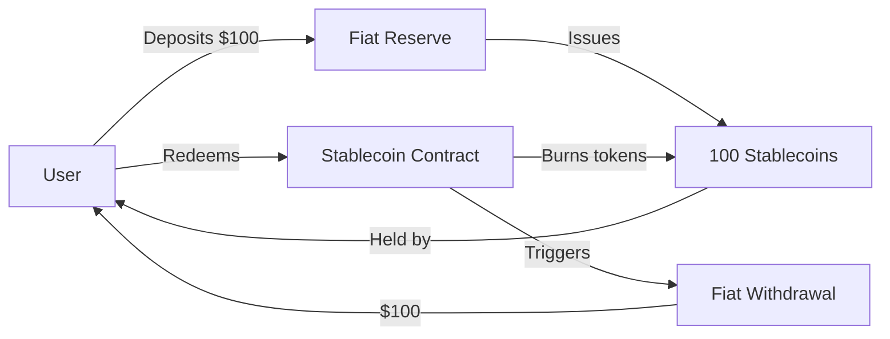
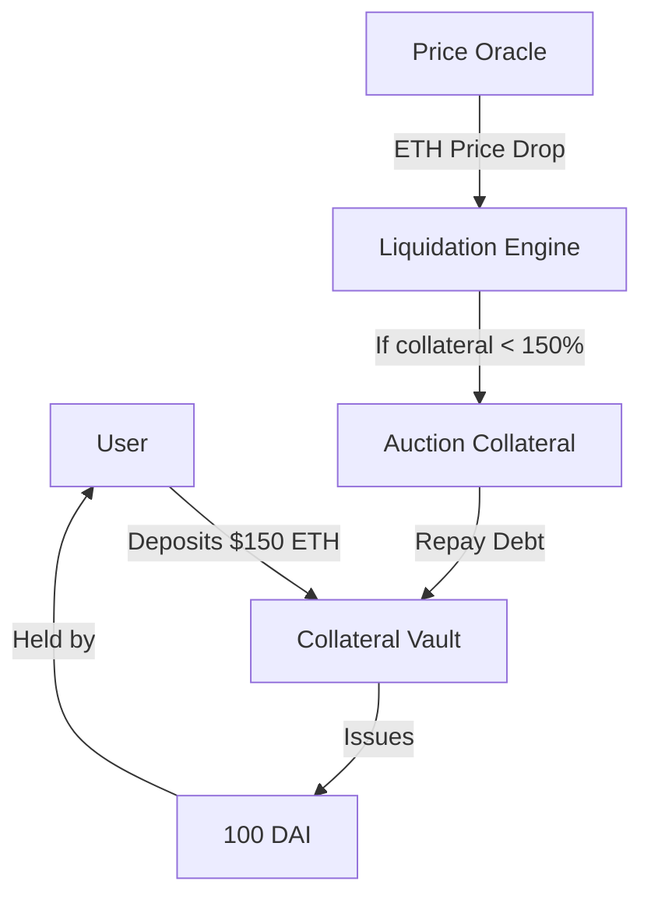
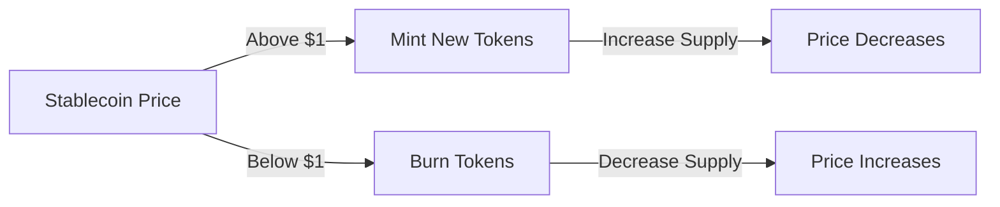
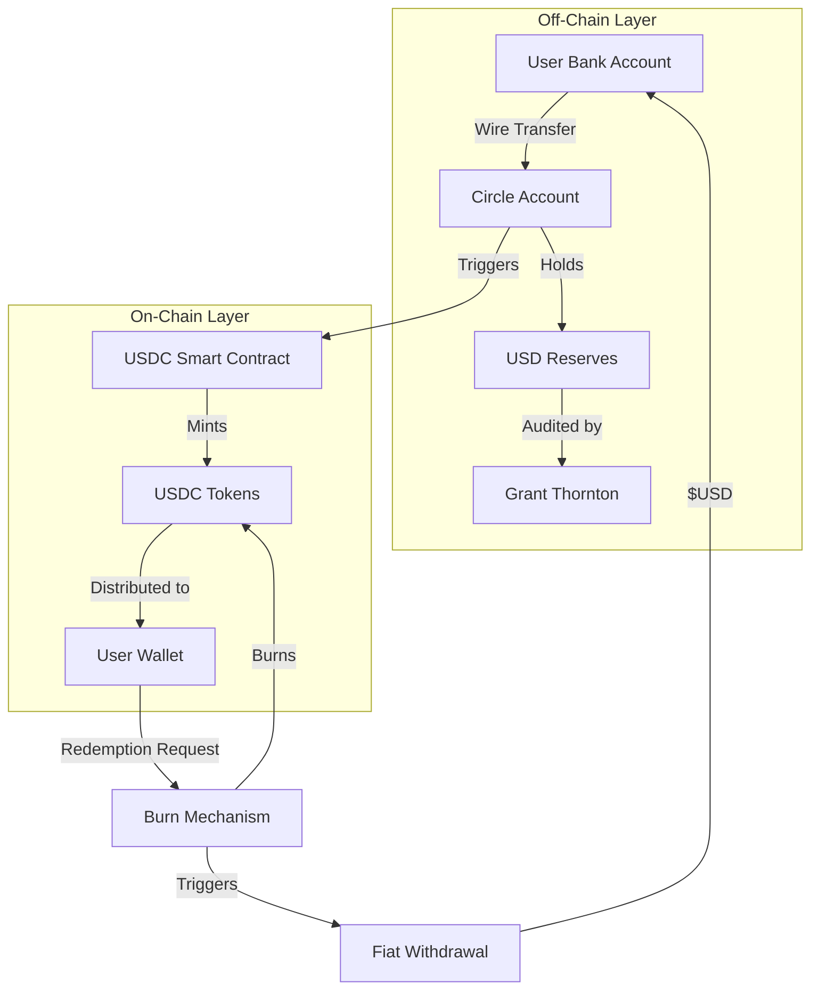
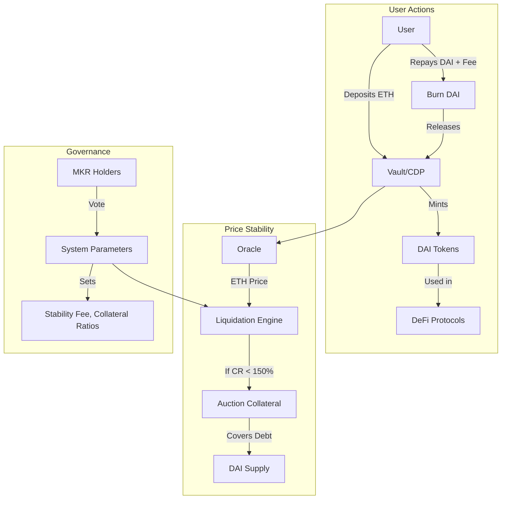
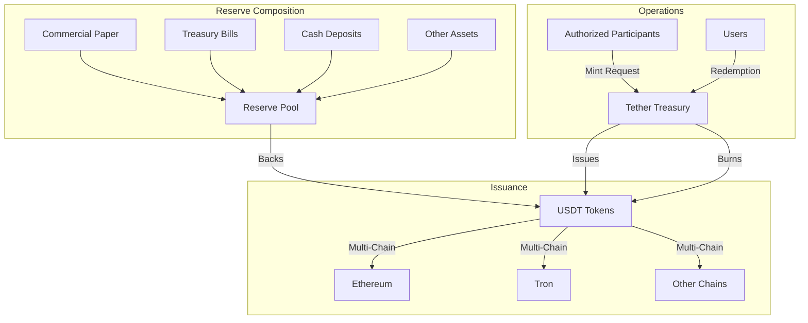
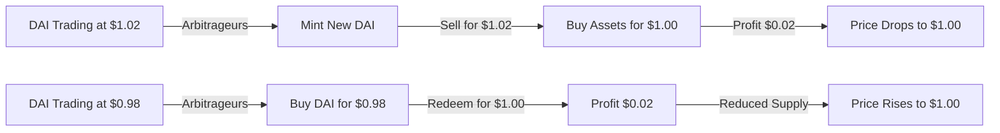
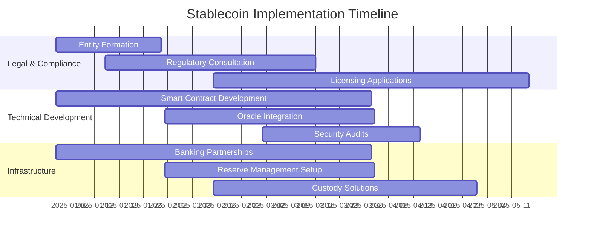

# How to Make a New Stablecoin: Complete Technical Design Guide

*Estimated read: 25–30 minutes · Skill level: Intermediate to Advanced*

Stablecoins are the backbone of decentralized finance, providing price stability in the volatile crypto market. This comprehensive guide explores the technical architecture behind different stablecoin models, from fiat-backed to algorithmic designs, with insights from industry leaders like USDC, DAI, and USDT.

---

## Table of Contents

- [Stablecoin Fundamentals](#stablecoin-fundamentals)
- [Stablecoin Types and Mechanisms](#stablecoin-types-and-mechanisms)
- [Case Study: USDC (Fiat-Backed)](#case-study-usdc-fiat-backed)
- [Case Study: DAI (Crypto-Collateralized)](#case-study-dai-crypto-collateralized)
- [Case Study: USDT (Mixed Reserves)](#case-study-usdt-mixed-reserves)
- [Smart Contract Architecture](#smart-contract-architecture)
- [Price Stability Mechanisms](#price-stability-mechanisms)
- [Oracle Integration](#oracle-integration)
- [Security and Risk Management](#security-and-risk-management)
- [Regulatory Considerations](#regulatory-considerations)
- [Implementation Roadmap](#implementation-roadmap)

---

## Stablecoin Fundamentals

### What is a Stablecoin?

A stablecoin is a cryptocurrency designed to maintain a stable value relative to a reference asset, typically the US Dollar (1:1 peg). Stablecoins solve the volatility problem that makes traditional cryptocurrencies unsuitable for everyday transactions.

### Core Requirements

1. **Price Stability**: Maintain peg within acceptable range (typically ±1%)
2. **Transparency**: Clear visibility into reserves and mechanisms
3. **Redeemability**: Ability to convert to underlying asset
4. **Scalability**: Handle high transaction volumes
5. **Security**: Protection against exploits and attacks

### Key Metrics

```javascript
class StablecoinMetrics {
    calculateHealthMetrics(stablecoin) {
        return {
            // Price stability
            priceDeviation: this.calculatePriceDeviation(stablecoin),
            
            // Collateralization
            collateralRatio: this.getCollateralRatio(stablecoin),
            
            // Liquidity
            liquidityDepth: this.measureLiquidityDepth(stablecoin),
            
            // Adoption
            circulatingSupply: this.getCirculatingSupply(stablecoin),
            
            // Decentralization
            holderDistribution: this.analyzeDistribution(stablecoin)
        };
    }
}
```

---

## Stablecoin Types and Mechanisms

### 1. Fiat-Backed Stablecoins

Backed 1:1 by fiat currency reserves held in bank accounts.



**Pros:**
- Simple to understand
- High stability
- Easy redemption

**Cons:**
- Centralized
- Requires trust in custodian
- Regulatory overhead

### 2. Crypto-Collateralized Stablecoins

Over-collateralized by cryptocurrency assets.



**Pros:**
- Decentralized
- Transparent
- Trustless

**Cons:**
- Capital inefficient
- Complexity
- Liquidation risk

### 3. Algorithmic Stablecoins

Use algorithms and market incentives to maintain peg.



**Pros:**
- No collateral needed
- Highly scalable
- Capital efficient

**Cons:**
- Complex mechanisms
- Death spiral risk
- Regulatory uncertainty

### 4. Hybrid Models

Combine multiple mechanisms for stability.

---

## Case Study: USDC (Fiat-Backed)

### Overview

USDC (USD Coin) is a fiat-backed stablecoin issued by Circle. Each USDC is backed 1:1 by US dollars held in reserve accounts, with regular attestations by independent auditors.

### Technical Architecture



### Smart Contract Implementation

```solidity
// Simplified USDC-style Contract
pragma solidity ^0.8.20;

import "@openzeppelin/contracts/token/ERC20/ERC20.sol";
import "@openzeppelin/contracts/access/AccessControl.sol";
import "@openzeppelin/contracts/security/Pausable.sol";

contract FiatBackedStablecoin is ERC20, AccessControl, Pausable {
    bytes32 public constant MINTER_ROLE = keccak256("MINTER_ROLE");
    bytes32 public constant BURNER_ROLE = keccak256("BURNER_ROLE");
    bytes32 public constant PAUSER_ROLE = keccak256("PAUSER_ROLE");
    bytes32 public constant BLACKLISTER_ROLE = keccak256("BLACKLISTER_ROLE");
    
    mapping(address => bool) public blacklisted;
    
    event Mint(address indexed to, uint256 amount);
    event Burn(address indexed from, uint256 amount);
    event Blacklisted(address indexed account);
    event UnBlacklisted(address indexed account);
    
    constructor() ERC20("USD Coin", "USDC") {
        _grantRole(DEFAULT_ADMIN_ROLE, msg.sender);
        _grantRole(MINTER_ROLE, msg.sender);
        _grantRole(BURNER_ROLE, msg.sender);
        _grantRole(PAUSER_ROLE, msg.sender);
        _grantRole(BLACKLISTER_ROLE, msg.sender);
    }
    
    function mint(address to, uint256 amount) 
        external 
        onlyRole(MINTER_ROLE) 
        whenNotPaused 
    {
        require(!blacklisted[to], "Address blacklisted");
        _mint(to, amount);
        emit Mint(to, amount);
    }
    
    function burn(uint256 amount) external {
        _burn(msg.sender, amount);
        emit Burn(msg.sender, amount);
    }
    
    function burnFrom(address account, uint256 amount) 
        external 
        onlyRole(BURNER_ROLE) 
    {
        _burn(account, amount);
        emit Burn(account, amount);
    }
    
    function pause() external onlyRole(PAUSER_ROLE) {
        _pause();
    }
    
    function unpause() external onlyRole(PAUSER_ROLE) {
        _unpause();
    }
    
    function blacklist(address account) 
        external 
        onlyRole(BLACKLISTER_ROLE) 
    {
        blacklisted[account] = true;
        emit Blacklisted(account);
    }
    
    function unBlacklist(address account) 
        external 
        onlyRole(BLACKLISTER_ROLE) 
    {
        blacklisted[account] = false;
        emit UnBlacklisted(account);
    }
    
    function _beforeTokenTransfer(
        address from,
        address to,
        uint256 amount
    ) internal override whenNotPaused {
        require(!blacklisted[from], "Sender blacklisted");
        require(!blacklisted[to], "Recipient blacklisted");
        super._beforeTokenTransfer(from, to, amount);
    }
    
    function decimals() public pure override returns (uint8) {
        return 6; // USDC uses 6 decimals
    }
}
```

### Key Features

1. **Minting Process**: Only authorized minters can create new tokens
2. **Burning Process**: Users can burn tokens to redeem USD
3. **Blacklisting**: Ability to freeze accounts for compliance
4. **Pausability**: Emergency pause mechanism
5. **Upgradeability**: Proxy pattern for contract upgrades

### Reserve Management

```javascript
// Off-chain reserve management system
class ReserveManager {
    constructor(bankingPartner, auditor) {
        this.bankingPartner = bankingPartner;
        this.auditor = auditor;
    }
    
    async processDeposit(userId, amount) {
        // 1. Verify bank transfer
        const transferConfirmed = await this.bankingPartner.verifyDeposit(
            userId,
            amount
        );
        
        if (!transferConfirmed) {
            throw new Error("Transfer not confirmed");
        }
        
        // 2. Update reserve ledger
        await this.updateReserveLedger(amount, 'credit');
        
        // 3. Trigger on-chain minting
        const mintTx = await this.mintStablecoins(userId, amount);
        
        // 4. Log for audit trail
        await this.logTransaction({
            type: 'MINT',
            userId,
            amount,
            txHash: mintTx.hash,
            timestamp: Date.now()
        });
        
        return mintTx;
    }
    
    async processRedemption(userId, tokenAmount) {
        // 1. Verify token burn
        const burnConfirmed = await this.verifyBurn(userId, tokenAmount);
        
        // 2. Update reserve ledger
        await this.updateReserveLedger(tokenAmount, 'debit');
        
        // 3. Initiate bank transfer
        const transferId = await this.bankingPartner.initiateWithdrawal(
            userId,
            tokenAmount
        );
        
        // 4. Log for audit
        await this.logTransaction({
            type: 'BURN',
            userId,
            amount: tokenAmount,
            transferId,
            timestamp: Date.now()
        });
        
        return transferId;
    }
    
    async generateAttestation() {
        // Generate monthly attestation report
        const reserves = await this.bankingPartner.getTotalReserves();
        const circulation = await this.getTotalCirculation();
        
        return {
            reserves,
            circulation,
            ratio: reserves / circulation,
            timestamp: Date.now(),
            auditor: this.auditor.name
        };
    }
}
```

### Success Factors

1. **Regulatory Compliance**: Full regulatory licenses
2. **Transparent Reserves**: Monthly attestations
3. **Multi-Chain Support**: Deployed on multiple blockchains
4. **Banking Partnerships**: Strong relationships with financial institutions
5. **Developer Friendly**: Well-documented APIs

---

## Case Study: DAI (Crypto-Collateralized)

### Overview

DAI is a decentralized, crypto-collateralized stablecoin created by MakerDAO. Users lock cryptocurrency (ETH, WBTC, etc.) as collateral to mint DAI, with over-collateralization ensuring stability.

### Technical Architecture



### Core Smart Contracts

#### 1. Vault Contract (CDP)

```solidity
// Simplified MakerDAO Vault
pragma solidity ^0.8.20;

contract Vault {
    struct Position {
        uint256 collateral;  // Amount of collateral (e.g., ETH)
        uint256 debt;        // Amount of DAI minted
    }
    
    mapping(address => Position) public positions;
    
    address public oracle;
    address public daiToken;
    uint256 public collateralizationRatio = 150; // 150% minimum
    uint256 public stabilityFee = 200; // 2% APR (basis points)
    uint256 public liquidationPenalty = 1300; // 13%
    
    event VaultOpened(address indexed user, uint256 collateral, uint256 debt);
    event VaultClosed(address indexed user);
    event Liquidated(address indexed user, uint256 collateral, uint256 debt);
    
    function openVault(uint256 daiAmount) external payable {
        require(msg.value > 0, "Must deposit collateral");
        
        uint256 ethPrice = IOracle(oracle).getPrice();
        uint256 collateralValue = (msg.value * ethPrice) / 1e18;
        uint256 requiredCollateral = (daiAmount * collateralizationRatio) / 100;
        
        require(
            collateralValue >= requiredCollateral,
            "Insufficient collateral"
        );
        
        positions[msg.sender] = Position({
            collateral: msg.value,
            debt: daiAmount
        });
        
        // Mint DAI to user
        IDai(daiToken).mint(msg.sender, daiAmount);
        
        emit VaultOpened(msg.sender, msg.value, daiAmount);
    }
    
    function addCollateral() external payable {
        require(positions[msg.sender].debt > 0, "No vault found");
        positions[msg.sender].collateral += msg.value;
    }
    
    function withdrawCollateral(uint256 amount) external {
        Position storage pos = positions[msg.sender];
        require(pos.collateral >= amount, "Insufficient collateral");
        
        pos.collateral -= amount;
        
        // Check collateralization ratio
        require(
            isHealthy(msg.sender),
            "Would breach collateralization ratio"
        );
        
        payable(msg.sender).transfer(amount);
    }
    
    function mintMoreDai(uint256 amount) external {
        Position storage pos = positions[msg.sender];
        require(pos.collateral > 0, "No vault found");
        
        pos.debt += amount;
        
        require(isHealthy(msg.sender), "Insufficient collateral");
        
        IDai(daiToken).mint(msg.sender, amount);
    }
    
    function repayDai(uint256 amount) external {
        Position storage pos = positions[msg.sender];
        require(pos.debt >= amount, "Repay amount too high");
        
        // Calculate accrued fees
        uint256 fees = calculateFees(msg.sender);
        uint256 totalRepayment = amount + fees;
        
        // Burn DAI
        IDai(daiToken).burnFrom(msg.sender, totalRepayment);
        
        pos.debt -= amount;
    }
    
    function closeVault() external {
        Position storage pos = positions[msg.sender];
        require(pos.debt == 0, "Must repay all debt first");
        
        uint256 collateralToReturn = pos.collateral;
        delete positions[msg.sender];
        
        payable(msg.sender).transfer(collateralToReturn);
        
        emit VaultClosed(msg.sender);
    }
    
    function liquidate(address user) external {
        require(!isHealthy(user), "Vault is healthy");
        
        Position storage pos = positions[user];
        
        uint256 debtWithPenalty = pos.debt * (10000 + liquidationPenalty) / 10000;
        
        // Auction collateral
        _auctionCollateral(pos.collateral, debtWithPenalty);
        
        // Close position
        delete positions[user];
        
        emit Liquidated(user, pos.collateral, pos.debt);
    }
    
    function isHealthy(address user) public view returns (bool) {
        Position storage pos = positions[user];
        if (pos.debt == 0) return true;
        
        uint256 ethPrice = IOracle(oracle).getPrice();
        uint256 collateralValue = (pos.collateral * ethPrice) / 1e18;
        uint256 requiredCollateral = (pos.debt * collateralizationRatio) / 100;
        
        return collateralValue >= requiredCollateral;
    }
    
    function calculateFees(address user) public view returns (uint256) {
        Position storage pos = positions[user];
        // Simplified fee calculation
        return (pos.debt * stabilityFee) / 10000;
    }
    
    function _auctionCollateral(uint256 collateral, uint256 debt) internal {
        // Implement Dutch auction or other liquidation mechanism
        // This would interact with a separate auction contract
    }
}
```

#### 2. DAI Token Contract

```solidity
pragma solidity ^0.8.20;

import "@openzeppelin/contracts/token/ERC20/ERC20.sol";
import "@openzeppelin/contracts/access/AccessControl.sol";

contract Dai is ERC20, AccessControl {
    bytes32 public constant MINTER_ROLE = keccak256("MINTER_ROLE");
    
    constructor() ERC20("Dai Stablecoin", "DAI") {
        _grantRole(DEFAULT_ADMIN_ROLE, msg.sender);
    }
    
    function mint(address to, uint256 amount) 
        external 
        onlyRole(MINTER_ROLE) 
    {
        _mint(to, amount);
    }
    
    function burnFrom(address account, uint256 amount) external {
        uint256 currentAllowance = allowance(account, msg.sender);
        require(currentAllowance >= amount, "Insufficient allowance");
        
        _approve(account, msg.sender, currentAllowance - amount);
        _burn(account, amount);
    }
}
```

#### 3. Price Stability Module (PSM)

The PSM allows 1:1 swaps between DAI and other stablecoins:

```solidity
contract PriceStabilityModule {
    address public dai;
    address public usdc;
    uint256 public fee = 1; // 0.01% fee (in basis points)
    
    event Swap(address indexed user, address tokenIn, uint256 amountIn, uint256 amountOut);
    
    function swapUSDCForDAI(uint256 usdcAmount) external {
        // Transfer USDC from user
        IERC20(usdc).transferFrom(msg.sender, address(this), usdcAmount);
        
        // Calculate DAI amount (accounting for decimals difference)
        uint256 daiAmount = (usdcAmount * 1e12) * (10000 - fee) / 10000;
        
        // Mint DAI to user
        IDai(dai).mint(msg.sender, daiAmount);
        
        emit Swap(msg.sender, usdc, usdcAmount, daiAmount);
    }
    
    function swapDAIForUSDC(uint256 daiAmount) external {
        // Burn DAI from user
        IDai(dai).burnFrom(msg.sender, daiAmount);
        
        // Calculate USDC amount
        uint256 usdcAmount = (daiAmount / 1e12) * (10000 - fee) / 10000;
        
        // Transfer USDC to user
        IERC20(usdc).transfer(msg.sender, usdcAmount);
        
        emit Swap(msg.sender, dai, daiAmount, usdcAmount);
    }
}
```

### Key Mechanisms

#### 1. Stability Fee

Interest rate charged on DAI debt, adjusted by governance:

```javascript
class StabilityFeeController {
    calculateAccruedFee(vault, currentTime) {
        const timeElapsed = currentTime - vault.lastUpdate;
        const annualRate = this.getStabilityFee(); // e.g., 2%
        
        // Compound interest calculation
        const ratePerSecond = Math.pow(1 + annualRate, 1 / (365 * 24 * 60 * 60));
        const multiplier = Math.pow(ratePerSecond, timeElapsed);
        
        return vault.debt * (multiplier - 1);
    }
}
```

#### 2. Liquidation Mechanism

```javascript
class LiquidationEngine {
    async checkAndLiquidate(vaultAddress) {
        const vault = await this.getVault(vaultAddress);
        const ethPrice = await this.oracle.getPrice('ETH');
        
        const collateralValue = vault.collateral * ethPrice;
        const requiredCollateral = vault.debt * this.collateralizationRatio;
        
        if (collateralValue < requiredCollateral) {
            // Trigger liquidation auction
            await this.startAuction({
                collateral: vault.collateral,
                debt: vault.debt,
                penalty: this.liquidationPenalty
            });
        }
    }
    
    async startAuction(liquidationData) {
        // Dutch auction: price decreases over time
        const auctionDuration = 6 * 60 * 60; // 6 hours
        const startPrice = liquidationData.debt * 1.13 / liquidationData.collateral;
        
        return {
            startTime: Date.now(),
            endTime: Date.now() + auctionDuration * 1000,
            startPrice,
            collateralAmount: liquidationData.collateral
        };
    }
}
```

#### 3. DAI Savings Rate (DSR)

Users can lock DAI to earn interest:

```solidity
contract DaiSavingsRate {
    mapping(address => uint256) public deposits;
    uint256 public savingsRate = 150; // 1.5% APR
    mapping(address => uint256) public lastUpdateTime;
    
    function join(uint256 amount) external {
        IDai(dai).transferFrom(msg.sender, address(this), amount);
        
        // Update accrued interest
        _updateInterest(msg.sender);
        
        deposits[msg.sender] += amount;
        lastUpdateTime[msg.sender] = block.timestamp;
    }
    
    function exit(uint256 amount) external {
        _updateInterest(msg.sender);
        
        require(deposits[msg.sender] >= amount, "Insufficient balance");
        deposits[msg.sender] -= amount;
        
        IDai(dai).transfer(msg.sender, amount);
    }
    
    function _updateInterest(address user) internal {
        uint256 timeElapsed = block.timestamp - lastUpdateTime[user];
        uint256 interest = (deposits[user] * savingsRate * timeElapsed) / 
                          (10000 * 365 days);
        
        deposits[user] += interest;
        lastUpdateTime[user] = block.timestamp;
    }
}
```

### Governance and Risk Parameters

```javascript
class MakerGovernance {
    async proposeParameterChange(parameter, newValue) {
        const proposal = {
            type: 'PARAMETER_CHANGE',
            parameter, // e.g., 'stabilityFee', 'collateralizationRatio'
            currentValue: await this.getParameter(parameter),
            proposedValue: newValue,
            proposer: this.getCurrentUser(),
            votingPeriod: 7 * 24 * 60 * 60 // 7 days
        };
        
        return await this.submitProposal(proposal);
    }
    
    async voteOnProposal(proposalId, support) {
        const mkrBalance = await this.getMKRBalance(this.getCurrentUser());
        
        await this.castVote({
            proposalId,
            support,
            weight: mkrBalance
        });
    }
    
    async executeProposal(proposalId) {
        const proposal = await this.getProposal(proposalId);
        
        if (proposal.votesFor > proposal.votesAgainst) {
            await this.updateParameter(
                proposal.parameter,
                proposal.proposedValue
            );
        }
    }
}
```

### Success Factors

1. **Decentralization**: No single point of control
2. **Over-Collateralization**: Provides stability buffer
3. **Multiple Collateral Types**: Diversifies risk
4. **Active Governance**: MKR holders manage system
5. **Battle-Tested**: Survived major market crashes

---

## Case Study: USDT (Mixed Reserves)

### Overview

Tether (USDT) is the largest stablecoin by market cap, using a mixed reserve approach with commercial paper, Treasury bills, and other assets backing the peg.

### Technical Architecture



### Multi-Chain Implementation

USDT exists on multiple blockchains. Here's an example coordinator:

```solidity
// Multi-chain USDT coordinator (conceptual)
contract TetherMultiChain {
    struct ChainSupply {
        uint256 totalSupply;
        bool active;
        address contractAddress;
    }
    
    mapping(uint256 => ChainSupply) public chainSupplies;
    uint256 public globalSupply;
    
    event ChainMint(uint256 indexed chainId, uint256 amount);
    event ChainBurn(uint256 indexed chainId, uint256 amount);
    
    function mintOnChain(uint256 chainId, uint256 amount) 
        external 
        onlyRole(MINTER_ROLE) 
    {
        require(chainSupplies[chainId].active, "Chain not active");
        
        chainSupplies[chainId].totalSupply += amount;
        globalSupply += amount;
        
        emit ChainMint(chainId, amount);
        
        // Off-chain: trigger actual minting on target chain
    }
    
    function burnOnChain(uint256 chainId, uint256 amount) 
        external 
        onlyRole(BURNER_ROLE) 
    {
        require(
            chainSupplies[chainId].totalSupply >= amount,
            "Insufficient supply"
        );
        
        chainSupplies[chainId].totalSupply -= amount;
        globalSupply -= amount;
        
        emit ChainBurn(chainId, amount);
    }
    
    function getTotalSupply() external view returns (uint256) {
        return globalSupply;
    }
}
```

### Reserve Attestation System

```javascript
class ReserveAttestationSystem {
    async generateAttestation(date) {
        // Gather reserve data
        const reserves = {
            cash: await this.getCashReserves(),
            commercialPaper: await this.getCommercialPaper(),
            treasuries: await this.getTreasuryBills(),
            other: await this.getOtherAssets()
        };
        
        const totalReserves = Object.values(reserves).reduce((a, b) => a + b, 0);
        const totalCirculation = await this.getTotalCirculation();
        
        // Generate attestation report
        return {
            date,
            reserves,
            totalReserves,
            circulation: totalCirculation,
            backingRatio: totalReserves / totalCirculation,
            auditor: 'BDO Italia',
            reportUrl: await this.publishReport(reserves)
        };
    }
}
```

---

## Smart Contract Architecture

### Modular Design Pattern

```solidity
// Modular stablecoin architecture
pragma solidity ^0.8.20;

interface IStablecoin {
    function mint(address to, uint256 amount) external;
    function burn(address from, uint256 amount) external;
}

interface IReserveManager {
    function getReserveBalance() external view returns (uint256);
    function recordDeposit(uint256 amount) external;
    function recordWithdrawal(uint256 amount) external;
}

interface IPriceOracle {
    function getPrice() external view returns (uint256);
}

interface IComplianceModule {
    function isAuthorized(address account) external view returns (bool);
    function checkTransfer(address from, address to, uint256 amount) 
        external view returns (bool);
}

contract ModularStablecoin is IStablecoin {
    address public reserveManager;
    address public priceOracle;
    address public complianceModule;
    
    function setReserveManager(address _manager) 
        external 
        onlyRole(ADMIN_ROLE) 
    {
        reserveManager = _manager;
    }
    
    function mint(address to, uint256 amount) 
        external 
        override 
        onlyRole(MINTER_ROLE) 
    {
        require(
            IComplianceModule(complianceModule).isAuthorized(to),
            "Not authorized"
        );
        
        require(
            IReserveManager(reserveManager).getReserveBalance() >= amount,
            "Insufficient reserves"
        );
        
        _mint(to, amount);
        IReserveManager(reserveManager).recordDeposit(amount);
    }
    
    function burn(address from, uint256 amount) 
        external 
        override 
        onlyRole(BURNER_ROLE) 
    {
        _burn(from, amount);
        IReserveManager(reserveManager).recordWithdrawal(amount);
    }
}
```

### Upgradeable Proxy Pattern

```solidity
// Transparent proxy for upgradeability
pragma solidity ^0.8.20;

import "@openzeppelin/contracts/proxy/transparent/TransparentUpgradeableProxy.sol";

contract StablecoinProxy is TransparentUpgradeableProxy {
    constructor(
        address implementation,
        address admin,
        bytes memory data
    ) TransparentUpgradeableProxy(implementation, admin, data) {}
}

// Implementation contract
contract StablecoinV1 {
    // State variables
    uint256 public totalSupply;
    mapping(address => uint256) public balances;
    
    // Can be upgraded to V2 with new features
}
```

---

## Price Stability Mechanisms

### 1. Arbitrage Incentives



### 2. Interest Rate Adjustments

```javascript
class InterestRateController {
    adjustStabilityFee(currentPrice, targetPrice) {
        const deviation = (currentPrice - targetPrice) / targetPrice;
        
        if (deviation > 0.01) {
            // Price too high, increase stability fee to reduce supply
            return this.increaseStabilityFee();
        } else if (deviation < -0.01) {
            // Price too low, decrease stability fee to increase supply
            return this.decreaseStabilityFee();
        }
        
        return this.currentStabilityFee;
    }
    
    increaseStabilityFee() {
        // Increase by 0.5%
        return this.currentStabilityFee * 1.005;
    }
    
    decreaseStabilityFee() {
        // Decrease by 0.5%
        return this.currentStabilityFee * 0.995;
    }
}
```

### 3. Collateral Ratio Adjustments

```solidity
contract DynamicCollateralization {
    uint256 public baseCollateralRatio = 150;
    uint256 public maxCollateralRatio = 200;
    uint256 public minCollateralRatio = 120;
    
    function getRequiredCollateralRatio() public view returns (uint256) {
        // Adjust based on market volatility
        uint256 volatility = IVolatilityOracle(volatilityOracle).getVolatility();
        
        if (volatility > 50) {
            return maxCollateralRatio;
        } else if (volatility < 20) {
            return minCollateralRatio;
        }
        
        return baseCollateralRatio;
    }
}
```

---

## Oracle Integration

### Price Feed Aggregator

```solidity
contract PriceAggregator {
    struct PriceFeed {
        address oracle;
        uint256 weight;
        uint256 lastUpdate;
    }
    
    PriceFeed[] public priceFeeds;
    uint256 public constant STALENESS_THRESHOLD = 1 hours;
    
    function getAggregatedPrice() public view returns (uint256, uint256) {
        uint256 totalWeight;
        uint256 weightedPrice;
        uint256 validFeeds;
        
        for (uint i = 0; i < priceFeeds.length; i++) {
            if (block.timestamp - priceFeeds[i].lastUpdate > STALENESS_THRESHOLD) {
                continue; // Skip stale prices
            }
            
            uint256 price = IPriceOracle(priceFeeds[i].oracle).getPrice();
            weightedPrice += price * priceFeeds[i].weight;
            totalWeight += priceFeeds[i].weight;
            validFeeds++;
        }
        
        require(validFeeds >= 3, "Insufficient valid price feeds");
        
        return (weightedPrice / totalWeight, validFeeds);
    }
    
    function addPriceFeed(address oracle, uint256 weight) 
        external 
        onlyRole(ADMIN_ROLE) 
    {
        priceFeeds.push(PriceFeed({
            oracle: oracle,
            weight: weight,
            lastUpdate: block.timestamp
        }));
    }
}
```

### Chainlink Integration

```solidity
import "@chainlink/contracts/src/v0.8/interfaces/AggregatorV3Interface.sol";

contract ChainlinkPriceOracle {
    mapping(address => address) public priceFeeds;
    
    function setTokenPriceFeed(address token, address priceFeed) 
        external 
        onlyRole(ADMIN_ROLE) 
    {
        priceFeeds[token] = priceFeed;
    }
    
    function getTokenPrice(address token) 
        external 
        view 
        returns (uint256, uint256) 
    {
        address priceFeed = priceFeeds[token];
        require(priceFeed != address(0), "Price feed not set");
        
        AggregatorV3Interface feed = AggregatorV3Interface(priceFeed);
        (
            uint80 roundId,
            int256 price,
            uint256 startedAt,
            uint256 updatedAt,
            uint80 answeredInRound
        ) = feed.latestRoundData();
        
        require(price > 0, "Invalid price");
        require(updatedAt > 0, "Round not complete");
        require(answeredInRound >= roundId, "Stale price");
        
        return (uint256(price), updatedAt);
    }
}
```

---

## Security and Risk Management

### 1. Emergency Pause Mechanism

```solidity
contract EmergencyPause is Pausable, AccessControl {
    bytes32 public constant GUARDIAN_ROLE = keccak256("GUARDIAN_ROLE");
    
    uint256 public constant PAUSE_DURATION = 24 hours;
    uint256 public pausedAt;
    
    function emergencyPause() external onlyRole(GUARDIAN_ROLE) {
        _pause();
        pausedAt = block.timestamp;
        
        emit EmergencyPaused(msg.sender, block.timestamp);
    }
    
    function unpause() external onlyRole(ADMIN_ROLE) {
        require(
            block.timestamp >= pausedAt + PAUSE_DURATION,
            "Minimum pause duration not met"
        );
        
        _unpause();
        emit Unpaused(msg.sender, block.timestamp);
    }
}
```

### 2. Circuit Breakers

```solidity
contract CircuitBreaker {
    uint256 public maxDailyMint;
    uint256 public maxSingleMint;
    mapping(uint256 => uint256) public dailyMinted;
    
    function checkMintLimits(uint256 amount) internal {
        uint256 today = block.timestamp / 1 days;
        
        require(amount <= maxSingleMint, "Exceeds single mint limit");
        require(
            dailyMinted[today] + amount <= maxDailyMint,
            "Exceeds daily mint limit"
        );
        
        dailyMinted[today] += amount;
    }
}
```

### 3. Multi-Signature Requirements

```solidity
contract MultiSigMinter {
    uint256 public constant REQUIRED_SIGNATURES = 3;
    mapping(bytes32 => mapping(address => bool)) public mintApprovals;
    mapping(bytes32 => uint256) public approvalCount;
    
    function approveMint(bytes32 mintId) external onlyRole(SIGNER_ROLE) {
        require(!mintApprovals[mintId][msg.sender], "Already approved");
        
        mintApprovals[mintId][msg.sender] = true;
        approvalCount[mintId]++;
        
        if (approvalCount[mintId] >= REQUIRED_SIGNATURES) {
            _executeMint(mintId);
        }
    }
}
```

---

## Regulatory Considerations

### KYC/AML Integration

```solidity
contract ComplianceLayer {
    enum KYCStatus { NONE, PENDING, APPROVED, REJECTED }
    
    struct UserCompliance {
        KYCStatus kycStatus;
        uint256 kycExpiry;
        uint256 dailyLimit;
        uint256 totalTransferred;
        uint256 lastResetTime;
    }
    
    mapping(address => UserCompliance) public compliance;
    
    function checkTransferCompliance(
        address from,
        address to,
        uint256 amount
    ) external view returns (bool, string memory) {
        // Check sender KYC
        if (compliance[from].kycStatus != KYCStatus.APPROVED) {
            return (false, "Sender KYC not approved");
        }
        
        // Check expiry
        if (block.timestamp > compliance[from].kycExpiry) {
            return (false, "Sender KYC expired");
        }
        
        // Check daily limits
        if (_exceedsDailyLimit(from, amount)) {
            return (false, "Exceeds daily transfer limit");
        }
        
        return (true, "Transfer approved");
    }
}
```

---

## Implementation Roadmap

### Phase 1: Foundation (Months 1-3)



### Phase 2: Testing (Months 4-5)

- Internal testing on testnet
- Bug bounty program
- Stress testing
- Third-party audits

### Phase 3: Launch (Month 6)

- Mainnet deployment
- Initial minting
- DEX liquidity provision
- Integration partnerships

### Phase 4: Growth (Months 7-12)

- Multi-chain deployment
- DeFi protocol integrations
- Marketing and adoption
- Continuous improvement

---

## Conclusion

Building a successful stablecoin requires careful attention to:

1. **Mechanism Design**: Choose the right collateralization model
2. **Technical Excellence**: Robust, audited smart contracts
3. **Reserve Management**: Transparent, sufficient backing
4. **Regulatory Compliance**: Proactive engagement with regulators
5. **Risk Management**: Multiple layers of security
6. **Market Making**: Deep liquidity for stability

### Key Takeaways

- Fiat-backed stablecoins offer simplicity but require centralization
- Crypto-collateralized stablecoins provide decentralization at the cost of capital efficiency
- Successful stablecoins combine technical innovation with strong operational practices
- Regulatory compliance is not optional—plan for it from day one
- Oracle security and multi-sig governance are critical

### Resources

- [MakerDAO Technical Documentation](https://docs.makerdao.com/)
- [USDC Developer Documentation](https://developers.circle.com/)
- [Chainlink Price Feeds](https://docs.chain.link/data-feeds)
- [OpenZeppelin Contracts](https://docs.openzeppelin.com/contracts/)
- [DeFi Safety Stablecoin Reviews](https://www.defisafety.com/)

---

*This guide was written on 2025-11-17. Stablecoin regulations and best practices continue to evolve. Always consult legal and technical experts before launching a stablecoin project.*
