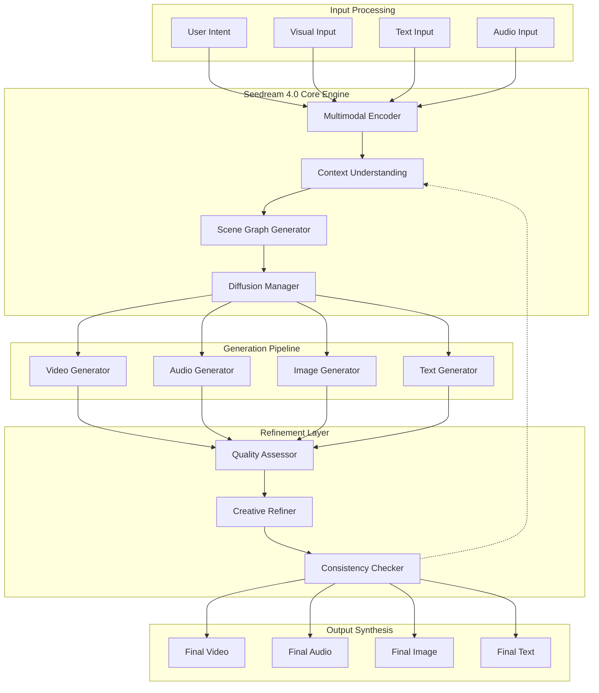

# The Secret Behind ByteDance's Seedream 4.0: Revolutionizing Multimodal Creative AI

ByteDance has just unveiled Seedream 4.0, their latest multimodal creative engine that's setting new benchmarks in AI-powered content generation. But what makes this system truly remarkable isn't just its technical prowess—it's the ingenious architectural decisions that make it feel less like using a tool and more like collaborating with a creative partner. Let's dive deep into the technical innovations that power this creative revolution.

## Why Seedream 4.0 Matters: The Creative AI Paradigm Shift

Think of traditional content creation tools as individual instruments in an orchestra—each excellent at one thing but requiring a conductor (you) to coordinate them. Seedream 4.0 is like having the entire orchestra, conductor, and composer all working in perfect harmony, understanding not just what you want to create, but *why* and *how* it should feel.

### The Multimodal Trinity: Understanding, Creating, Refining

Seedream 4.0's architecture revolves around three core capabilities that work in seamless concert:

1. **Multimodal Understanding**: Like having a creative director who speaks every visual language
2. **Contextual Generation**: Like an artist who understands not just technique but narrative
3. **Iterative Refinement**: Like a seasoned editor who knows exactly what needs tweaking

## Technical Architecture: The Engine Under the Hood



### 1. The Multimodal Encoder: A Universal Translator

Imagine trying to describe the feeling of a sunset to someone who's never seen one. You'd use words, maybe hum a melody, gesture with your hands, and reference other experiences. Seedream 4.0's multimodal encoder works similarly—it doesn't just process inputs separately but understands the *relationships* between different types of content.

**Technical Innovation**: Instead of using separate encoders for each modality, Seedream 4.0 employs a unified transformer architecture with modality-specific attention heads. This allows the system to understand, for example, how the rhythm of background music should influence the pacing of visual transitions.

### 2. Context Understanding: The Creative Intelligence

This is where Seedream 4.0 truly shines. Traditional AI models are like incredibly skilled craftspeople who can execute any technique perfectly but don't understand the story they're telling. Seedream 4.0's context understanding layer functions like a creative director who grasps not just the immediate request but the broader narrative context.

**Key Innovation**: The system maintains a persistent creative context graph that evolves throughout the generation process. Think of it as the AI's "creative memory"—it remembers not just what you've asked for, but the creative decisions that led to those requests.

### 3. The Diffusion Manager: Orchestrating Controlled Chaos

Diffusion models are fascinating because they essentially learn to "un-randomize" noise into meaningful content. But managing multiple diffusion processes for different modalities simultaneously? That's like conducting multiple orchestras playing different symphonies while ensuring they harmonize perfectly.

**Technical Deep Dive**: Seedream 4.0 introduces "cross-modal diffusion synchronization," where the denoising process for one modality (say, video) influences the denoising process for another (audio). This ensures that when a character in a generated video opens their mouth, the audio diffusion process "knows" to generate speech at that exact moment.

## The Creative Refinement Loop: Where Magic Happens

What sets Seedream 4.0 apart from its predecessors isn't just better initial generation—it's the sophisticated refinement process. Imagine having a creative collaborator who not only understands your vision but can anticipate problems you haven't even noticed yet.

### Quality Assessment: The AI Critic

The quality assessor isn't just checking for technical correctness—it's evaluating creative coherence. Does the generated content serve the narrative purpose? Is the emotional tone consistent? Are there subtle discontinuities that might break immersion?

**Analogy**: Think of it as having a film editor who can spot continuity errors, pacing issues, and emotional inconsistencies before the human eye even processes them.

### Creative Refiner: The Perfectionist Partner

This component makes micro-adjustments based on the quality assessment. It's not regenerating content from scratch but making surgical improvements—adjusting timing, refining textures, tweaking audio levels, or subtly shifting color palettes to improve overall coherence.

## Real-World Applications: Where Rubber Meets Road

### Content Creators: The Democratization of High-End Production

For individual creators, Seedream 4.0 is like having a full production studio in your pocket. You can describe a complex scene—"a melancholic character walking through a rain-soaked neon-lit city"—and get not just visually stunning footage but appropriately synchronized audio, realistic lighting physics, and consistent character movement.

### Enterprise Applications: Scaling Creative Operations

For businesses, Seedream 4.0 represents a paradigm shift in content production pipelines. Instead of maintaining separate teams for video production, audio engineering, and post-production, companies can now iterate on creative concepts at unprecedented speed while maintaining professional quality.

### Education and Training: Immersive Learning Experiences

Educational institutions can create rich, multimodal learning experiences without specialized production knowledge. Complex concepts can be visualized, narrated, and made interactive through natural language descriptions.

## Technical Challenges Solved: The Engineering Marvels

### Cross-Modal Consistency: Solving the Synchronization Problem

One of the biggest challenges in multimodal generation is maintaining consistency across different types of content. If you generate a video of someone speaking and separate audio, how do you ensure the lip movements match the words?

**Seedream 4.0's Solution**: Temporal alignment vectors that enforce consistency constraints across modalities throughout the generation process, not just at the end.

### Computational Efficiency: Making Power Accessible

Generating high-quality multimodal content traditionally requires enormous computational resources. Seedream 4.0 introduces several optimizations:

- **Progressive Generation**: Start with low-resolution/low-fidelity content and progressively refine
- **Modality Prioritization**: Intelligently determine which modalities need the most computational attention
- **Adaptive Batch Processing**: Dynamically adjust batch sizes based on content complexity

### Memory Management: Handling Creative Contexts

Maintaining creative context throughout long generation sessions requires sophisticated memory management. Seedream 4.0 uses a hierarchical memory system:

- **Immediate Context**: Current generation parameters and constraints
- **Session Context**: Creative decisions made during the current session
- **Global Context**: User preferences and style patterns learned over time

## The Competitive Landscape: How Seedream 4.0 Stacks Up

When compared to alternatives like OpenAI's Sora or Google's Gemini Vision, Seedream 4.0's key differentiator is its *creative coherence*. While other systems excel at generating high-quality individual pieces of content, Seedream 4.0 understands how those pieces fit together into a cohesive creative vision.

**Market Impact**: This isn't just an incremental improvement—it's a fundamental shift toward AI systems that think creatively rather than just execute tasks.

## Implementation Considerations: Getting Started

### For Developers

Seedream 4.0 exposes a clean API that abstracts away the complexity while providing granular control when needed:

```python
# Simplified API example
creative_engine = SeedreamEngine(
    style_consistency=True,
    cross_modal_sync=True,
    quality_threshold="high"
)

result = creative_engine.generate(
    prompt="A thoughtful product demo showcasing our new app",
    duration=30,
    aspect_ratio="16:9",
    mood="professional yet approachable"
)
```

### For Content Teams

The learning curve is surprisingly gentle. Teams report being productive within days rather than weeks, thanks to the intuitive natural language interface and intelligent defaults.

## Looking Forward: The Future of Creative AI

Seedream 4.0 represents more than just technological advancement—it's a glimpse into a future where the bottleneck in creative work shifts from technical execution to creative vision. As these systems become more sophisticated, the most valuable skill becomes not knowing how to use tools, but knowing what to create.

### Implications for the Creator Economy

- **Lower Barriers to Entry**: High-quality content creation becomes accessible to anyone with creative vision
- **Faster Iteration Cycles**: Ideas can be tested and refined in hours rather than weeks
- **New Creative Roles**: Emergence of "AI Creative Directors" who specialize in guiding AI systems

### Technical Evolution Ahead

The next frontier isn't just better generation—it's AI systems that can engage in true creative collaboration, understanding not just what you want to create but helping you discover what you didn't know you wanted to create.

## Conclusion: The Creative Revolution is Here

ByteDance's Seedream 4.0 isn't just another AI tool—it's a preview of a future where creativity and technology merge so seamlessly that the distinction becomes meaningless. For the tech community, it represents a masterclass in architectural design and cross-modal AI. For creators, it's a liberation from technical constraints. For businesses, it's a competitive advantage waiting to be harnessed.

The secret behind Seedream 4.0's success isn't any single breakthrough—it's the thoughtful integration of multiple advanced techniques into a system that feels less like technology and more like magic. And perhaps that's the most impressive achievement of all: making incredibly complex technology feel effortlessly simple.

*As we stand at this inflection point in creative AI, one thing is certain: the future of content creation will be limited only by our imagination, not our tools.*

---

## Technical References and Further Reading

- **Cross-Modal Attention Mechanisms**: "Attention Is All You Need" and subsequent multimodal adaptations
- **Diffusion Model Synchronization**: Recent advances in temporal consistency for generative models
- **Creative AI Evaluation**: Emerging frameworks for assessing creative AI output quality
- **Production Pipeline Integration**: Best practices for incorporating generative AI into content workflows

*Want to discuss the implications of creative AI for your industry? Let's connect on LinkedIn and explore how these technologies might transform your creative workflows.*