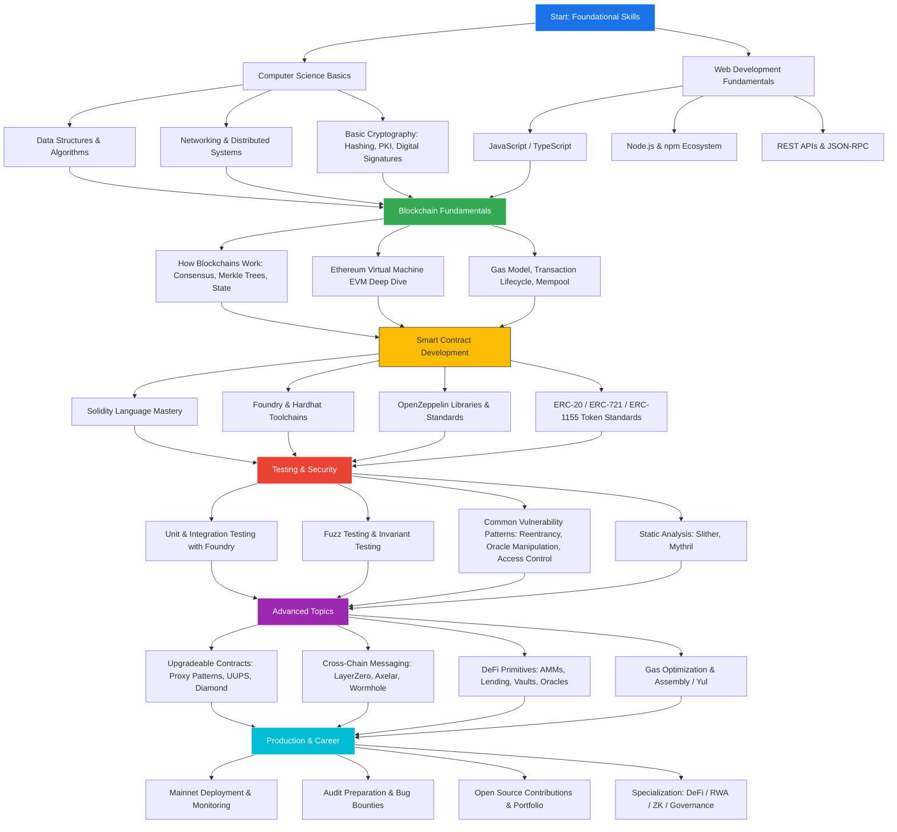

# How to Become a Smart Contract Engineer: A Complete Learning Path

The demand for smart contract engineers has surged as decentralized finance (DeFi), real-world asset (RWA) tokenization, and on-chain governance reshape how value moves across the internet. Smart contract engineers sit at the intersection of software engineering, cryptography, and financial systems design — a rare combination that commands premium compensation and significant influence over protocol-level decisions.

This guide distills the learning journey into a structured roadmap so you can plan your path from beginner to production-grade smart contract engineer.

---

## Learning Path Roadmap

---

## Phase 1: Foundational Skills

### Computer Science Basics

Before writing a single line of Solidity, you need solid grounding in:

- **Data structures & algorithms** — Hash maps, trees, and graph traversal are directly relevant to understanding how blockchains store and validate state.
- **Networking & distributed systems** — Concepts such as Byzantine fault tolerance, eventual consistency, and peer-to-peer gossip protocols underpin every blockchain.
- **Basic cryptography** — Understand hashing functions (SHA-256, Keccak-256), public-key infrastructure, digital signatures (ECDSA, EdDSA), and Merkle trees.

### Web Development Fundamentals

Most smart contract tooling is JavaScript/TypeScript-based:

- **JavaScript / TypeScript** — The lingua franca of Web3 frontend and scripting layers.
- **Node.js & npm** — Package management, scripting, and build tooling.
- **REST APIs & JSON-RPC** — The interface layer for communicating with blockchain nodes (e.g., `eth_call`, `eth_sendRawTransaction`).

---

## Phase 2: Blockchain Fundamentals

### How Blockchains Work

Study the mechanics end-to-end:

1. **Consensus mechanisms** — Proof of Work, Proof of Stake, and their trade-offs.
2. **State model** — Account-based (Ethereum) vs. UTXO-based (Bitcoin).
3. **Block structure** — Headers, transaction roots, receipts trie, state trie.

### EVM Deep Dive

The Ethereum Virtual Machine is the runtime environment for most smart contracts:

- Understand the **stack-based architecture** and opcode set.
- Study **storage layout** — how `mapping`, `array`, and `struct` are packed into 32-byte slots.
- Learn the **gas model** — why `SSTORE` is expensive, how EIP-2929 changed cold/warm access costs, and how to estimate gas.

### Transaction Lifecycle

Follow a transaction from creation to finality:

`User signs tx → JSON-RPC to node → Mempool → Block proposer includes tx → EVM execution → State transition → Block finalization`

Understanding the mempool is critical for appreciating MEV (Maximal Extractable Value) and front-running risks.

---

## Phase 3: Smart Contract Development

### Solidity Mastery

Solidity is the dominant language for EVM-based chains. Key topics:

- **Value types vs. reference types** — `uint256`, `address`, `bytes32` vs. `mapping`, `struct`, arrays.
- **Visibility & access control** — `public`, `external`, `internal`, `private`, and custom modifiers.
- **Inheritance & interfaces** — Contract composition, abstract contracts, and interface adherence.
- **Events & logging** — Indexed vs. non-indexed parameters for efficient off-chain querying.
- **Error handling** — `require`, `revert`, custom errors (cheaper gas since Solidity 0.8.4).

### Toolchains

Modern smart contract development relies on two primary toolchains:

| Tool | Language | Strengths |
|------|----------|-----------|
| **Foundry** (forge, cast, anvil) | Solidity tests | Fast compilation, fuzz testing, mainnet forking |
| **Hardhat** | JS/TS tests | Rich plugin ecosystem, wide adoption, TypeChain |

Start with Foundry for its speed and native Solidity testing, then learn Hardhat for JavaScript integration tests and deployment scripts.

### Token Standards

Master the core ERC standards:

- **ERC-20** — Fungible tokens (the backbone of DeFi).
- **ERC-721** — Non-fungible tokens (NFTs).
- **ERC-1155** — Multi-token standard (batch operations, mixed fungible/non-fungible).
- **ERC-4626** — Tokenized vaults (standardized yield-bearing tokens).

Use **OpenZeppelin Contracts** as your starting library — battle-tested, audited, and widely used.

---

## Phase 4: Testing & Security

Security is not an afterthought; it is a core competency.

### Testing Strategy

1. **Unit tests** — Test individual functions in isolation.
2. **Integration tests** — Test contract interactions across multiple contracts.
3. **Fuzz testing** — Supply random inputs to discover edge cases (Foundry's `forge test --fuzz-runs 10000`).
4. **Invariant testing** — Define properties that must always hold; the fuzzer tries to break them.
5. **Fork testing** — Test against a fork of mainnet state to validate real-world interactions.

### Common Vulnerability Patterns

Study the canonical vulnerability classes:

| Vulnerability | Description | Mitigation |
|--------------|-------------|------------|
| Reentrancy | External call before state update | Checks-Effects-Interactions pattern, ReentrancyGuard |
| Oracle manipulation | Price feed tampered via flash loan | TWAP oracles, multi-source aggregation |
| Access control | Missing role checks | OpenZeppelin AccessControl, Ownable2Step |
| Integer overflow | Arithmetic wraps around | Solidity ≥0.8 built-in checks |
| Front-running | MEV bots exploit pending transactions | Commit-reveal, private mempools |
| Storage collision | Proxy upgrades overwrite slots | EIP-1967 storage slots, unstructured storage |

### Static Analysis Tools

- **Slither** — Fast static analyzer by Trail of Bits; catches common patterns.
- **Mythril** — Symbolic execution engine; finds deeper logic bugs.
- **Certora Prover** — Formal verification for critical invariants.

---

## Phase 5: Advanced Topics

### Upgradeable Contracts

Most production protocols need upgradeability:

- **Transparent Proxy** — Separate admin and user call paths.
- **UUPS (EIP-1822)** — Upgrade logic lives in the implementation contract.
- **Diamond Standard (EIP-2535)** — Modular facets for large-scale contracts.

### Cross-Chain Development

As the ecosystem fragments across L1s and L2s, cross-chain messaging becomes essential:

- **LayerZero** — Omnichain fungible tokens (OFT), generic messaging.
- **Axelar / Wormhole** — General message passing with validator networks.
- **Rollup bridges** — Native bridges for Optimistic and ZK rollups.

### DeFi Primitives

Understanding DeFi building blocks is mandatory:

- **Automated Market Makers (AMMs)** — Uniswap V2/V3/V4, Curve, Balancer.
- **Lending protocols** — Aave, Compound, Morpho.
- **Vaults & yield aggregators** — Yearn, ERC-4626 standard.
- **Oracles** — Chainlink, Pyth, Uniswap TWAP.

### Gas Optimization

When every opcode costs money, optimization matters:

- Pack storage variables into single 32-byte slots.
- Use `calldata` instead of `memory` for read-only function parameters.
- Prefer `uint256` over smaller types (EVM operates on 256-bit words natively).
- Use inline assembly (Yul) for hot paths where Solidity generates suboptimal code.

---

## Phase 6: Production & Career

### Mainnet Deployment

Deploying to mainnet is a ceremony, not a click:

1. Finalize audit findings and apply fixes.
2. Deploy via a multi-sig or governance proposal.
3. Verify source code on Etherscan / Sourcify.
4. Set up monitoring: Forta agents, OpenZeppelin Defender, or custom Tenderly alerts.
5. Publish deployment addresses and ABIs for integrators.

### Building Your Portfolio

- **Contribute to open source** — Submit PRs to OpenZeppelin, Uniswap, Aave, or smaller protocols.
- **Bug bounties** — Immunefi, Code4rena, Sherlock, and Hats Finance.
- **Write about what you learn** — Technical blog posts demonstrate depth.
- **Build and ship** — A deployed protocol on testnet or mainnet speaks louder than a resume.

### Specialization Tracks

As you mature, consider specializing:

| Track | Focus Areas |
|-------|-------------|
| **DeFi Engineer** | AMMs, lending, derivatives, MEV |
| **RWA / Tokenization** | Compliance, SEC frameworks, off-chain oracles |
| **ZK Engineer** | Circom, Halo2, PLONK, privacy protocols |
| **Security Researcher** | Auditing, formal verification, bug bounties |
| **Protocol Governance** | On-chain voting, DAO tooling, treasury management |

---

## Recommended Resources

| Resource | Type | Link |
|----------|------|------|
| CryptoZombies | Interactive tutorial | [cryptozombies.io](https://cryptozombies.io) |
| Solidity by Example | Code snippets | [solidity-by-example.org](https://solidity-by-example.org) |
| Foundry Book | Official docs | [book.getfoundry.sh](https://book.getfoundry.sh) |
| OpenZeppelin Docs | Library reference | [docs.openzeppelin.com](https://docs.openzeppelin.com) |
| Damn Vulnerable DeFi | Security challenges | [damnvulnerabledefi.xyz](https://www.damnvulnerabledefi.xyz) |
| EVM Codes | Opcode reference | [evm.codes](https://www.evm.codes) |
| Secureum | Security bootcamp | [secureum.xyz](https://secureum.xyz) |

---

## Conclusion

Becoming a smart contract engineer is not a weekend project — it is a deliberate, multi-phase journey that combines traditional software engineering discipline with blockchain-specific knowledge. The roadmap above gives you a structured path, but the key accelerator is **building in public**: deploy contracts, break things on testnets, contribute to audits, and share your findings. The ecosystem rewards builders, and the barrier to entry is lower than it appears once you commit to the fundamentals.

Start with Phase 1, follow the Mermaid roadmap above, and ship your first contract within 30 days. The rest follows from consistent practice and curiosity.
