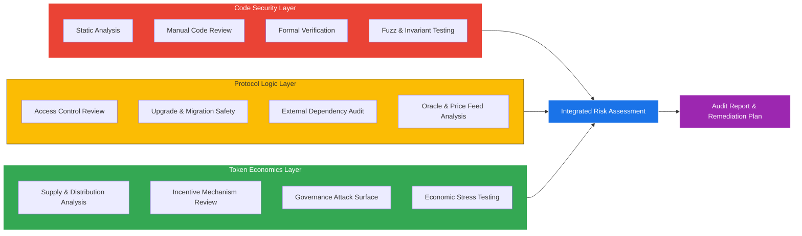

# Smart Contract Auditing & Screening: Industrial Best Practices Combined with Token Economics

Smart contract audits have traditionally focused on code-level vulnerabilities — reentrancy, access control, integer overflow. While these checks remain essential, the most devastating exploits in recent years have not been pure code bugs. They have been **economic exploits**: flash-loan-driven oracle manipulations, governance attacks funded by borrowed tokens, and incentive misalignments that drained treasuries over months rather than minutes.

A modern audit framework must combine **code security analysis** with **token-economic screening** to catch both classes of risk. This guide presents an integrated methodology used by leading audit firms and adapted for internal security teams.

---

## The Integrated Audit Framework

A comprehensive smart contract audit operates across three layers:



---

## Layer 1: Code Security Analysis

### 1.1 Static Analysis

Static analysis tools scan the codebase without executing it, flagging known vulnerability patterns:

| Tool | Approach | Best For |
|------|----------|----------|
| **Slither** | Pattern matching, data flow | Fast first pass, CI integration |
| **Mythril** | Symbolic execution | Deep logic bugs, path exploration |
| **Semgrep** | Custom rule engine | Organization-specific patterns |
| **Aderyn** | Rust-based analyzer | Fast Solidity-specific checks |

**Best practice**: Run Slither as a CI gate on every pull request. Use Mythril for deeper pre-audit scans. Write custom Semgrep rules for project-specific invariants.

### 1.2 Manual Code Review

No tool replaces a human auditor reading every line. The manual review should follow a checklist:

- [ ] **All external calls** use Checks-Effects-Interactions pattern
- [ ] **Access control** is applied to every state-changing function
- [ ] **Reentrancy guards** protect functions that transfer value
- [ ] **Input validation** covers boundary conditions and zero addresses
- [ ] **Event emission** occurs for every state change (for off-chain monitoring)
- [ ] **Upgrade safety** — no storage collisions, initializers are protected
- [ ] **Arithmetic** — confirm Solidity ≥0.8 or SafeMath usage
- [ ] **Denial of service** — no unbounded loops over user-controlled arrays
- [ ] **Timestamp dependence** — no critical logic relying on `block.timestamp` precision

### 1.3 Formal Verification

For critical protocol components (e.g., core lending logic, bridge message verification), formal verification provides mathematical guarantees:

- **Certora Prover** — Write specifications in CVL (Certora Verification Language) that express invariants. The prover exhaustively checks all reachable states.
- **Halmos** — Symbolic testing using Foundry-style tests, bridging the gap between fuzzing and full formal verification.
- **K Framework** — Full formal semantics for EVM bytecode verification.

**When to use formal verification**: For any function that controls token minting, burning, or transfer authorization. The cost of formal verification is a fraction of the value at risk.

### 1.4 Fuzz Testing & Invariant Testing

Fuzzing complements static analysis by exploring runtime behavior:

```
forge test --match-test testFuzz --fuzz-runs 100000
```

**Invariant testing** is particularly powerful for token economics: define properties like "total supply must equal sum of all balances" or "no single address can hold more than X% of supply," then let the fuzzer try to violate them.

---

## Layer 2: Protocol Logic Analysis

### 2.1 Access Control Review

Map every privileged function to its required role:

| Function | Required Role | Risk if Compromised |
|----------|---------------|---------------------|
| `mint()` | MINTER_ROLE | Infinite inflation |
| `pause()` | PAUSER_ROLE | Protocol freeze |
| `upgradeTo()` | UPGRADER_ROLE | Full contract takeover |
| `setOracle()` | ADMIN_ROLE | Price manipulation |

**Best practice**: Use **OpenZeppelin AccessControl** with role-based permissions. Require multi-sig or timelock for all admin functions. Document the intended role hierarchy.

### 2.2 Upgrade & Migration Safety

Upgradeable contracts introduce a persistent attack surface:

- Verify **EIP-1967 storage slots** are used correctly.
- Check that **initializers cannot be re-invoked** (use `initializer` modifier from OpenZeppelin).
- Ensure the **upgrade function is properly gated** (timelocked, multi-sig, or governance-controlled).
- Run **storage layout compatibility checks** between old and new implementations (`forge inspect --storage-layout`).

### 2.3 External Dependency Audit

Smart contracts do not exist in isolation. Review every external contract interaction:

- **Which oracles are used?** — Chainlink, Pyth, Uniswap TWAP, custom.
- **What happens if the oracle returns stale data?** — Check for staleness thresholds.
- **Are there flash-loan-resistant price checks?** — Spot prices from AMMs are trivially manipulable.
- **What third-party libraries are imported?** — Pin exact versions; review any unverified dependencies.

### 2.4 Oracle & Price Feed Analysis

Oracle manipulation is the single largest category of DeFi exploits by dollar value. The audit must verify:

1. **Multi-source aggregation** — Do not rely on a single price source.
2. **Staleness checks** — Reject prices older than a defined threshold.
3. **Deviation bounds** — Flag prices that deviate more than X% from a TWAP.
4. **Flash-loan resistance** — Use TWAP over multiple blocks, not instantaneous spot prices.
5. **Circuit breakers** — Automatically pause the protocol if prices move beyond expected bounds.

---

## Layer 3: Token Economics Analysis

This is where most audit firms stop — and where the most sophisticated exploits begin.

### 3.1 Supply & Distribution Analysis

Examine the token's supply mechanics:

- **Total supply** — Is it fixed, inflationary, or deflationary?
- **Minting authority** — Who can mint? Under what conditions? Is there a cap?
- **Burn mechanics** — Are tokens burned on transactions? What is the long-term deflationary pressure?
- **Vesting schedules** — When do team/investor tokens unlock? Can a large unlock event crash the market?

**Red flags**:
- Minting authority held by a single EOA (externally owned account).
- No cap on minting, combined with a governance system that can be captured.
- Cliff vesting with >20% of supply unlocking simultaneously.

### 3.2 Incentive Mechanism Review

Token incentives drive user behavior. Misaligned incentives create exploitable loops:

**Questions to answer**:
- Do staking rewards exceed protocol revenue? (Unsustainable yield)
- Can a user stake-and-unstake in the same transaction to claim rewards? (Flash-loan staking)
- Does the reward distribution formula handle edge cases: zero total staked, single staker, rapid stake/unstake?
- Are liquidity mining rewards time-weighted or snapshot-based? (Snapshot-based rewards are gameable)

**Economic modeling**: Build a spreadsheet or Python simulation of the token economy under adversarial conditions:

1. Model a **whale accumulation** scenario — what happens if one actor controls 30% of supply?
2. Model a **rapid exit** scenario — what happens if 50% of stakers exit in one epoch?
3. Model a **flash-loan governance attack** — can an attacker borrow tokens, vote, and return them in one transaction?

### 3.3 Governance Attack Surface

On-chain governance creates an additional attack surface that pure code audits miss:

| Attack Vector | Description | Mitigation |
|--------------|-------------|------------|
| Flash-loan voting | Borrow tokens, vote, return | Vote-escrow (veToken), snapshot at proposal creation |
| Low-quorum capture | Pass proposals when voter participation is low | Dynamic quorum, minimum vote thresholds |
| Timelock bypass | Execute proposals before community can react | Minimum timelock delay (48-72 hours) |
| Proposal spam | Flood governance with proposals to cause voter fatigue | Proposal deposit requirement |
| Delegate concentration | Small number of delegates control majority of votes | Delegate decay, quadratic voting |

### 3.4 Economic Stress Testing

Go beyond code to simulate economic attacks:

**Flash Loan Attack Simulation**:
1. Identify every function that reads a price or balance.
2. For each, determine if the value can be manipulated within a single transaction.
3. Model the profit an attacker could extract by manipulating that value.
4. Verify that the protocol's defenses (TWAP, multi-block delay, circuit breakers) prevent the attack.

**Bank Run Simulation**:
1. Model what happens when all depositors try to withdraw simultaneously.
2. Check for cascading liquidations — can one large withdrawal trigger a chain of liquidations?
3. Verify the protocol's solvency under 3σ market moves.

**MEV Analysis**:
1. Identify transactions that are profitable to front-run or sandwich.
2. Evaluate whether the protocol design minimizes extractable value.
3. Check for commit-reveal schemes or private mempool integration.

---

## The Integrated Audit Process

### Step 1: Scoping (1-2 days)

- Define the contracts in scope.
- Identify the token model and economic assumptions.
- Review documentation, whitepapers, and economic models.
- Establish severity classification (Critical / High / Medium / Low / Informational).

### Step 2: Automated Analysis (1-2 days)

- Run Slither, Mythril, and Aderyn.
- Execute existing test suites; measure coverage.
- Run invariant tests against token economic properties.

### Step 3: Manual Review (5-15 days, depending on scope)

- Line-by-line code review by at least two independent auditors.
- Protocol logic analysis: access control, upgrade paths, external dependencies.
- Token economics analysis: supply, incentives, governance, stress testing.

### Step 4: Findings & Remediation (3-5 days)

- Compile findings with severity, description, and recommended fix.
- Discuss findings with the development team.
- Verify fixes do not introduce new issues.

### Step 5: Final Report

The report should include:

1. **Executive summary** — Risk level, key findings, overall assessment.
2. **Scope & methodology** — Contracts audited, tools used, economic models reviewed.
3. **Findings** — Categorized by severity, with code references and recommended fixes.
4. **Token economics assessment** — Supply analysis, incentive review, governance risk.
5. **Remediation status** — Which findings were fixed, acknowledged, or disputed.

---

## Screening Checklist: Before You Invest or Integrate

For teams evaluating whether to integrate with or invest in a protocol, use this quick-screening checklist:

### Code Quality Signals

- [ ] At least one reputable audit completed (Trail of Bits, OpenZeppelin, Consensys Diligence, Spearbit, Cantina)
- [ ] Source code verified on block explorer (Etherscan, Sourcify)
- [ ] Active bug bounty program (Immunefi, Code4rena)
- [ ] Test coverage >90% with fuzz tests
- [ ] No critical/high findings unresolved

### Token Economics Signals

- [ ] Token supply is capped or inflation rate is bounded and transparent
- [ ] Vesting schedule is published and verifiable on-chain
- [ ] Governance requires vote-escrow or snapshot-based voting (flash-loan resistant)
- [ ] Protocol revenue covers or exceeds token emissions (sustainable yield)
- [ ] No single entity controls >30% of governance power

### Operational Security Signals

- [ ] Admin keys are behind a multi-sig (≥3/5 signers)
- [ ] Timelock on all governance actions (≥48 hours)
- [ ] Monitoring and alerting in place (Forta, OpenZeppelin Defender, Tenderly)
- [ ] Incident response plan documented
- [ ] Regular re-audits scheduled (at minimum after major upgrades)

---

## Conclusion

Auditing a smart contract without analyzing its token economics is like inspecting a building's electrical wiring while ignoring its structural foundation. The most sophisticated attackers today exploit **economic design flaws** — governance capture, oracle manipulation, unsustainable incentives — not buffer overflows.

An integrated audit that combines code security, protocol logic, and token-economic analysis provides the comprehensive coverage that modern DeFi demands. Whether you are an auditor, a protocol team, or an investor performing due diligence, the framework above gives you a systematic approach to evaluating smart contract risk across all three dimensions.
