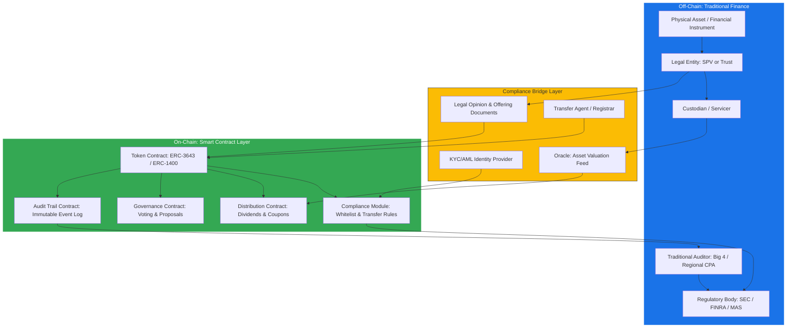
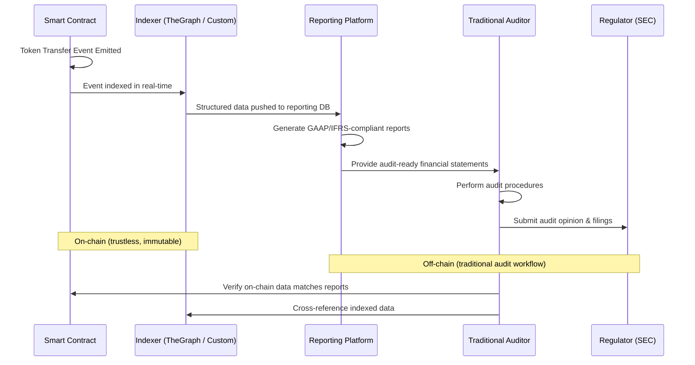
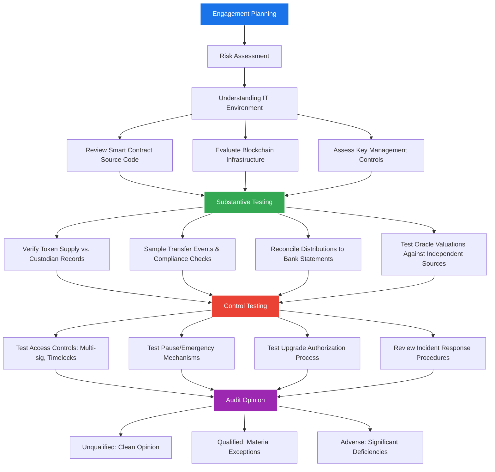

# Smart Contracts in RWA: How On-Chain Assets Interact with Audit Agencies for SEC and Regulatory Compliance

Real-World Asset (RWA) tokenization is the process of representing ownership of physical or financial assets — real estate, bonds, commodities, private equity, carbon credits — as digital tokens on a blockchain. Unlike purely native crypto assets, RWA tokens must satisfy two parallel requirement sets: the **technical requirements** of on-chain security and the **legal requirements** of securities regulation, accounting standards, and traditional audit frameworks.

This creates a unique engineering challenge: smart contracts for RWA must be designed from day one to be **auditable by entities that do not read Solidity** — the SEC, PCAOB-registered auditors, bank examiners, and legal compliance teams.

This guide explains how smart contracts are used in RWA tokenization, how they interact with traditional audit agencies, and the architectural patterns that make this possible.

---

## How Smart Contracts Are Used in RWA

### The RWA Tokenization Stack



### Core Smart Contract Components

#### 1. Security Token Contract (ERC-3643 / ERC-1400)

Unlike ERC-20 tokens that anyone can transfer freely, security tokens enforce compliance rules at the contract level:

- **ERC-3643 (T-REX)** — The most widely adopted standard for regulated security tokens. Developed by Tokeny, it integrates identity verification directly into the transfer function.
- **ERC-1400** — A standard for partitioned security tokens, supporting multiple classes (e.g., Series A vs. Series B) within a single contract.

Key difference from ERC-20:

```
// ERC-20: Anyone can transfer
function transfer(address to, uint256 amount) → bool

// ERC-3643: Transfer checks compliance before execution
function transfer(address to, uint256 amount) → bool
    requires: identityRegistry.isVerified(to)
    requires: complianceModule.canTransfer(msg.sender, to, amount)
    requires: !paused
```

Every transfer passes through a **compliance gate** that checks:
- Is the recipient KYC/AML verified?
- Does the transfer violate investor count limits (e.g., Reg D 99-investor cap)?
- Does the recipient's jurisdiction allow holding this asset?
- Would this transfer breach concentration limits?

#### 2. Compliance Module

The compliance module encodes regulatory rules as on-chain logic:

| Rule | Regulation | Smart Contract Implementation |
|------|-----------|-------------------------------|
| Maximum investor count | SEC Reg D (506b): 35 non-accredited | `require(investorCount <= maxInvestors)` |
| Accredited investor only | SEC Reg D (506c) | `require(identityRegistry.isAccredited(to))` |
| Holding period | SEC Rule 144: 6-12 months | `require(block.timestamp >= purchaseTime + holdingPeriod)` |
| Geographic restriction | Varies by jurisdiction | `require(allowedCountries[identityRegistry.country(to)])` |
| Transfer volume limit | Anti-manipulation | `require(dailyVolume + amount <= maxDailyVolume)` |

#### 3. Distribution Contract

For yield-bearing assets (bonds, real estate, revenue-sharing tokens), the distribution contract automates coupon/dividend payments:

- Calculate each holder's pro-rata share based on token balance at a **snapshot block**.
- Distribute stablecoins (USDC, USDT) or fiat on-ramp credits.
- Record all distributions as on-chain events for audit trail.

#### 4. Audit Trail Contract

This is the critical component for traditional audit integration — an immutable, append-only event log:

- **Token issuance and redemption events**
- **Transfer events** with compliance check results
- **Valuation updates** from oracle feeds
- **Distribution events** with per-holder amounts
- **Governance actions** (parameter changes, compliance rule updates)
- **Pause/unpause events** with reason codes

---

## How Smart Contracts Interact with Traditional Audit Agencies

### The Audit Gap

Traditional auditors (Big 4 firms, regional CPAs, PCAOB-registered firms) are accustomed to:
- Reviewing bank statements and custodian reports
- Sampling transactions from databases
- Verifying asset existence through physical inspection or third-party confirmation
- Testing internal controls via walkthroughs and observation

Smart contracts introduce a fundamentally different paradigm: the **ledger is public**, **transactions are immutable**, and **business logic is encoded in bytecode**. This creates both opportunities (perfect transaction records) and challenges (auditors cannot read Solidity).

### The Compliance Bridge Architecture

The solution is a **Compliance Bridge** — a set of off-chain services and on-chain contracts that translate blockchain state into formats traditional auditors can consume:



### Key Integration Points

#### 1. Event Indexing & Data Pipeline

On-chain events are indexed into a queryable database:

- **The Graph** — Decentralized indexing protocol; subgraphs define which events to index.
- **Custom indexers** — Many RWA platforms run proprietary indexers for regulatory data.
- **Dune Analytics / Flipside** — For ad-hoc queries and dashboards.

The indexed data feeds into a **reporting platform** that generates:
- **Balance reports** — Token holder balances at any point in time.
- **Transaction reports** — Complete transfer history with compliance check results.
- **Distribution reports** — All dividend/coupon payments with per-holder breakdowns.
- **NAV reports** — Net asset value calculations using oracle-fed valuations.

#### 2. Proof of Reserves

For asset-backed tokens, auditors need to verify that the on-chain token supply matches the off-chain asset base:

| Verification | On-Chain Source | Off-Chain Source |
|-------------|----------------|-----------------|
| Total supply | `token.totalSupply()` | Custodian statement |
| Asset valuation | Oracle price feed | Independent appraisal |
| Reserve ratio | Supply × price vs. reserve | Bank/custodian balance |
| Holder count | Identity registry | Transfer agent records |

**Chainlink Proof of Reserve** is an emerging standard that automates this verification by connecting on-chain supply data to off-chain reserve attestations.

#### 3. GAAP/IFRS Compliance Mapping

Smart contract events must map to accounting entries:

| Smart Contract Event | Accounting Treatment (GAAP) |
|---------------------|----------------------------|
| Token issuance | Liability (if debt) or Equity (if equity) |
| Token transfer | No P&L impact; update holder registry |
| Dividend distribution | Reduce retained earnings, increase liability |
| Token redemption | Reduce liability/equity, reduce cash |
| Valuation oracle update | Fair value adjustment (ASC 820) |
| Impairment trigger | Write-down (ASC 326 for credit losses) |

Reporting platforms like **Bitwave**, **Lukka**, and **Cryptio** specialize in mapping on-chain activity to GAAP/IFRS-compliant journal entries.

---

## Making Smart Contracts Auditable for the SEC

### SEC Regulatory Framework for Digital Assets

The SEC evaluates digital assets primarily through the **Howey Test**: an investment contract exists when there is (1) an investment of money, (2) in a common enterprise, (3) with an expectation of profits, (4) derived from the efforts of others.

Most RWA tokens satisfy the Howey Test and are therefore **securities**. This triggers registration and reporting requirements under:

- **Securities Act of 1933** — Registration of new securities offerings.
- **Securities Exchange Act of 1934** — Ongoing reporting for registered securities.
- **Regulation D** — Exemptions for private placements (506(b), 506(c)).
- **Regulation S** — Exemptions for offshore transactions.
- **Regulation A+** — "Mini-IPO" for offerings up to $75M.

### Smart Contract Design for SEC Compliance

#### Transfer Restrictions

The SEC requires that securities transfers comply with applicable exemptions. The smart contract must enforce:

1. **Lock-up periods** — Reg D securities typically cannot be resold for 6-12 months.
2. **Accredited investor verification** — For 506(c) offerings, all purchasers must be verified accredited investors.
3. **Investor count limits** — Reg D 506(b) limits non-accredited investors to 35.
4. **Blue sky laws** — State-level restrictions on who can purchase.
5. **Bad actor disqualification** — SEC Rule 506(d) prohibits certain individuals from participating.

All of these are encoded in the **compliance module** and checked on every transfer.

#### Reporting & Disclosure

Registered securities require periodic reporting:

| Filing | Frequency | Smart Contract Data Source |
|--------|-----------|--------------------------|
| Form D | At offering | Issuance events, investor registry |
| Form 10-K | Annual | Full-year transaction history, NAV |
| Form 10-Q | Quarterly | Quarterly transaction history, distributions |
| Form 8-K | Event-driven | Material events (pause, upgrade, oracle change) |
| Schedule 13D/G | Ownership threshold | Holder balance monitoring (≥5% ownership) |

The smart contract's **audit trail contract** emits events that feed directly into these filings.

#### Custody Requirements

SEC Rule 206(4)-2 (the "Custody Rule") requires qualified custodians for client assets. For tokenized assets:

- The **underlying asset** must be held by a qualified custodian (e.g., bank, broker-dealer, trust company).
- The **private keys** controlling the token contract's admin functions should be in institutional-grade custody (e.g., Fireblocks, Anchorage, Copper).
- Multi-sig wallets (e.g., Safe) with geographically distributed signers satisfy custody controls.

---

## Interaction Model with Traditional Audit Agencies

### Big 4 Audit Workflow for Tokenized Assets



### What Auditors Examine

#### 1. Smart Contract Code Review

Big 4 firms increasingly have blockchain-specialized teams (e.g., EY OpsChain, Deloitte COINIA, PwC's blockchain assurance practice). They review:

- **Source code verification** — Is the deployed bytecode identical to the published source?
- **Third-party audit reports** — Has the contract been audited by a reputable security firm?
- **Known vulnerability assessment** — Are there any open findings from audits or bug bounties?
- **Code change history** — If upgradeable, what changes have been made and were they authorized?

#### 2. Token Supply & Reserve Verification

The most critical audit procedure: **does the token supply match the underlying assets?**

Procedure:
1. Query `totalSupply()` from the token contract at the audit date.
2. Obtain independent confirmation from the qualified custodian of assets held.
3. Reconcile on-chain supply to off-chain reserves.
4. Investigate and document any discrepancies.

#### 3. Transaction Sampling

Auditors sample token transfers and verify:
- The transfer passed all compliance checks (KYC, jurisdiction, holding period).
- The transfer was authorized (not the result of a compromised key).
- The transfer is accurately reflected in the reporting platform's financial statements.

#### 4. Internal Control Testing

For SOC 2 or ISAE 3402 engagements:

| Control Objective | Smart Contract Implementation | Audit Test |
|-------------------|------------------------------|-----------|
| Authorized access only | Multi-sig with threshold | Verify signer list and threshold configuration |
| Change management | Timelock on upgrades | Review upgrade history, verify timelock delays |
| Segregation of duties | Separate roles (minter, pauser, admin) | Verify role assignments, no single key has multiple roles |
| Business continuity | Pause mechanism | Test pause/unpause functionality |
| Data integrity | Immutable event log | Cross-reference on-chain events to off-chain records |

---

## Emerging Standards and Frameworks

### AICPA's Digital Assets Accounting Guidance

The American Institute of Certified Public Accountants (AICPA) has published guidance on:
- Classification of digital assets (intangible asset vs. financial instrument).
- Fair value measurement for digital assets.
- Custody and safeguarding considerations.
- Internal control frameworks for blockchain-based systems.

### PCAOB Considerations

The Public Company Accounting Oversight Board is evaluating:
- How to audit distributed ledger technology-based records.
- Whether blockchain-native records meet the definition of "sufficient appropriate audit evidence."
- Standards for auditing smart contract logic as part of IT general controls.

### ISAE 3000 / SOC 2 for Tokenization Platforms

Tokenization platforms increasingly pursue SOC 2 Type II reports covering:
- Security, availability, and confidentiality of the tokenization infrastructure.
- Smart contract deployment and upgrade controls.
- Key management and custody procedures.
- Incident response and disaster recovery.

### Basel Committee on Digital Asset Exposure

For banks holding tokenized assets, the Basel Committee's framework (effective January 2025) classifies digital assets by risk:
- **Group 1a** — Tokenized traditional assets with full reserve backing → standard capital treatment.
- **Group 1b** — Stablecoins with effective stabilization mechanisms → standard capital treatment with add-ons.
- **Group 2** — Unbacked crypto assets → 1250% risk weight.

Smart contracts that can **prove reserve backing on-chain** help classify tokens into the more favorable Group 1a category.

---

## Practical Architecture for an Auditable RWA Platform

### Recommended Technology Stack

| Layer | Component | Purpose |
|-------|-----------|---------|
| **Token** | ERC-3643 (T-REX) | Compliant security token with identity integration |
| **Identity** | On-chain identity registry + off-chain KYC provider (Jumio, Onfido) | Whitelist management |
| **Compliance** | Modular compliance contracts | Enforce transfer rules per jurisdiction |
| **Oracle** | Chainlink + independent appraiser | Asset valuation and proof of reserves |
| **Custody** | Fireblocks / Anchorage + Safe multi-sig | Key management and asset custody |
| **Indexing** | The Graph + custom indexer | Event indexing and query layer |
| **Reporting** | Bitwave / Lukka / custom | GAAP/IFRS financial reporting |
| **Audit** | Immutable event log + off-chain attestations | Audit-ready data package |

### Design Principles

1. **Transparency by default** — Every state change emits an event. Every compliance check result is logged.
2. **Separation of concerns** — Token logic, compliance logic, and distribution logic are in separate contracts.
3. **Immutable audit trail** — The audit trail contract is non-upgradeable. Once an event is emitted, it cannot be altered.
4. **Off-chain readability** — Generate human-readable reports from on-chain data for auditors who do not interact with blockchain directly.
5. **Regulator access** — Provide read-only dashboards or API endpoints for regulators to query on-chain state independently.

---

## Conclusion

Smart contracts in RWA tokenization are not just about putting assets on-chain — they are about building a **compliance-native infrastructure** that satisfies both the immutability guarantees of blockchain and the accountability requirements of traditional finance.

The key insight is that **the smart contract itself is the internal control**. When transfer restrictions, distribution logic, and audit trails are encoded in verified, audited, and immutable smart contracts, the audit process becomes more reliable, not less. The challenge is bridging the gap between on-chain data and the formats, standards, and workflows that the SEC, Big 4 auditors, and bank examiners expect.

The platforms that get this right — by adopting compliant token standards (ERC-3643), implementing robust compliance modules, maintaining immutable audit trails, and integrating with traditional reporting systems — will be the ones that unlock the $16 trillion opportunity in tokenized real-world assets.

The future of finance is not on-chain or off-chain. It is both, connected by smart contracts that speak the language of regulation as fluently as they speak the language of code.
