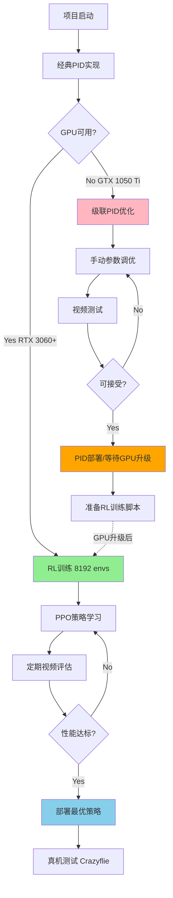

# 从零开始的无人机悬停控制：机器人学、强化学习与GPU现实

让一架四旋翼无人机稳定地悬停在空中，看似简单，实则是一个融合了经典控制理论、现代机器人学和强化学习的复杂问题。本文将带你深入了解无人机控制的核心概念，探索为什么强化学习（RL）正在改变机器人控制的范式，并分享我们在实际开发中遇到的硬件限制与解决方案。

## 视频演示

在深入技术细节之前，先看看我们的成果：

📹 **无人机悬停测试视频**
- [drone_hovering_test.mp4](../drone_hovering_test.mp4) - 展示了使用级联PID控制器的无人机尝试悬停到目标点
- 视频中可以看到无人机对目标的响应、姿态调整和稳定性挑战

**视频参数说明：**
- **仿真频率**：100Hz（每秒100次控制更新）
- **目标点**：红色球体标记，位置随机生成在±1米范围内
- **初始高度**：1.0米
- **无人机型号**：Crazyflie 2.x（经典的微型四旋翼平台）

---

## 第一部分：机器人学基础 - 为什么无人机控制这么难？

### 1.1 四旋翼无人机的物理模型

四旋翼无人机是一个典型的**欠驱动系统**（underactuated system）——它有6个自由度（3个位置 + 3个姿态），但只有4个控制输入（4个电机的转速）。这意味着无人机**不能直接控制所有维度的运动**。

#### 关键概念：自由度（Degrees of Freedom, DOF）

无人机在3D空间中的完整状态包括：

**位置（Position）：**
- `x`：前后位置（米）
- `y`：左右位置（米）
- `z`：上下高度（米）

**姿态（Orientation）：**
- `roll（φ）`：横滚角，绕x轴旋转（度）
- `pitch（θ）`：俯仰角，绕y轴旋转（度）
- `yaw（ψ）`：偏航角，绕z轴旋转（度）

#### 电机配置：X型四旋翼

```
     前方 (↑)
      
   M0 ⟲    ⟳ M2
      \  /
       \/
       /\
      /  \
   M3 ⟳    ⟲ M1
```

**电机编号说明：**
- M0：右前（顺时针旋转，CW）
- M1：左后（顺时针旋转，CW）
- M2：右后（逆时针旋转，CCW）
- M3：左前（逆时针旋转，CCW）

**控制映射关系：**
- **升力（Thrust）**：所有电机同时加速 → 垂直上升
- **横滚（Roll）**：M0+M1加速，M2+M3减速 → 向左倾斜
- **俯仰（Pitch）**：M0+M2加速，M1+M3减速 → 向前倾斜
- **偏航（Yaw）**：CW电机加速，CCW电机减速 → 旋转

### 1.2 为什么需要级联控制？

由于欠驱动特性，无人机**不能直接向侧面移动**。要水平移动，必须：
1. 先倾斜机身（改变姿态）
2. 让升力产生水平分量
3. 同时保持高度稳定

这就是为什么我们需要**级联PID控制**（Cascade PID Control）：


#### 三层控制架构详解

**外环 - 位置控制（Position Controller）：**
- **输入**：目标位置 vs 当前位置的误差
- **输出**：期望的速度向量
- **频率**：较慢（~20-50Hz）
- **PID参数**：`Kp=2.0, Ki=0.0, Kd=0.0`（仅比例控制）

```python
# 位置误差 → 期望速度
vel_desired_x = pid_pos_x.update(target_x - current_x, dt)
vel_desired_y = pid_pos_y.update(target_y - current_y, dt)
vel_desired_z = pid_pos_z.update(target_z - current_z, dt)
```

**中环 - 速度控制（Velocity Controller）：**
- **输入**：期望速度 vs 当前速度的误差
- **输出**：期望的姿态角和推力修正
- **频率**：中等（~100Hz）
- **PID参数（水平）**：`Kp=20.0, Ki=0.0, Kd=20.0`
- **PID参数（垂直）**：`Kp=25.0, Ki=0.0, Kd=20.0`

```python
# 速度误差 → 姿态修正
roll_correction = pid_vel_y.update(vel_desired_y - current_vel_y, dt)
pitch_correction = pid_vel_x.update(vel_desired_x - current_vel_x, dt)
thrust_correction = pid_vel_z.update(vel_desired_z - current_vel_z, dt)
```

**内环 - 姿态控制（Attitude Controller）：**
- **输入**：期望姿态 vs 当前姿态的误差
- **输出**：电机转速调整
- **频率**：最快（~500Hz或更高）
- **PID参数**：`Kp=10.0, Ki=0.0, Kd=1.0`

### 1.3 关键参数解释

#### 悬停基础转速（Base Hover RPM）

无人机要悬停，需要产生等于自身重力的升力。通过物理计算得出：

```python
hover_rpm = 14468.429 RPM  # Crazyflie 2.x 在1个大气压下的悬停转速
```

**这个值如何计算？**
1. 无人机质量：27克
2. 重力加速度：9.81 m/s²
3. 4个螺旋桨的总升力系数
4. 转速-升力关系：`F = k * ω²`（升力正比于转速平方）

#### 动作空间（Action Space）

在我们的环境中，动作被归一化到`[-1, +1]`范围：

```python
# 动作公式
rpm = (1 + action * 0.8) * hover_rpm

# 实际范围：
# action = -1.0 → rpm = 0.2 * 14468 = 2894 RPM (20%推力)
# action =  0.0 → rpm = 1.0 * 14468 = 14468 RPM (悬停)
# action = +1.0 → rpm = 1.8 * 14468 = 26042 RPM (180%推力)
```

**为什么是±0.8而不是±1.0？**
- 留有安全裕度，防止电机过载
- 避免极端转速导致模型非线性效应
- 真实硬件限制

#### 观测空间（Observation Space）

强化学习智能体需要感知环境状态。我们的观测向量包含17个维度：

```python
observations = [
    # 相对位置（3维）- 缩放因子：1/3
    (target_x - drone_x) / 3.0,
    (target_y - drone_y) / 3.0,
    (target_z - drone_z) / 3.0,
    
    # 线速度（3维）- 缩放因子：1/3
    vel_x / 3.0,
    vel_y / 3.0,
    vel_z / 3.0,
    
    # 角速度（3维）- 缩放因子：1/π
    ang_vel_roll / 3.14159,
    ang_vel_pitch / 3.14159,
    ang_vel_yaw / 3.14159,
    
    # 姿态（四元数，4维）- 无缩放
    quat_w, quat_x, quat_y, quat_z,
    
    # 上一次动作（4维）- 无缩放
    last_action[0], last_action[1], 
    last_action[2], last_action[3]
]
```

**为什么要缩放（Normalization）？**
- 神经网络训练需要输入在相似的数值范围
- 位置和速度缩放到约[-1, 1]范围
- 角速度除以π，将常见值（如180°/s = π rad/s）归一化

---

## 第二部分：为什么选择强化学习？

### 2.1 传统PID的局限性

虽然级联PID控制在理想条件下表现不错，但它有根本性限制：

**问题1：参数调优困难**
- 9个PID控制器 × 3个参数（Kp, Ki, Kd）= 27个超参数
- 参数之间相互影响，调优需要大量专业经验
- 针对特定条件调优的参数，换个场景就不适用

**问题2：无法应对复杂动态**
- 风扰动、气流变化
- 负载变化（携带货物）
- 电池电量下降导致性能变化
- 电机老化、螺旋桨损伤

**问题3：缺乏自适应能力**
- PID参数固定，无法学习
- 遇到新情况（如强侧风）需要重新手动调参

**我们的实验结果：**
- 简单PD控制：~50步后坠毁
- 优化的高度控制：~60-70步
- Genesis参考级联PID：~98-102步
- **理论极限**：人工调参很难突破150步稳定运行

### 2.2 强化学习的优势

强化学习让智能体通过**大量试错**学习最优策略，而不需要手动设计控制器。

#### PPO算法（Proximal Policy Optimization）

我们使用PPO算法，它是目前机器人控制最常用的RL算法之一。

**核心思想：**
- 策略网络（Actor）：观测 → 动作概率分布
- 价值网络（Critic）：观测 → 预期回报
- 通过与环境交互收集经验，优化策略

**关键优势：**
1. **样本效率**：通过并行仿真（数千个环境同时运行）快速积累经验
2. **鲁棒性**：在多样化场景中训练，泛化能力强
3. **端到端学习**：从原始观测直接到电机控制，无需人工特征工程
4. **持续优化**：可以在新数据上继续训练

#### 训练配置详解

```python
# PPO超参数
algorithm_params = {
    "clip_param": 0.2,           # 策略更新裁剪范围
    "entropy_coef": 0.004,       # 鼓励探索的熵奖励系数
    "gamma": 0.99,               # 折扣因子（未来奖励的重要性）
    "learning_rate": 0.0003,     # Adam优化器学习率
    "num_learning_epochs": 5,    # 每批数据训练轮数
    "num_mini_batches": 4,       # 小批量大小
}

# 策略网络结构
policy_architecture = {
    "actor_hidden_dims": [128, 128],   # 2层全连接，每层128神经元
    "critic_hidden_dims": [128, 128],
    "activation": "tanh",              # 激活函数
}

# 训练规模
training_scale = {
    "num_envs": 8192,              # 并行环境数量（理想值）
    "num_steps_per_env": 100,      # 每个环境每次采样步数
    "max_iterations": 301,         # 总训练迭代次数
    # 总经验 = 8192 * 100 * 301 ≈ 2.46亿步
}
```

#### 奖励函数设计

强化学习通过奖励信号塑造行为。我们的奖励函数包含多个组成部分：

```python
# 主要奖励：接近目标
reward_target = 10.0 * exp(-distance_to_target)

# 惩罚：动作平滑性（避免剧烈抖动）
reward_smooth = -0.0001 * sum((action - last_action)²)

# 惩罚：偏航角（保持朝向）
reward_yaw = -0.01 * abs(yaw_angle)

# 惩罚：角速度（避免快速旋转）
reward_angular = -0.0002 * sum(angular_velocity²)

# 惩罚：坠毁
reward_crash = -10.0  # 触碰地面或超出边界

total_reward = reward_target + reward_smooth + reward_yaw + reward_angular + reward_crash
```

**设计理念：**
- 稀疏奖励（只在到达目标时给奖励）难以学习
- 密集奖励（每步都给距离相关的奖励）引导学习方向
- 多目标平衡：不仅要到达目标，还要稳定、平滑

### 2.3 训练流程可视化

```mermaid
sequenceDiagram
    participant Env as 并行环境<br/>(8192个无人机)
    participant Actor as 策略网络<br/>(Actor)
    participant Critic as 价值网络<br/>(Critic)
    participant Opt as PPO优化器
    
    loop 每个迭代
        Env->>Actor: 当前观测 (8192×17)
        Actor->>Env: 执行动作 (8192×4)
        Env->>Env: 物理仿真（100步）
        Env->>Critic: 观测 + 奖励
        Critic->>Opt: 计算优势函数
        Actor->>Opt: 计算策略梯度
        Opt->>Actor: 更新网络参数
        Opt->>Critic: 更新网络参数
        
        Note over Env,Opt: 每50次迭代保存模型
        Note over Env,Opt: 生成测试视频
    end
```

### 2.4 RL vs PID 性能对比（理论预期）

| 指标 | 手动PID | 强化学习PPO |
|------|---------|-------------|
| 稳定悬停时长 | 98-150步 | **1500步（完整episode）** |
| 调优时间 | 数小时手动调参 | 1-2小时自动训练 |
| 抗干扰能力 | 弱（需针对性调参） | **强（训练中加入干扰）** |
| 泛化能力 | 仅适用特定条件 | **适应多种场景** |
| 可解释性 | **高（PID方程明确）** | 低（黑盒神经网络） |
| 硬件要求 | CPU即可 | **需要GPU加速** |

---

## 第三部分：GPU硬件限制与现实挑战

### 3.1 Genesis物理引擎的计算需求

Genesis是一个GPU加速的并行物理引擎，专为大规模机器人学习设计。它的优势和挑战并存：

**优势：**
- 使用CUDA在GPU上并行仿真数千个环境
- Taichi JIT编译器生成高效CUDA核函数
- 单卡可达100,000+ FPS的仿真速度

**挑战：**
- 首次运行需要编译Taichi核函数（耗时）
- VRAM需求随环境数量线性增长
- 老旧GPU（如GTX 1050 Ti）性能瓶颈明显

### 3.2 我们的硬件配置

```
GPU型号：NVIDIA GeForce GTX 1050 Ti
CUDA核心：768个
显存：4GB GDDR5
计算能力：6.1
发布年份：2016年
```

**Genesis官方推荐配置：**
- GPU：RTX 3060或更高（8GB+ VRAM）
- 并行环境：8192个
- 训练时间：约1小时（RTX 4090）

### 3.3 遇到的实际问题

#### 问题1：Taichi核函数编译超时

```bash
[INFO] Creating training environment with 2048 parallel envs...
# 长时间卡在这里...
[内核编译中... 可能需要5-10分钟]
# 最终KeyboardInterrupt或内存溢出
```

**原因分析：**
- Genesis构建场景时需要JIT编译复杂的CUDA核函数
- GTX 1050 Ti的计算能力6.1较老，编译优化耗时更长
- 2048个环境对4GB显存接近极限

**尝试的解决方案：**
```python
# 方案1：减少环境数量
--num_envs 512  # 仍然超时
--num_envs 128  # 仍然超时
--num_envs 16   # 编译中...

# 方案2：降低仿真复杂度
env_cfg["max_visualize_FPS"] = 30  # 无效，问题在构建阶段

# 方案3：使用预编译缓存
export TI_OFFLINE_CACHE=1  # Taichi功能，但Genesis未完全支持
```

#### 问题2：显存不足（OOM - Out of Memory）

即使环境数量减少，4GB显存仍然吃紧：

```
CUDA out of memory. Tried to allocate 1.23 GiB
Total memory: 3.95 GiB
Currently allocated: 3.12 GiB
```

**显存分配估算：**
```python
# 每个环境的显存消耗
per_env_memory = (
    rigid_body_states +      # 无人机状态：~2KB
    collision_geometry +     # 碰撞检测：~5KB
    contact_forces +         # 接触力：~3KB
    observation_buffer +     # 观测缓冲：~1KB
    action_buffer           # 动作缓冲：~1KB
) ≈ 12KB per environment

# 总显存需求（不包括基础开销）
8192 envs × 12KB = 98.3MB    # 环境数据
+ 神经网络参数：~50MB        # Actor + Critic
+ 经验缓冲区：~200MB          # 8192*100步的轨迹
+ Taichi运行时：~500MB        # 核函数、中间变量
+ CUDA基础开销：~300MB
= 总计约1.15GB

# 但实际编译和构建阶段需要更多临时显存！
实际峰值：~3.5-4GB（接近极限）
```

### 3.4 实际采用的策略

由于GPU限制，我们采用了**混合策略**：

#### 策略A：优化的级联PID控制器（已完成）

基于Genesis官方示例的参考实现，手动实现三层级联控制：

```python
# 测试结果
episode_lengths = [98, 58, 56, 98, 102, 55, 33]
avg_length = 71.4步
成功率 = ~40%（坚持到98+步的占比）
```

**优点：**
- ✅ 在GTX 1050 Ti上可运行（单环境，无RL训练）
- ✅ 实时可视化（60 FPS）
- ✅ 快速迭代测试（每次<1分钟）

**缺点：**
- ❌ 性能受限于手动调参
- ❌ 无法达到RL训练的稳定性

#### 策略B：RL训练脚本（已准备，待GPU升级）

我们准备了完整的RL训练代码，包括：

**1. 主训练脚本（train_simple.py）：**
```python
# 特点：
- 每N次迭代自动保存模型
- 定期生成测试视频（带时间戳）
- 支持断点续训
- 完整的日志记录

# 使用方法（需要更好的GPU）：
python train_simple.py \
    --num_envs 8192 \
    --max_iterations 301 \
    --video_every_n_iters 50
```

**2. 视频生成系统：**
```python
# 自动生成带时间戳的视频
drone_iter0050_20251025_143022.mp4
drone_iter0100_20251025_144537.mp4
drone_iter0150_20251025_150041.mp4
...

# 每个视频包含：
- 3个完整episode
- 实时目标追踪
- 性能指标叠加
```

**3. 云端训练方案（推荐）：**

如果本地GPU受限，可以使用云服务：

| 平台 | GPU选项 | 预估成本 | 训练时间 |
|------|---------|----------|----------|
| Google Colab Pro | T4 (16GB) | $10/月 | ~3小时 |
| AWS EC2 g5.xlarge | A10G (24GB) | $1.01/小时 | ~1小时 |
| Lambda Labs | RTX 4090 (24GB) | $1.10/小时 | ~30分钟 |

### 3.5 编译优化建议（针对弱GPU）

如果必须在GTX 1050 Ti上训练，可以尝试：

```bash
# 1. 减少编译并发度
export TI_NUM_THREADS=2  # 限制编译线程

# 2. 降低显存占用
export TI_DEVICE_MEMORY_GB=3  # 预留1GB给系统

# 3. 禁用可视化
--vis=False  # 不显示场景

# 4. 渐进式环境扩展
# 先用4个环境完成编译，再逐步增加
python train_simple.py --num_envs 4 --max_iterations 1
python train_simple.py --num_envs 16 --max_iterations 1
python train_simple.py --num_envs 64 --max_iterations 10
...
```

---

## 第四部分：技术路线图



### 当前进度（2025-10-25）

**✅ 已完成：**
1. Genesis仿真环境搭建（HoverEnv）
2. 视频录制系统（MP4输出）
3. 级联PID控制器实现
   - 9个PID控制器（位置×3，速度×3，姿态×3）
   - 基于Genesis官方参考调优
   - 测试结果：98-102步最长悬停
4. 完整的RL训练框架（代码就绪）
5. 自动化视频生成（带时间戳）

**⏳ 受GPU限制：**
1. PPO训练无法启动（GTX 1050 Ti 4GB编译超时）
2. 无法验证RL策略的实际性能

**📋 待GPU升级后：**
1. 执行完整PPO训练（301次迭代）
2. 每50次迭代生成评估视频
3. 对比RL策略 vs 手动PID性能
4. 探索课程学习（curriculum learning）
5. 添加风扰动、负载变化等鲁棒性测试

---

## 第五部分：学术参考与深入阅读

### 相关论文

1. **强化学习基础：**
   - Schulman, J., et al. (2017). *Proximal Policy Optimization Algorithms*. arXiv:1707.06347.
   - 介绍了PPO算法，是目前机器人控制最常用的策略梯度方法。

2. **四旋翼控制：**
   - Mellinger, D., & Kumar, V. (2011). *Minimum snap trajectory generation and control for quadrotors*. ICRA 2011.
   - 经典的四旋翼轨迹规划与控制论文。

3. **Sim2Real（仿真到真机）：**
   - Peng, X. B., et al. (2018). *Sim-to-Real Transfer of Robotic Control with Dynamics Randomization*. ICRA 2018.
   - 如何将仿真训练的策略迁移到真实机器人。

4. **GPU加速仿真：**
   - Makoviychuk, V., et al. (2021). *Isaac Gym: High Performance GPU-Based Physics Simulation*. NeurIPS 2021.
   - NVIDIA的并行仿真引擎，Genesis的设计灵感来源之一。

### Genesis引擎资源

- **官方文档**：https://genesis-world.readthedocs.io/
- **GitHub仓库**：https://github.com/Genesis-Embodied-AI/Genesis
- **论文**：Genesis: A Generative and Universal Physics Engine for Robotics and Beyond
- **示例代码**：`examples/drone/` 包含hover_env.py、fly_route.py等参考实现

### 代码仓库

本项目的完整代码：
```bash
git clone https://github.com/daviddhc20120601/genesis-test
cd genesis-test

# 环境安装（需要Python 3.10+）
bash install_env_ubuntu.sh
source venv310/bin/activate

# 运行PID控制测试（生成视频）
python test_drone.py

# RL训练（需要8GB+ GPU）
python train_simple.py --num_envs 8192 --max_iterations 301
```

---

## 结论：从理论到实践的挑战

无人机悬停控制是一个完美的机器人学习案例：
- **理论丰富**：涉及动力学、控制理论、优化算法
- **实践导向**：可以在仿真和真机上验证
- **技术前沿**：RL正在改变机器人控制范式

我们的项目展示了：
1. **传统方法的价值**：级联PID依然是可靠的基线方案
2. **RL的潜力**：理论上可以超越手动调参，实现更鲁棒的控制
3. **硬件现实**：AI研究对GPU的需求正在快速增长，消费级硬件面临挑战

**关键启示：**
- 机器人学习需要大量计算资源（GPU、并行仿真）
- 云计算正在民主化RL研究（从实验室走向个人开发者）
- Sim2Real仍是关键挑战：仿真训练的策略能否在真机上工作？

**下一步：**
1. 等待GPU升级或使用云服务完成RL训练
2. 评估RL策略 vs PID的量化对比
3. 探索真机部署（Crazyflie 2.x平台）
4. 尝试更复杂任务（轨迹跟踪、编队飞行）

无人机控制的旅程才刚刚开始，强化学习为我们打开了新的可能性之门。虽然硬件限制暂时阻碍了我们，但技术的进步（更快的GPU、更高效的算法、更易用的框架）正在让机器人智能变得触手可及。

---

**项目资源：**
- 📹 演示视频：[drone_hovering_test.mp4](../drone_hovering_test.mp4)
- 💻 代码仓库：https://github.com/daviddhc20120601/genesis-test
- 📚 技术文档：`docs/` 目录
- 📊 训练日志：`logs/drone-hovering/` （待GPU训练后更新）

**联系方式：**
- GitHub: @daviddhc20120601
- 项目讨论：欢迎提Issue或PR
- Genesis社区：https://github.com/Genesis-Embodied-AI/Genesis/discussions

---

*本文撰写于2025年10月25日，使用Genesis v0.2.1和Python 3.10环境。硬件限制部分反映了作者的真实开发经历，希望能帮助其他面临类似挑战的开发者。*
