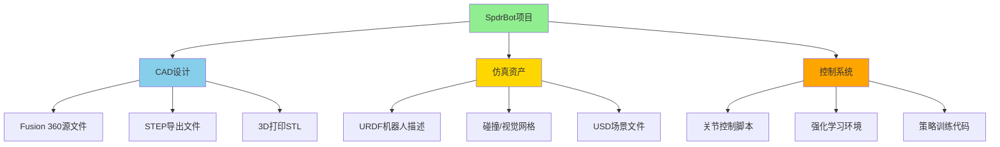
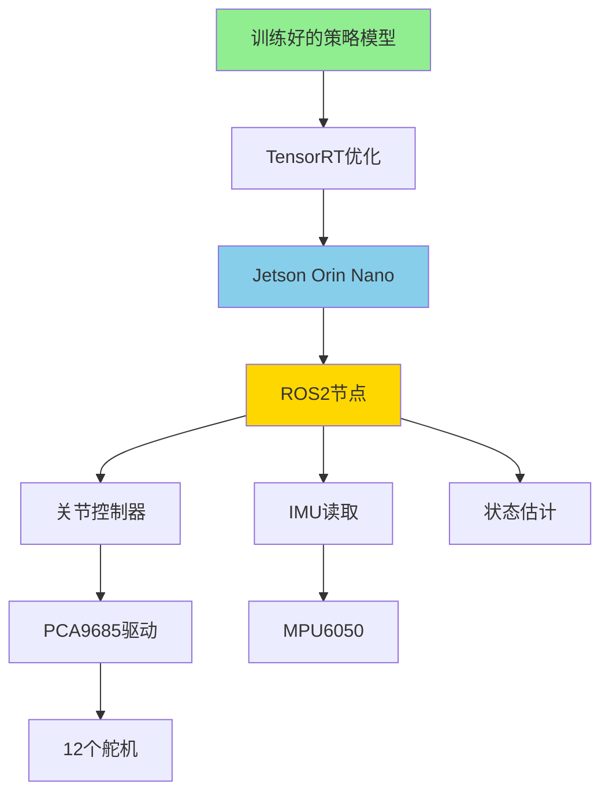

# 从设计到仿真：使用NVIDIA Isaac Sim和Autodesk Fusion构建SpdrBot四足蜘蛛机器人

在当今机器人技术快速发展的时代，仿真-现实（Sim-to-Real）工作流程正在改变我们设计和测试机器人的方式。本文将带你深入了解如何使用**NVIDIA Isaac Sim**和**Autodesk Fusion 360**构建一个完整的四足蜘蛛机器人——**SpdrBot**，从机械设计到物理仿真再到强化学习训练的全过程。

## 项目资源与参考链接

📹 **视频教程与资源：**
- 🎓 NVIDIA机器人学基础学习路径：[Robotics Fundamentals](https://nvda.ws/41hhGMS)
- 🕷️ SpdrBot设计文件：[Indystry.cc SpdrBot](https://indystry.cc/product/3d-printable-4-legged-spider-robot/)
- 💾 Isaac Lab项目：[GitHub - Indystrycc/SpdrBot](https://github.com/Indystrycc/SpdrBot)

**硬件采购清单（参考链接）：**
- 🧠 计算平台：[Jetson Orin Nano Developer Kit](https://www.seeedstudio.com/NVIDIA-Jetson-Orin-Nano-Developer-Kit-p-5617.html) - NVIDIA边缘AI计算平台
- ⚙️ 舵机：[SG90/MG90S微型舵机](https://amzn.to/4lYqL5C) - 12个，用于关节驱动
- 🎛️ 舵机驱动板：[PCA9685 16通道PWM驱动板](https://amzn.to/4ogF4Ea) - I2C接口
- 🖨️ 3D打印机：建议使用支持PLA/PETG的FDM打印机

---

## 第一部分：SpdrBot项目概述

### 1.1 什么是SpdrBot？

SpdrBot是一款开源的四足蜘蛛机器人，专为机器人学习和仿真设计。它具有以下特点：

**机械结构：**
- 4条腿，每条腿3个自由度
- 总共12个舵机驱动
- 所有零件针对FDM 3D打印优化
- 紧凑的结构设计，便于组装和维护

**仿真特性：**
- 完整的URDF（统一机器人描述格式）文件
- 预配置的USD（通用场景描述）场景
- 可直接导入NVIDIA Isaac Sim
- 支持强化学习训练



### 1.2 为什么选择Isaac Sim + Fusion 360组合？

| 特性 | NVIDIA Isaac Sim | Autodesk Fusion 360 |
|------|------------------|---------------------|
| **主要用途** | 物理仿真、强化学习 | CAD设计、机械工程 |
| **物理引擎** | PhysX 5 (GPU加速) | 有限元分析(FEA) |
| **渲染质量** | RTX光线追踪 | 基础渲染 |
| **机器人支持** | URDF/MJCF/USD | 导出STEP/URDF |
| **AI集成** | 原生支持 | 需要导出 |
| **协作** | Nucleus协作服务器 | 云协作 |

**两者结合的优势：**
1. **设计→仿真无缝衔接**：在Fusion 360中设计，导出到Isaac Sim测试
2. **快速迭代**：物理仿真结果指导设计改进
3. **真实物理**：Isaac Sim的GPU加速物理引擎提供准确的动力学仿真
4. **AI训练就绪**：直接在Isaac Lab中进行强化学习

---

## 第二部分：NVIDIA Isaac Sim环境配置

### 2.1 Isaac Sim系统要求

**最低硬件配置：**
```
GPU: NVIDIA RTX 3070 (8GB VRAM) 或更高
CPU: Intel i7 / AMD Ryzen 7 或同等
RAM: 32GB
存储: 50GB SSD（推荐NVMe）
操作系统: Ubuntu 22.04 LTS / Windows 10/11
```

**推荐配置（用于强化学习训练）：**
```
GPU: NVIDIA RTX 4090 (24GB VRAM)
CPU: Intel i9 / AMD Ryzen 9
RAM: 64GB
存储: 100GB+ NVMe SSD
操作系统: Ubuntu 22.04 LTS（最佳兼容性）
```

### 2.2 安装Isaac Sim

**方法一：通过Omniverse Launcher（推荐初学者）**

1. 下载并安装[NVIDIA Omniverse Launcher](https://www.nvidia.com/en-us/omniverse/)
2. 登录NVIDIA账户
3. 在Exchange中搜索"Isaac Sim"
4. 点击安装，等待下载完成（约15-20GB）

**方法二：通过pip安装（高级用户）**

```bash
# 创建conda环境
conda create -n isaac python=3.10
conda activate isaac

# 安装Isaac Sim核心包
pip install isaacsim-rl isaacsim-replicator isaacsim-extscache-physics isaacsim-extscache-kit-sdk isaacsim-extscache-kit isaacsim-app --extra-index-url https://pypi.nvidia.com
```

### 2.3 安装Isaac Lab

Isaac Lab是构建在Isaac Sim之上的强化学习框架：

```bash
# 克隆Isaac Lab仓库
git clone https://github.com/isaac-sim/IsaacLab.git
cd IsaacLab

# 创建conda环境
./isaaclab.sh --install

# 验证安装
./isaaclab.sh -p source/standalone/tutorials/00_sim/create_empty.py
```

### 2.4 获取SpdrBot仿真资产

```bash
# 克隆SpdrBot仓库
git clone https://github.com/Indystrycc/SpdrBot.git
cd SpdrBot

# 目录结构
SpdrBot/
├── urdf/
│   ├── spdrbot.urdf          # 机器人描述文件
│   ├── meshes/               # 3D网格文件
│   │   ├── collision/        # 碰撞检测网格
│   │   └── visual/           # 可视化网格
├── usd/
│   └── spdr_stage.usd        # 预配置Isaac Sim场景
├── scripts/
│   └── spyderbot_test.py     # 基础控制测试脚本
└── README.md
```

---

## 第三部分：Autodesk Fusion 360机械设计

### 3.1 SpdrBot结构解析

SpdrBot采用模块化设计，主要组件包括：

**核心结构：**
```
身体（Body）
├── 顶板（Top Plate）- 安装电子元件
├── 底板（Bottom Plate）- 结构支撑
└── 侧板×4（Side Plates）- 腿部安装点

腿部×4（Leg Assembly）
├── 髋关节（Hip）- 水平旋转，范围±45°
├── 大腿（Thigh）- 垂直摆动，范围±60°
└── 小腿（Shin）- 垂直摆动，范围±90°
```

### 3.2 在Fusion 360中设计/修改SpdrBot

如果你想自定义SpdrBot设计，可以按照以下步骤操作：

**步骤1：导入STEP文件**

```
文件 → 打开 → 从计算机打开
选择SpdrBot的STEP文件
选择"作为新设计"导入
```

**步骤2：理解组件层次**

在Fusion 360浏览器面板中，你会看到：
- `Body` - 机身组件
- `Leg_FR` - 前右腿
- `Leg_FL` - 前左腿
- `Leg_BR` - 后右腿
- `Leg_BL` - 后左腿
- `Joints` - 关节定义

**步骤3：修改设计参数**

```python
# 关键参数示例（可在Fusion 360参数管理器中修改）
body_length = 120  # mm，机身长度
body_width = 80    # mm，机身宽度
leg_length_1 = 45  # mm，大腿长度
leg_length_2 = 65  # mm，小腿长度
servo_horn_offset = 5  # mm，舵机舵盘偏移
```

### 3.3 导出为仿真格式

**导出URDF的工作流程：**

由于Fusion 360原生不支持URDF导出，需要使用第三方插件：

**方法一：使用fusion2urdf插件**

```bash
# 安装fusion2urdf
# 在Fusion 360中：
# 工具 → ADD-INS → Scripts and Add-Ins
# 导入fusion2urdf脚本

# 配置关节
# 1. 为每个活动关节定义旋转轴
# 2. 设置关节限位
# 3. 定义父子链接关系
```

**方法二：手动导出+转换**

```bash
# 1. 从Fusion 360导出STEP
文件 → 导出 → STEP (*.step)

# 2. 使用工具转换为URDF
# 推荐工具：
# - onshape-to-robot（Python工具）
# - solidworks-urdf-exporter（如果有SolidWorks）
# - 手动编写URDF文件
```

### 3.4 导出3D打印文件

```bash
# 为每个零件导出STL
文件 → 3D打印 → 选择组件
设置：
  - 细化程度：高
  - 单位：毫米
  - 格式：STL (Binary)

# 推荐的3D打印参数
材料: PLA或PETG
层高: 0.2mm
填充: 20-40%
支撑: 部分零件需要
```

---

## 第四部分：在Isaac Sim中导入和配置SpdrBot

### 4.1 URDF文件结构详解

SpdrBot的URDF文件定义了机器人的完整运动学和动力学模型：

```xml
<?xml version="1.0"?>
<robot name="spdrbot">
  <!-- 基础链接（机身） -->
  <link name="base_link">
    <visual>
      <geometry>
        <mesh filename="package://spdrbot/meshes/visual/body.obj"/>
      </geometry>
    </visual>
    <collision>
      <geometry>
        <mesh filename="package://spdrbot/meshes/collision/body_collision.obj"/>
      </geometry>
    </collision>
    <inertial>
      <mass value="0.5"/>
      <inertia ixx="0.001" ixy="0" ixz="0" 
               iyy="0.002" iyz="0" izz="0.001"/>
    </inertial>
  </link>

  <!-- 前右腿 - 髋关节 -->
  <joint name="FR_hip_joint" type="revolute">
    <parent link="base_link"/>
    <child link="FR_hip"/>
    <origin xyz="0.06 -0.04 0" rpy="0 0 0"/>
    <axis xyz="0 0 1"/>
    <limit lower="-0.785" upper="0.785" effort="1.0" velocity="5.0"/>
  </joint>

  <link name="FR_hip">
    <visual>
      <geometry>
        <mesh filename="package://spdrbot/meshes/visual/hip.obj"/>
      </geometry>
    </visual>
    <!-- ... 碰撞和惯性参数 ... -->
  </link>

  <!-- 前右腿 - 大腿关节 -->
  <joint name="FR_thigh_joint" type="revolute">
    <parent link="FR_hip"/>
    <child link="FR_thigh"/>
    <origin xyz="0.02 0 0" rpy="0 0 0"/>
    <axis xyz="0 1 0"/>
    <limit lower="-1.047" upper="1.047" effort="1.5" velocity="5.0"/>
  </joint>

  <!-- ... 其他关节和链接定义 ... -->
</robot>
```

### 4.2 导入URDF到Isaac Sim

**方法一：使用URDF Importer扩展**

```python
# 在Isaac Sim中运行的Python脚本
from omni.isaac.core.utils.extensions import enable_extension
enable_extension("omni.importer.urdf")

from omni.importer.urdf import _urdf
import omni.kit.commands

# 配置URDF导入参数
urdf_config = _urdf.ImportConfig()
urdf_config.merge_fixed_joints = False
urdf_config.fix_base = False
urdf_config.make_default_prim = True
urdf_config.create_physics_scene = True

# 导入URDF
result, prim_path = omni.kit.commands.execute(
    "URDFParseAndImportFile",
    urdf_path="/path/to/spdrbot/urdf/spdrbot.urdf",
    import_config=urdf_config,
)

print(f"Robot imported at: {prim_path}")
```

**方法二：直接打开预配置的USD场景**

```python
# 打开SpdrBot预配置场景
from omni.isaac.core import World
from omni.isaac.core.utils.stage import open_stage

# 加载预配置的SpdrBot场景
open_stage("/path/to/SpdrBot/usd/spdr_stage.usd")

# 初始化世界
world = World()
world.reset()
```

### 4.3 配置物理参数

在Isaac Sim中微调SpdrBot的物理属性：

```python
from omni.isaac.core.articulations import Articulation
from pxr import UsdPhysics, PhysxSchema

# 获取机器人关节
robot = Articulation("/World/spdrbot")
robot.initialize()

# 配置关节驱动器（PD控制器）
joint_names = [
    "FR_hip_joint", "FR_thigh_joint", "FR_shin_joint",
    "FL_hip_joint", "FL_thigh_joint", "FL_shin_joint",
    "BR_hip_joint", "BR_thigh_joint", "BR_shin_joint",
    "BL_hip_joint", "BL_thigh_joint", "BL_shin_joint"
]

# 设置PD增益
stiffness = 50.0   # 刚度（位置控制）
damping = 5.0      # 阻尼（速度控制）

for joint_name in joint_names:
    robot.set_joint_stiffness(joint_name, stiffness)
    robot.set_joint_damping(joint_name, damping)
```

---

## 第五部分：SpdrBot运动控制

### 5.1 基础关节控制

使用提供的测试脚本验证机器人响应：

```python
# spyderbot_test.py - 基础关节控制演示
import numpy as np
from omni.isaac.core import World
from omni.isaac.core.articulations import Articulation
import time

class SpdrBotController:
    """SpdrBot基础控制器"""
    
    def __init__(self, robot_prim_path="/World/spdrbot"):
        self.robot = Articulation(robot_prim_path)
        self.robot.initialize()
        
        # 关节配置：每条腿3个关节 × 4条腿 = 12个关节
        self.num_joints = 12
        self.joint_positions = np.zeros(self.num_joints)
        
    def set_joint_positions(self, positions):
        """
        设置所有关节的目标位置
        
        参数:
            positions: numpy数组，形状(12,)，单位：弧度
        """
        self.robot.set_joint_positions(positions)
        
    def get_joint_positions(self):
        """获取当前关节位置"""
        return self.robot.get_joint_positions()
    
    def stand_pose(self):
        """设置站立姿态"""
        # 站立时各关节角度（弧度）
        stand_positions = np.array([
            0.0, -0.5, 1.0,  # 前右腿：髋、大腿、小腿
            0.0, -0.5, 1.0,  # 前左腿
            0.0, -0.5, 1.0,  # 后右腿
            0.0, -0.5, 1.0   # 后左腿
        ])
        self.set_joint_positions(stand_positions)
        
    def wave_leg(self, leg_index=0, amplitude=0.3, frequency=1.0, t=0):
        """
        挥动指定腿
        
        参数:
            leg_index: 腿索引 (0=FR, 1=FL, 2=BR, 3=BL)
            amplitude: 挥动幅度（弧度）
            frequency: 频率（Hz）
            t: 时间（秒）
        """
        positions = self.get_joint_positions()
        
        # 计算正弦波动作
        offset = leg_index * 3
        positions[offset] = amplitude * np.sin(2 * np.pi * frequency * t)
        positions[offset + 1] = -0.5 + 0.2 * np.sin(2 * np.pi * frequency * t)
        positions[offset + 2] = 1.0 - 0.3 * np.sin(2 * np.pi * frequency * t)
        
        self.set_joint_positions(positions)

# 使用示例
if __name__ == "__main__":
    world = World()
    controller = SpdrBotController()
    
    # 先站立
    controller.stand_pose()
    world.step()
    time.sleep(1.0)
    
    # 挥动前右腿
    for i in range(100):
        t = i * 0.01
        controller.wave_leg(leg_index=0, t=t)
        world.step()
```

### 5.2 步态生成

四足机器人的步态是一个复杂的话题，以下是几种常见步态的实现：

```python
class GaitGenerator:
    """步态生成器"""
    
    def __init__(self, controller):
        self.controller = controller
        self.phase = 0.0
        
    def tripod_gait(self, velocity=0.1, dt=0.01):
        """
        三脚步态（对角步态）
        同时移动对角线上的腿：(FR, BL) 和 (FL, BR) 交替
        """
        self.phase += dt * 2.0  # 步态相位
        
        # 计算各腿相位（对角腿同相位）
        leg_phases = [
            self.phase,           # FR
            self.phase + np.pi,   # FL（反相）
            self.phase + np.pi,   # BR（反相）
            self.phase            # BL
        ]
        
        positions = np.zeros(12)
        
        for leg_idx, phase in enumerate(leg_phases):
            offset = leg_idx * 3
            
            # 髋关节：前后摆动
            positions[offset] = 0.3 * np.sin(phase)
            
            # 大腿关节：抬腿
            lift = max(0, np.sin(phase))  # 只在上升阶段抬腿
            positions[offset + 1] = -0.5 - 0.2 * lift
            
            # 小腿关节：配合大腿
            positions[offset + 2] = 1.0 + 0.2 * lift
            
        self.controller.set_joint_positions(positions)
        
    def wave_gait(self, velocity=0.05, dt=0.01):
        """
        波浪步态 - 每次只移动一条腿
        顺序：FR → BR → FL → BL
        稳定性高但速度慢
        """
        self.phase += dt
        cycle_time = 4.0  # 完成一个周期的时间
        
        positions = np.zeros(12)
        
        for leg_idx in range(4):
            offset = leg_idx * 3
            # 每条腿在周期的1/4时间内活动
            leg_phase = (self.phase - leg_idx * cycle_time / 4) % cycle_time
            
            if leg_phase < cycle_time / 4:
                # 这条腿正在移动
                t = leg_phase / (cycle_time / 4) * np.pi
                positions[offset] = 0.3 * np.sin(t)
                positions[offset + 1] = -0.5 - 0.3 * np.sin(t)
                positions[offset + 2] = 1.0 + 0.3 * np.sin(t)
            else:
                # 这条腿支撑
                positions[offset] = 0.3 * np.sin(np.pi)  # 保持在后方
                positions[offset + 1] = -0.5
                positions[offset + 2] = 1.0
                
        self.controller.set_joint_positions(positions)
```

---

## 第六部分：使用Isaac Lab进行强化学习训练

### 6.1 为什么使用强化学习？

传统步态控制方法的局限：
- 需要手动调整大量参数
- 难以适应不同地形
- 缺乏自主适应能力

**强化学习的优势：**
- 自动学习最优控制策略
- 对环境变化具有鲁棒性
- 可以发现人类难以设计的步态

### 6.2 创建Isaac Lab环境

```python
# spdrbot_env.py - SpdrBot强化学习环境
import torch
import numpy as np
from omni.isaac.lab.envs import ManagerBasedRLEnv
from omni.isaac.lab.managers import SceneEntityCfg
from omni.isaac.lab.assets import ArticulationCfg
from omni.isaac.lab.sensors import ContactSensorCfg

class SpdrBotEnvCfg:
    """SpdrBot环境配置"""
    
    # 仿真参数
    decimation = 4  # 动作重复次数
    episode_length_s = 20.0  # 每个episode时长
    
    # 场景配置
    num_envs = 4096  # 并行环境数量
    env_spacing = 2.0  # 环境间距
    
    # 机器人配置
    robot = ArticulationCfg(
        prim_path="/World/envs/env_.*/Robot",
        spawn=sim_utils.UrdfFileCfg(
            asset_path="path/to/spdrbot.urdf",  # 替换为实际URDF路径
            rigid_props=sim_utils.RigidBodyPropertiesCfg(
                disable_gravity=False,
                max_depenetration_velocity=10.0,
            ),
            articulation_props=sim_utils.ArticulationRootPropertiesCfg(
                enabled_self_collisions=False,
                solver_position_iteration_count=4,
                solver_velocity_iteration_count=0,
            ),
        ),
        init_state=ArticulationCfg.InitialStateCfg(
            pos=(0.0, 0.0, 0.15),  # 初始位置（稍高于地面）
            joint_pos={".*": 0.0},  # 初始关节角度
        ),
        actuators={
            "legs": IdealPDActuatorCfg(
                joint_names_expr=[".*_joint"],
                stiffness=50.0,  # PD控制器刚度
                damping=5.0,     # PD控制器阻尼
            ),
        },
    )
    
    # 接触传感器
    contact_forces = ContactSensorCfg(
        prim_path="/World/envs/env_.*/Robot/.*_shin",
        history_length=3,
        track_air_time=True,
    )


class SpdrBotEnv(ManagerBasedRLEnv):
    """SpdrBot强化学习环境"""
    
    cfg: SpdrBotEnvCfg
    
    def __init__(self, cfg: SpdrBotEnvCfg):
        super().__init__(cfg)
        
        # 获取机器人和传感器
        self.robot = self.scene.articulations["robot"]
        self.contact_sensor = self.scene.sensors["contact_forces"]
        
        # 观测空间维度
        # 3 (基座线速度) + 3 (基座角速度) + 3 (重力方向) + 
        # 12 (关节位置) + 12 (关节速度) + 4 (足端接触) + 12 (上一动作) = 49
        self.num_obs = 49
        
        # 动作空间维度：12个关节的位置增量
        self.num_actions = 12
        
    def _get_observations(self) -> dict:
        """
        获取观测值
        
        返回:
            包含观测向量的字典
        """
        # 基座状态
        base_lin_vel = self.robot.data.root_lin_vel_b  # 本体坐标系线速度
        base_ang_vel = self.robot.data.root_ang_vel_b  # 本体坐标系角速度
        
        # 重力方向（在本体坐标系中）
        gravity_b = self.robot.data.projected_gravity_b
        
        # 关节状态
        joint_pos = self.robot.data.joint_pos
        joint_vel = self.robot.data.joint_vel
        
        # 足端接触（二值化）
        foot_contact = (self.contact_sensor.data.net_forces_w.norm(dim=-1) > 1.0).float()
        
        # 上一步动作
        last_action = self.actions
        
        obs = torch.cat([
            base_lin_vel,     # (N, 3)
            base_ang_vel,     # (N, 3)
            gravity_b,        # (N, 3)
            joint_pos,        # (N, 12)
            joint_vel,        # (N, 12)
            foot_contact,     # (N, 4)
            last_action       # (N, 12)
        ], dim=-1)
        
        return {"policy": obs}
    
    def _get_rewards(self) -> torch.Tensor:
        """
        计算奖励
        
        返回:
            奖励张量，形状(num_envs,)
        """
        # 前进速度奖励
        forward_vel = self.robot.data.root_lin_vel_b[:, 0]  # x方向速度
        reward_forward = torch.exp(-torch.abs(forward_vel - 0.5))  # 目标速度0.5 m/s
        
        # 保持直立奖励
        up_vec = self.robot.data.projected_gravity_b[:, 2]  # z分量应该接近-1
        reward_upright = torch.exp(-torch.abs(up_vec + 1.0) * 2.0)
        
        # 能量效率惩罚
        torques = self.robot.data.applied_torque
        reward_energy = -0.0001 * torch.sum(torques ** 2, dim=-1)
        
        # 动作平滑性惩罚
        action_diff = self.actions - self.prev_actions
        reward_smooth = -0.01 * torch.sum(action_diff ** 2, dim=-1)
        
        # 足端气相时间奖励（鼓励周期性步态）
        air_time = self.contact_sensor.data.air_time
        reward_gait = torch.exp(-torch.abs(air_time - 0.25).mean(dim=-1))  # 目标25%气相
        
        # 总奖励
        total_reward = (
            reward_forward * 1.0 +
            reward_upright * 0.5 +
            reward_energy +
            reward_smooth +
            reward_gait * 0.2
        )
        
        return total_reward
    
    def _get_dones(self) -> tuple:
        """
        检查终止条件
        
        返回:
            (terminated, truncated) 元组
        """
        # 跌倒检测
        base_height = self.robot.data.root_pos_w[:, 2]
        fallen = base_height < 0.05
        
        # 过度倾斜检测
        up_vec = self.robot.data.projected_gravity_b[:, 2]
        tilted = up_vec > -0.5
        
        terminated = fallen | tilted
        truncated = self.episode_length_buf >= self.max_episode_length
        
        return terminated, truncated
```

### 6.3 训练配置与执行

```python
# train_spdrbot.py - SpdrBot训练脚本
from omni.isaac.lab.utils.dict import class_to_dict
from omni.isaac.lab_tasks.utils.wrappers.rsl_rl import (
    RslRlOnPolicyRunnerCfg,
    RslRlVecEnvWrapper,
)
from rsl_rl.runners import OnPolicyRunner

# PPO训练配置
class SpdrBotPPORunnerCfg(RslRlOnPolicyRunnerCfg):
    """PPO训练配置"""
    
    num_steps_per_env = 24  # 每个环境每次采样步数
    max_iterations = 1500   # 最大训练迭代次数
    save_interval = 100     # 保存间隔
    
    # PPO算法参数
    policy = RslRlPpoAlgorithmCfg(
        learning_rate=1e-3,
        num_learning_epochs=5,
        num_mini_batches=4,
        clip_param=0.2,
        entropy_coef=0.01,
        value_loss_coef=1.0,
        max_grad_norm=1.0,
    )
    
    # 策略网络配置
    actor_critic = RslRlPpoActorCriticCfg(
        init_noise_std=1.0,
        actor_hidden_dims=[512, 256, 128],
        critic_hidden_dims=[512, 256, 128],
        activation="elu",
    )

def train():
    """执行训练"""
    
    # 创建环境
    env_cfg = SpdrBotEnvCfg()
    env_cfg.num_envs = 4096
    env = SpdrBotEnv(env_cfg)
    
    # 包装为RSL-RL兼容格式
    env = RslRlVecEnvWrapper(env)
    
    # 创建训练器
    runner_cfg = SpdrBotPPORunnerCfg()
    runner = OnPolicyRunner(
        env, 
        class_to_dict(runner_cfg), 
        log_dir="logs/spdrbot",
        device="cuda:0"
    )
    
    # 开始训练
    runner.learn(num_learning_iterations=runner_cfg.max_iterations)

if __name__ == "__main__":
    train()
```

### 6.4 训练可视化与评估

```python
# evaluate_spdrbot.py - 加载并评估训练好的策略
import torch
from omni.isaac.core import World

def evaluate_policy(checkpoint_path, num_episodes=10):
    """
    评估训练好的策略
    
    参数:
        checkpoint_path: 模型checkpoint路径
        num_episodes: 评估episode数量
    """
    # 加载模型
    policy = torch.jit.load(checkpoint_path)
    policy.eval()
    
    # 创建单环境用于可视化
    env_cfg = SpdrBotEnvCfg()
    env_cfg.num_envs = 1
    env = SpdrBotEnv(env_cfg)
    
    world = World()
    
    total_reward = 0.0
    total_steps = 0
    
    for episode in range(num_episodes):
        obs = env.reset()
        done = False
        episode_reward = 0.0
        
        while not done:
            # 获取动作
            with torch.no_grad():
                action = policy(obs["policy"])
            
            # 执行动作
            obs, reward, done, info = env.step(action)
            
            # 渲染
            world.step(render=True)
            
            episode_reward += reward.item()
            total_steps += 1
            
        print(f"Episode {episode + 1}: Reward = {episode_reward:.2f}")
        total_reward += episode_reward
    
    print(f"\nAverage Reward: {total_reward / num_episodes:.2f}")
    print(f"Total Steps: {total_steps}")

if __name__ == "__main__":
    evaluate_policy("logs/spdrbot/model_1500.pt")
```

---

## 第七部分：部署到真实硬件

### 7.1 硬件组装清单

**电子元件：**
| 组件 | 型号/规格 | 数量 | 用途 |
|------|----------|------|------|
| 计算单元 | NVIDIA Jetson Orin Nano | 1 | 运行推理 |
| 舵机 | SG90或MG90S | 12 | 关节驱动 |
| 舵机驱动板 | PCA9685 16通道 | 1 | PWM信号生成 |
| 电源 | 7.4V 2S LiPo 2000mAh | 1 | 系统供电 |
| 降压模块 | 5V 5A DC-DC | 1 | 舵机供电 |
| 传感器 | IMU (MPU6050) | 1 | 姿态估计 |

**机械零件：**
- 3D打印的SpdrBot零件套装
- M2/M3螺丝螺母套装
- 舵机支架和舵盘

### 7.2 软件部署架构



### 7.3 策略导出与优化

```python
# export_policy.py - 导出为TensorRT格式
import torch
import tensorrt as trt

def export_to_tensorrt(checkpoint_path, output_path):
    """
    将PyTorch策略导出为TensorRT引擎
    
    参数:
        checkpoint_path: PyTorch模型路径
        output_path: TensorRT引擎输出路径
    """
    # 加载策略
    policy = torch.jit.load(checkpoint_path)
    
    # 示例输入
    dummy_input = torch.randn(1, 49).cuda()
    
    # 导出为ONNX
    onnx_path = output_path.replace(".trt", ".onnx")
    torch.onnx.export(
        policy, 
        dummy_input, 
        onnx_path,
        input_names=["observation"],
        output_names=["action"],
        dynamic_axes={"observation": {0: "batch"}, "action": {0: "batch"}}
    )
    
    # 使用TensorRT优化
    # 在Jetson上运行此部分
    logger = trt.Logger(trt.Logger.WARNING)
    builder = trt.Builder(logger)
    network = builder.create_network(
        1 << int(trt.NetworkDefinitionCreationFlag.EXPLICIT_BATCH)
    )
    parser = trt.OnnxParser(network, logger)
    
    with open(onnx_path, "rb") as f:
        parser.parse(f.read())
    
    config = builder.create_builder_config()
    config.set_flag(trt.BuilderFlag.FP16)  # 启用FP16加速
    
    engine = builder.build_serialized_network(network, config)
    
    with open(output_path, "wb") as f:
        f.write(engine)
    
    print(f"TensorRT引擎已保存到: {output_path}")
```

### 7.4 Jetson部署代码

```python
# spdrbot_deploy.py - Jetson上的部署代码
import numpy as np
import tensorrt as trt
import pycuda.driver as cuda
import pycuda.autoinit
from adafruit_servokit import ServoKit
import board
import busio
from mpu6050 import mpu6050
import time

class SpdrBotDeployer:
    """SpdrBot真机部署类"""
    
    def __init__(self, engine_path):
        # 加载TensorRT引擎
        self.load_engine(engine_path)
        
        # 初始化舵机驱动板
        i2c = busio.I2C(board.SCL, board.SDA)
        self.servo_kit = ServoKit(channels=16, i2c=i2c)
        
        # 设置舵机脉冲宽度范围
        for i in range(12):
            self.servo_kit.servo[i].set_pulse_width_range(500, 2500)
        
        # 初始化IMU
        self.imu = mpu6050(0x68)
        
        # 舵机角度限制（度）
        self.joint_limits = [
            (-45, 45),   # 髋关节
            (-60, 60),   # 大腿
            (-90, 90),   # 小腿
        ] * 4
        
        # 状态历史
        self.last_action = np.zeros(12)
        
    def load_engine(self, engine_path):
        """加载TensorRT引擎"""
        logger = trt.Logger(trt.Logger.WARNING)
        runtime = trt.Runtime(logger)
        
        with open(engine_path, "rb") as f:
            self.engine = runtime.deserialize_cuda_engine(f.read())
        
        self.context = self.engine.create_execution_context()
        
        # 分配GPU内存
        self.d_input = cuda.mem_alloc(4 * 49)   # float32 × 49
        self.d_output = cuda.mem_alloc(4 * 12)  # float32 × 12
        self.stream = cuda.Stream()
        
    def get_observation(self):
        """
        获取当前观测值
        
        返回:
            numpy数组，形状(49,)
        """
        # 读取IMU数据
        accel = self.imu.get_accel_data()
        gyro = self.imu.get_gyro_data()
        
        # 估计基座速度（简化版，实际需要更复杂的状态估计）
        base_lin_vel = np.array([0.0, 0.0, 0.0])  # 需要里程计或视觉
        base_ang_vel = np.array([
            np.radians(gyro['x']),
            np.radians(gyro['y']),
            np.radians(gyro['z'])
        ])
        
        # 重力方向
        gravity = np.array([accel['x'], accel['y'], accel['z']])
        gravity = gravity / np.linalg.norm(gravity)
        
        # 读取舵机位置（转换为弧度）
        joint_pos = np.zeros(12)
        for i in range(12):
            joint_pos[i] = np.radians(self.servo_kit.servo[i].angle - 90)
        
        # 关节速度（数值微分或编码器）
        joint_vel = np.zeros(12)  # 简化：假设为零
        
        # 足端接触（需要接触传感器，这里简化）
        foot_contact = np.ones(4)  # 假设全部接触
        
        obs = np.concatenate([
            base_lin_vel,    # 3
            base_ang_vel,    # 3
            gravity,         # 3
            joint_pos,       # 12
            joint_vel,       # 12
            foot_contact,    # 4
            self.last_action # 12
        ]).astype(np.float32)
        
        return obs
    
    def infer(self, observation):
        """
        使用TensorRT推理
        
        参数:
            observation: numpy数组，形状(49,)
            
        返回:
            动作，numpy数组，形状(12,)
        """
        # 拷贝输入到GPU
        cuda.memcpy_htod_async(self.d_input, observation, self.stream)
        
        # 执行推理
        self.context.execute_async_v2(
            bindings=[int(self.d_input), int(self.d_output)],
            stream_handle=self.stream.handle
        )
        
        # 拷贝输出到CPU
        output = np.empty(12, dtype=np.float32)
        cuda.memcpy_dtoh_async(output, self.d_output, self.stream)
        self.stream.synchronize()
        
        return output
    
    def apply_action(self, action):
        """
        将动作应用到舵机
        
        参数:
            action: numpy数组，形状(12,)，范围[-1, 1]
        """
        for i in range(12):
            # 动作转换为角度增量
            joint_type = i % 3
            low, high = self.joint_limits[i]
            
            # 映射动作到角度范围
            angle = 90 + action[i] * (high - low) / 2
            angle = np.clip(angle, low + 90, high + 90)
            
            # 设置舵机角度
            self.servo_kit.servo[i].angle = angle
        
        self.last_action = action.copy()
    
    def run(self, frequency=50):
        """
        主控制循环
        
        参数:
            frequency: 控制频率（Hz）
        """
        dt = 1.0 / frequency
        print("SpdrBot部署开始，按Ctrl+C停止")
        
        try:
            while True:
                start_time = time.time()
                
                # 获取观测
                obs = self.get_observation()
                
                # 推理
                action = self.infer(obs)
                
                # 应用动作
                self.apply_action(action)
                
                # 保持控制频率
                elapsed = time.time() - start_time
                if elapsed < dt:
                    time.sleep(dt - elapsed)
                    
        except KeyboardInterrupt:
            print("\n停止SpdrBot")
            # 回到安全姿态
            self.stand_pose()

if __name__ == "__main__":
    deployer = SpdrBotDeployer("spdrbot_policy.trt")
    deployer.run(frequency=50)
```

---

## 第八部分：故障排除与最佳实践

### 8.1 常见问题解决

**问题1：URDF导入后关节不动**
```bash
# 检查关节类型是否正确
# 确保URDF中的关节类型是"revolute"或"continuous"而非"fixed"

# 检查关节驱动器配置
# Isaac Sim需要显式配置关节驱动器（Articulation Drive）
```

**问题2：物理仿真不稳定**
```python
# 调整仿真参数
sim_params = {
    "dt": 1/240,           # 减小时间步长
    "substeps": 4,         # 增加子步数
    "gravity": [0, 0, -9.81],
    "use_gpu": True
}

# 检查惯性参数是否合理
# 质量和惯性矩阵需要与几何尺寸匹配
```

**问题3：强化学习训练不收敛**
```python
# 常见原因和解决方案：

# 1. 奖励函数设计问题
# - 检查奖励尺度是否合适（通常在[-10, 10]范围）
# - 确保奖励信号足够密集（每步都有反馈）

# 2. 观测归一化
# - 对观测值进行标准化处理
obs = (obs - obs_mean) / (obs_std + 1e-8)

# 3. 学习率调整
# - 初始学习率过高会导致不稳定
# - 尝试从1e-4开始，逐步调整
```

### 8.2 性能优化技巧

**仿真性能优化：**
```python
# 1. 使用简化碰撞几何体
# 用基本形状（球、盒、胶囊）替代复杂网格

# 2. 减少接触点数量
contact_cfg = ContactSensorCfg(
    prim_path="...",
    filter_prim_paths_expr=[".*_shin"],  # 只检测足端
)

# 3. 使用GPU pipeline
env_cfg.use_gpu_pipeline = True
```

**训练效率优化：**
```python
# 1. 增加并行环境数量
num_envs = 8192  # 充分利用GPU

# 2. 使用混合精度训练
from torch.cuda.amp import autocast, GradScaler
scaler = GradScaler()

# 3. 预计算不变量
# 将不随时间变化的计算移到循环外
```

### 8.3 项目扩展建议

**进阶任务：**
1. **地形适应**：在不平坦地面上训练
2. **负载搬运**：添加可变质量的载荷
3. **多机器人协同**：多个SpdrBot协作任务
4. **视觉导航**：添加摄像头，实现自主导航

**硬件升级路径：**
1. 更换高扭矩舵机（如Dynamixel XL330）
2. 添加力矩传感器实现力控制
3. 集成深度相机（如Intel RealSense D435i）
4. 升级到更强大的计算平台

---

## 结论

通过本文的详细指南，你已经了解了如何：

1. **设计阶段**：使用Autodesk Fusion 360进行机械设计，导出仿真所需的文件格式
2. **仿真阶段**：在NVIDIA Isaac Sim中导入和配置SpdrBot，实现物理准确的机器人仿真
3. **训练阶段**：使用Isaac Lab框架进行强化学习训练，学习四足机器人步态控制
4. **部署阶段**：将训练好的策略部署到Jetson边缘设备，控制真实硬件

**关键收获：**
- 🔧 **工具链整合**：Fusion 360 → URDF → Isaac Sim → Isaac Lab → Jetson
- 🤖 **Sim-to-Real**：仿真中训练的策略可以迁移到真实机器人
- 🚀 **加速开发**：并行仿真大幅缩短训练时间
- 🌐 **开源生态**：利用开源资源快速启动项目

**下一步行动：**
1. 完成NVIDIA的[机器人学基础学习路径](https://nvda.ws/41hhGMS)
2. 下载SpdrBot资产并在Isaac Sim中运行
3. 尝试修改奖励函数，训练不同的步态
4. 如果有硬件，尝试实际部署和测试

机器人仿真正在经历革命性变化，Isaac Sim和Fusion 360的组合为开发者提供了从概念到产品的完整工具链。无论你是学生、研究者还是工程师，这套工作流程都能帮助你更快地实现机器人创意。

---

**项目资源汇总：**
- 📚 [NVIDIA机器人学基础](https://nvda.ws/41hhGMS)
- 🕷️ [SpdrBot GitHub仓库](https://github.com/Indystrycc/SpdrBot)
- 🛒 [SpdrBot设计文件（Indystry.cc）](https://indystry.cc/product/3d-printable-4-legged-spider-robot/)
- 📖 [Isaac Sim文档](https://docs.isaacsim.omniverse.nvidia.com/)
- 📖 [Isaac Lab文档](https://isaac-sim.github.io/IsaacLab/)

**硬件采购链接（参考）：**
- 🧠 [Jetson Orin Nano Developer Kit](https://www.seeedstudio.com/NVIDIA-Jetson-Orin-Nano-Developer-Kit-p-5617.html)
- ⚙️ [SG90/MG90S微型舵机](https://amzn.to/4lYqL5C)
- 🎛️ [PCA9685舵机驱动板](https://amzn.to/4ogF4Ea)

**联系方式：**
- GitHub: [github.com/daviddhc20120601](https://github.com/daviddhc20120601)
- 项目问题：欢迎提Issue或PR

---

*本文撰写于2025年11月29日，基于NVIDIA Isaac Sim 4.0+和Isaac Lab 1.0+版本。随着软件更新，部分接口可能有变化，请以官方文档为准。*
