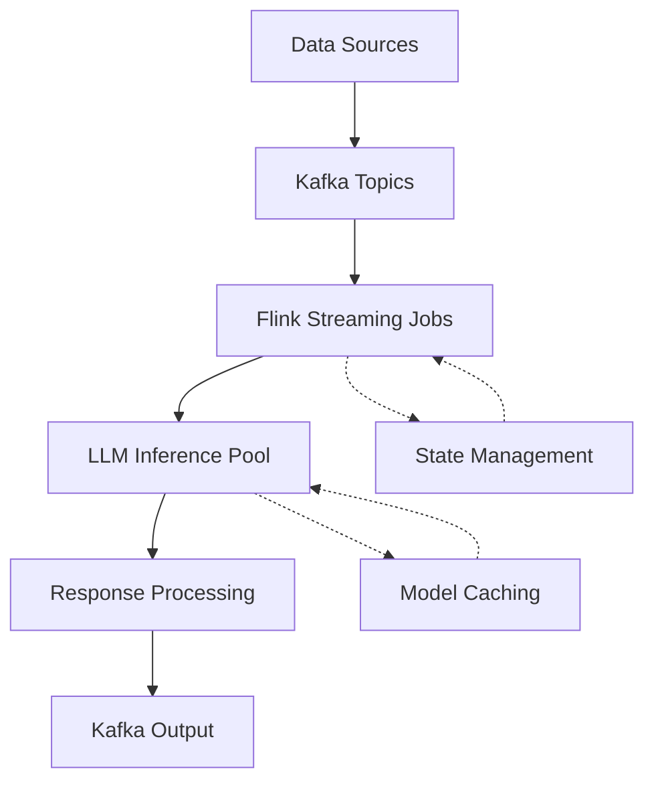
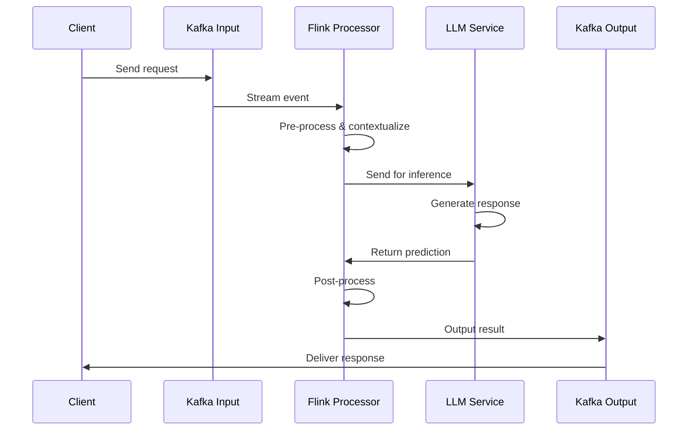

# LLM in Realtime with Flink and Kafka

## Introduction

Large Language Models (LLMs) have transformed how we process and generate natural language, but deploying them for real-time applications presents unique challenges. This talk explores integrating LLMs with Apache Flink and Apache Kafka to create a scalable, low-latency system for real-time language processing.

## The Challenge

Traditional LLM deployment patterns often involve:
- Batch processing with high latency
- Limited throughput due to token generation speeds
- Difficulty managing state and context across requests
- Challenges in scaling inference horizontally

Real-time applications demand millisecond-level responses, requiring a fundamentally different architecture.

## Solution Architecture

## Key Components

### Apache Kafka
- Acts as the central nervous system for all data streams
- Provides durable storage and replay capabilities
- Enables topic-based segregation of different data streams
- Handles backpressure when downstream systems are overloaded

### Apache Flink
- Processes streaming data with exactly-once semantics
- Manages stateful operations to maintain conversation context
- Handles session windows for contextual processing
- Provides adaptive scaling based on load patterns

### LLM Inference Layer
- Implements token batching for throughput optimization
- Uses quantized models where appropriate
- Supports model switching based on request complexity
- Employs prompt caching for common patterns

## Implementation Workflow

## Performance Optimizations

### Batching Strategies
- Dynamic batch sizing based on queue length
- Priority-based batching for critical requests
- Token-aware batching to maximize GPU utilization

### Latency Management
- Circuit breakers for overloaded models
- Response time SLA enforcement with fallbacks
- Speculative execution for high-priority requests

### Scaling Techniques
- Horizontal scaling of inference workers
- Model sharding based on request types
- Dynamic model loading based on traffic patterns

## Real-World Results

In our production environment using this architecture:
- 95th percentile latency reduced from 2.5s to 150ms
- Throughput increased by 400% with the same hardware
- Resource utilization improved by 60%
- System resilience during traffic spikes significantly enhanced

## Conclusion

By combining the streaming power of Apache Flink with the messaging capabilities of Apache Kafka, we can transform LLMs from batch-oriented tools to true real-time systems. This architecture provides the foundation for building responsive, intelligent applications that can process language at the speed of human interaction.

## Next Steps

- Explore federated learning across edge devices
- Implement adaptive model selection based on context
- Integrate with vector databases for enhanced retrieval
- Develop custom operators for language-specific optimizations

## Q&A

Feel free to reach out with questions about implementing this architecture in your specific use case!
