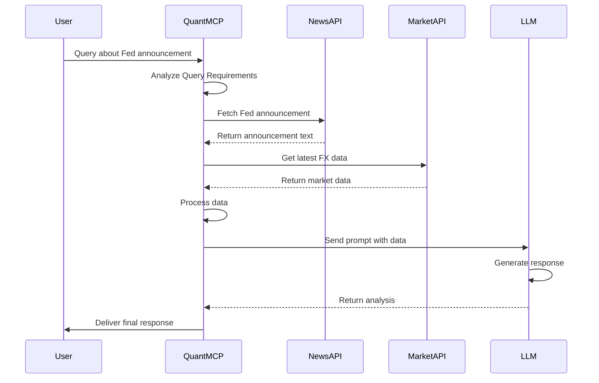
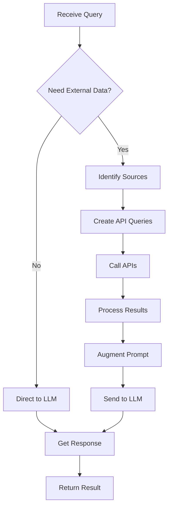

# Quant MCP Server: Augmenting LLMs with Real-Time Financial Data

Large Language Models (LLMs) offer powerful capabilities for text understanding, generation, and reasoning. However, in the fast-paced world of quantitative finance (Quant), their inherent limitation – static knowledge frozen at the time of training – poses a significant risk. Financial markets fluctuate constantly, news breaks in seconds, and economic indicators shift rapidly. Relying solely on an LLM's potentially outdated internal knowledge for financial analysis, risk assessment, or trading decisions is untenable.

Introducing the concept of a **Quant MCP Server (Master Control Program Server)** – an orchestration layer designed specifically to empower LLMs with the real-time, high-quality data crucial for financial applications. This post explores how such a system integrates LLMs with specialized financial data feeds and web search to deliver timely, accurate, and actionable insights.

## The Challenge: Static Models vs. Dynamic Markets

Financial data is notoriously volatile and time-sensitive. Stock prices, FX rates, commodity futures, breaking news, earnings reports, regulatory filings, and macroeconomic data change continuously. A standard LLM, asked about the current price of a security or the impact of just-released news, might provide outdated information or simply state its knowledge cutoff.

Furthermore, the cost of inaccuracy in finance is extremely high. Hallucinations or reliance on stale data can lead to poor investment decisions, incorrect risk calculations, and compliance breaches. Financial applications demand not just fluency but verifiable accuracy grounded in the latest market reality.

## The Quant MCP Server: A Financial Data Orchestrator

The Quant MCP Server acts as the central hub connecting financial analysts or trading algorithms (the users), the LLM, and a suite of external data sources and tools. Its key roles in a financial context include:

1.  **Query Analysis:** Determining if a request requires real-time market data, historical time-series data, specific company filings, breaking news, or general web information.
2.  **Tool/API Invocation:** Formulating precise queries for and interacting with various APIs:
    *   **Market Data APIs:** (e.g., Bloomberg API, Refinitiv Eikon, Alpha Vantage, Polygon.io) for real-time/historical prices, quotes, and volumes.
    *   **News APIs:** (e.g., Dow Jones Newswires, Reuters News, specialized FinTech news APIs) for low-latency news feeds.
    *   **Fundamental Data Providers:** For earnings reports, balance sheets, SEC filings (EDGAR).
    *   **Web Search APIs:** For broader context, sentiment analysis inputs, or information not available via structured feeds.
3.  **Information Synthesis & Validation:** Aggregating data from multiple sources, potentially cross-validating information, handling data formatting inconsistencies, and presenting a concise, structured context to the LLM.
4.  **Response Generation & Auditing:** Managing the LLM interaction to generate a final response, potentially including data provenance (source and timestamp) for auditability and compliance.

## The Workflow: Integrating Financial Data Streams

Consider a typical financial query workflow managed by the Quant MCP Server:

1.  **User/Algo Query:** A request is sent (e.g., "Summarize the key points from AAPL's latest earnings call and provide current market reaction.").
2.  **Analysis & Decision:** The MCP Server identifies the need for: a) the latest earnings call transcript/summary (likely from a fundamental data source or web search) and b) real-time price/volume data for AAPL (from a market data API).
3.  **Query Formulation & Execution:**
    *   It queries a financial database/web search for "AAPL latest earnings call transcript/summary."
    *   It queries a market data API for the current AAPL quote and recent price action.
4.  **Data Retrieval & Processing:** The server receives the earnings information and market data. It extracts key points from the earnings call and formats the market data (e.g., price change percentage since the call).
5.  **Context Augmentation:** A prompt is constructed for the LLM, including:
    *   The original query.
    *   The extracted earnings call highlights.
    *   The current market data.
    *   Instructions: "Based on the provided earnings summary and market data, answer the user's query."
6.  **LLM Generation:** The LLM synthesizes the information to generate a response like: "AAPL reported [key earnings metric]. Key discussion points included [summary]. Since the report, the stock price is currently trading at $XXX.XX, representing a Y.Y% change."
7.  **Final Response:** The MCP Server delivers the response, potentially tagging data points with sources and timestamps.

### Visualizing the Financial Flow

## Key Concepts: RAG and Tool Use in Finance

The **Retrieval-Augmented Generation (RAG)** paradigm is directly applicable. The Quant MCP Server acts as the retrieval mechanism, fetching relevant, timely financial data to augment the LLM's generation process for tasks like:

*   Generating market commentary.
*   Summarizing financial reports based on real-time context.
*   Answering complex financial queries requiring up-to-date data.

Similarly, **Tool Use** is essential. The MCP Server enables the LLM (or the system controlling it) to effectively use specialized financial tools and APIs, moving beyond simple web search to interact with professional-grade data sources.

*   **Paper Reference:** Lewis, P., et al. (2020). *Retrieval-Augmented Generation for Knowledge-Intensive NLP Tasks*. NeurIPS 2020.
*   **Paper Reference:** Schick, T., et al. (2023). *Toolformer: Language Models Can Teach Themselves to Use Tools*. arXiv:2302.04761.

## Technical Considerations in Finance

Implementing a Quant MCP Server involves finance-specific challenges:

*   **Latency:** Crucial for trading applications. Data retrieval and processing must be ultra-fast. System architecture needs optimization for low-latency data handling and LLM inference.
*   **Data Costs:** Real-time, high-quality financial data feeds are expensive. Efficient data usage, caching, and subscription management are vital.
*   **Data Quality & Reliability:** Financial decisions rely on accurate data. Robust validation, cross-referencing, and handling of data corrections/errors are necessary.
*   **Security & Compliance:** Handling sensitive financial data requires strict security measures. Data provenance, audit trails, and adherence to financial regulations (e.g., MiFID II, FINRA rules) are mandatory.
*   **Integration Complexity:** Integrating numerous diverse financial APIs, each with its own protocol, data format, and authentication, is complex.

### Decision Logic Example (Flowchart)

## Benefits for Quantitative Finance

*   **Enhanced Alpha Generation:** Combining LLM insights with real-time data for novel trading signals.
*   **Real-Time Risk Management:** Continuously updated risk exposure calculations based on live market data and news.
*   **Improved Financial Analysis:** Deeper, faster analysis incorporating the latest company performance, market sentiment, and economic trends.
*   **Automated Reporting & Compliance:** Generating accurate reports and performing compliance checks using up-to-the-minute data.
*   **Efficient Information Discovery:** Quickly finding and synthesizing relevant information from vast streams of financial news and data.

## Conclusion

A Quant MCP Server, acting as an intelligent orchestrator between LLMs and the dynamic world of financial data, represents a significant leap forward. By grounding LLM capabilities in real-time, high-quality data streams, such systems can mitigate the risks associated with static knowledge and unlock new opportunities for innovation in quantitative analysis, trading, risk management, and financial research. While technical challenges remain, the potential to create more informed, responsive, and ultimately more effective financial AI systems is immense.

***

**References:**

1.  Lewis, P., et al. (2020). Retrieval-Augmented Generation for Knowledge-Intensive NLP Tasks. *NeurIPS 2020*.
2.  Schick, T., et al. (2023). Toolformer: Language Models Can Teach Themselves to Use Tools. *arXiv:2302.04761*.
3.  Parisi, A., Garcia, A., & Riedl, M. (2022). TALM: Tool Augmented Language Models. *arXiv:2205.12255*.

***
`