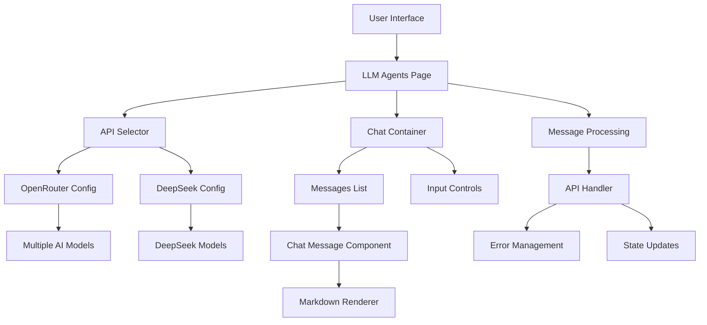
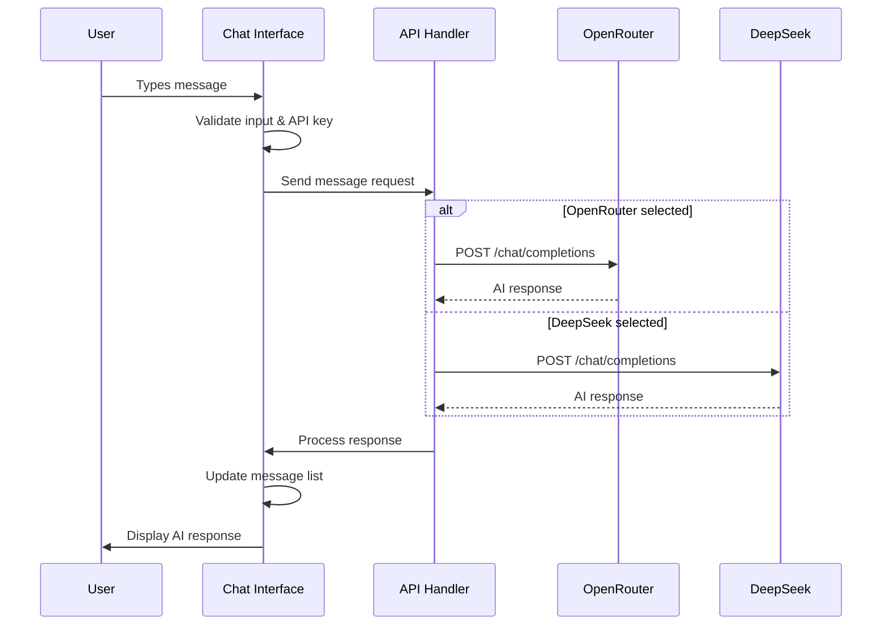
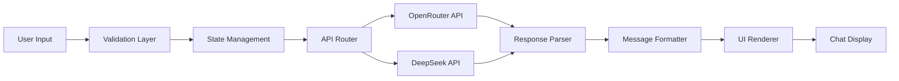
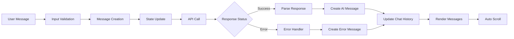
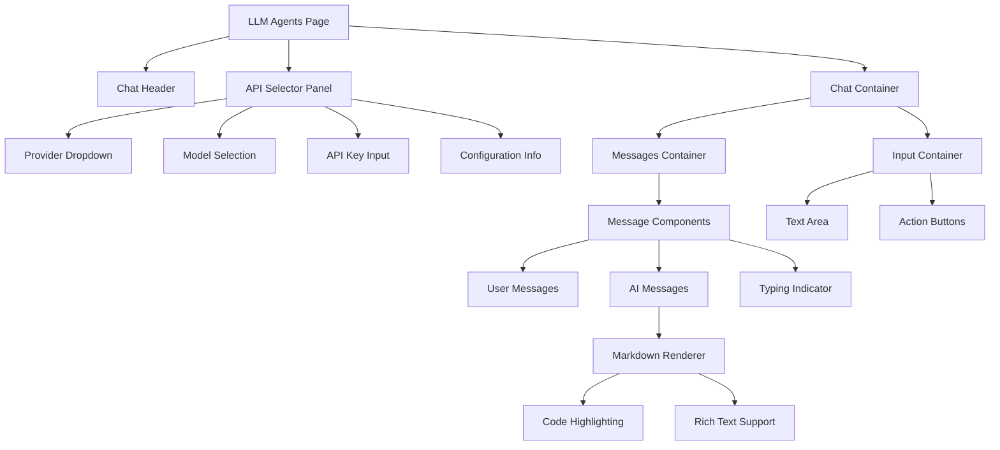
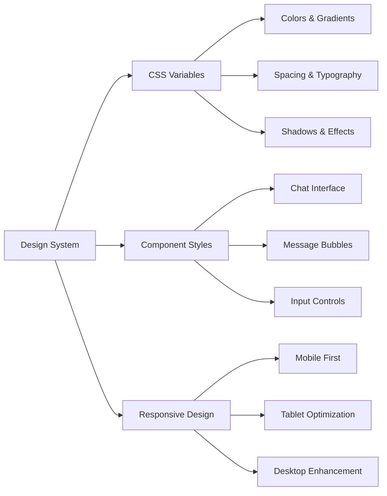
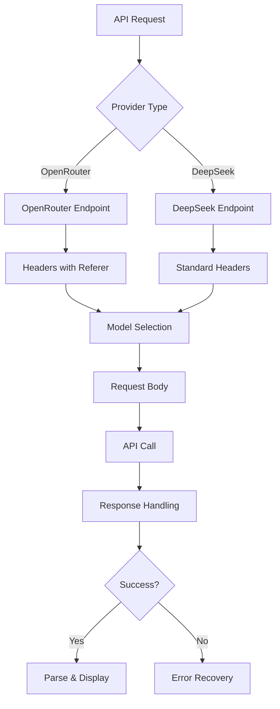
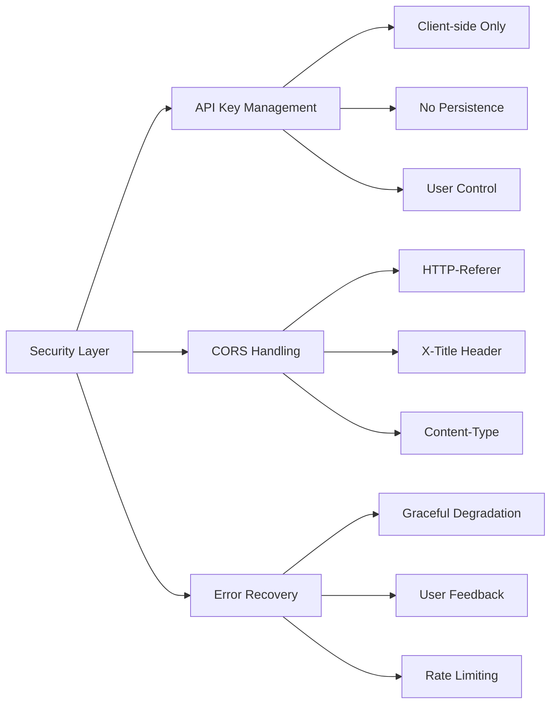

# Building a ChatGPT-like Interface with OpenRouter and DeepSeek APIs

In this post, I'll walk you through the complete implementation of a ChatGPT-like web interface that integrates with multiple AI providers through OpenRouter and DeepSeek APIs. This project demonstrates how to create a modern, responsive chat interface using React and Vite.

## 🎯 Project Overview

The LLM Agents chat interface provides:
- **Multi-API Support**: Integration with OpenRouter and DeepSeek APIs
- **Multiple AI Models**: Access to GPT-4, Claude, Qwen, Llama, and more
- **Real-time Chat**: Interactive messaging with typing indicators
- **Markdown Support**: Rich text rendering for AI responses
- **Responsive Design**: Mobile-friendly interface
- **Free Models**: Access to free AI models like Qwen3-Coder

## 🏗️ Architecture

The implementation follows a modular architecture with clear separation of concerns:



### Core Components Overview

**Main Chat Page (`LLMAgents.jsx`)**
- Manages chat state and user interactions
- Coordinates API calls and response handling
- Provides real-time UI updates

**API Selector (`ApiSelector.jsx`)**
- Dynamic provider and model selection
- Secure API key management interface
- Configuration validation

**Chat Message (`ChatMessage.jsx`)**
- Rich markdown rendering with syntax highlighting
- Responsive message layout
- Timestamp and model information display

### API Integration Flow



### Data Flow Architecture



### Message Processing Pipeline



**Key Processing Features:**
- **Input Validation**: Checks message content and API key presence
- **Error Recovery**: Graceful handling of API failures with user feedback
- **State Management**: Efficient React state updates for real-time chat
- **Auto-scroll**: Automatic scrolling to new messages for better UX

## 🎨 UI Components Architecture



### Component Responsibilities

**Chat Message Component**
- Renders user and AI messages with distinct styling
- Supports full markdown rendering with GitHub Flavored Markdown
- Displays timestamps and model information
- Handles code syntax highlighting

**API Selector Component**
- Provides dynamic model selection based on chosen provider
- Secure API key input with show/hide functionality
- Real-time configuration validation
- Links to provider documentation

## 🎨 Styling and UX

### Design System Overview



### Mobile-First Responsive Strategy

The interface uses a mobile-first approach with progressive enhancement:

**Mobile (iPhone/Small Screens)**
- Simplified navigation with collapsible elements
- Full-width message bubbles for better readability
- Large touch targets (minimum 44px)
- Optimized input areas with iOS keyboard support

**Tablet (iPad/Medium Screens)**
- Two-column layout with sidebar navigation
- Enhanced message formatting
- Improved typography scaling

**Desktop (Large Screens)**
- Full sidebar with enhanced navigation
- Multi-column layouts where appropriate
- Advanced interaction patterns

## 🔧 Key Features

### 1. Multi-Provider Support
- **OpenRouter**: Access to 9+ AI models including GPT-4, Claude, Gemini
- **DeepSeek**: Direct integration with DeepSeek's native API
- **Free Models**: Qwen3-Coder and DeepSeek free models

### 2. Advanced Message Handling
- **Conversation Context**: Maintains full chat history
- **Error Recovery**: Graceful error handling with user feedback
- **Typing Indicators**: Visual feedback during API calls
- **Auto-scroll**: Automatic scrolling to new messages

### 3. Rich Text Support
- **Markdown Rendering**: Full markdown support with syntax highlighting
- **Code Blocks**: Proper formatting for code snippets
- **Tables and Lists**: Complete GFM (GitHub Flavored Markdown) support

### 4. User Experience
- **Real-time Updates**: Instant message rendering
- **Keyboard Shortcuts**: Enter to send, Shift+Enter for new lines
- **Chat Management**: Clear chat functionality
- **Model Information**: Display current model in responses

## 🚀 Integration Steps

### 1. Navigation Integration
Added the new route to the main App component:

```jsx
import LLMAgents from "./pages/LLMAgents.jsx";

// In Routes
<Route path="/llm-agents" element={<LLMAgents />} />
```

### 2. Header Navigation
Updated the navigation to include the new section:

```jsx
<Link to="/llm-agents" className={isActive('/llm-agents') ? 'active' : ''}>
  LLM Agents
</Link>
```

### 3. Styling Integration
Extended the existing CSS architecture with chat-specific styles while maintaining design consistency.

## 📊 API Integration Strategy



### Supported AI Models

**OpenRouter Models:**
- Qwen3-Coder (Free) - Optimized for coding tasks
- Claude 3.5 Sonnet - Advanced reasoning and analysis
- GPT-4o - Latest OpenAI model with vision
- DeepSeek R1 (Free) - Reasoning-focused model
- Llama 3.1 405B - Meta's largest model
- Gemini Pro 1.5 - Google's multimodal AI

**DeepSeek Native Models:**
- DeepSeek Chat - General conversation
- DeepSeek Coder - Programming assistance

## 🔐 Security & Performance Framework



### Performance Optimization Strategy

**React Optimizations:**
- Memoized components for efficient re-rendering
- Efficient state updates with functional setState
- Lazy loading for large message histories
- Debounced input handling

**CSS Performance:**
- GPU-accelerated animations using transform
- Minimal reflows with layout-stable designs
- Efficient CSS selectors
- Reduced specificity conflicts

## 🌟 Advanced Features

### 1. Model Selection
Dynamic model switching based on API provider:
```jsx
const updateModelOnApiChange = (newApi) => {
  setSelectedApi(newApi);
  setSelectedModel(apiConfigs[newApi].models[0]);
};
```

### 2. Message Persistence
Future enhancement could include:
- Local storage for chat history
- Export/import functionality
- Session management

### 3. Streaming Responses
Potential upgrade to streaming APIs:
```javascript
// Streaming response handling
const reader = response.body.getReader();
const decoder = new TextDecoder();
// Process streaming chunks...
```

## 📱 Mobile Optimization

The interface is fully responsive with:
- **Adaptive Layout**: Flexible grid systems
- **Touch-friendly**: Large touch targets
- **Viewport Optimization**: Proper mobile viewport handling
- **Performance**: Efficient rendering for mobile devices

## 🔮 Future Roadmap

```mermaid
timeline
    title Feature Development Roadmap
    
    section Phase 1 : Core Enhancement
        Voice Input          : Speech-to-text integration
        File Uploads         : Document analysis capabilities
        Chat Templates       : Predefined conversation starters
    
    section Phase 2 : Advanced Features
        Plugin System        : Extensible functionality
        Advanced Analytics   : Usage tracking and insights
        Streaming Responses  : Real-time message streaming
    
    section Phase 3 : Platform Features
        PWA Support         : Progressive web app capabilities
        Offline Mode        : Basic functionality without internet
        WebSocket Support   : Real-time bidirectional communication
```

### Technical Evolution Path

**Performance Improvements:**
- Response caching for frequently asked questions
- WebSocket implementation for real-time streaming
- Service worker integration for offline capabilities
- Advanced state management with context providers

**User Experience Enhancements:**
- Voice input and output capabilities
- File upload and analysis features
- Customizable chat themes and layouts
- Advanced keyboard shortcuts and accessibility

## 📈 Performance Optimizations

### 1. Component Optimization
```jsx
// Memoized components for better performance
const ChatMessage = React.memo(({ message }) => {
  // Component implementation
});

// Efficient list rendering
const MessagesList = React.useMemo(() => 
  messages.map(message => (
    <ChatMessage key={message.id} message={message} />
  )), [messages]
);
```

### 2. CSS Optimizations
- **GPU Acceleration**: Transform-based animations
- **Efficient Selectors**: Minimal CSS specificity
- **Reduced Reflows**: Layout-optimized styles

## 🎯 Conclusion

This implementation demonstrates how to build a modern, scalable chat interface that rivals commercial AI chat applications. The modular architecture allows for easy extension and maintenance, while the responsive design ensures a great user experience across all devices.

The integration of multiple AI providers through a unified interface provides users with flexibility and choice, while the clean, intuitive design makes advanced AI capabilities accessible to everyone.

**Key Takeaways:**
- Modern React patterns enable efficient state management
- Proper error handling creates robust user experiences
- Responsive design principles ensure broad accessibility
- API abstraction allows for easy provider switching
- Clean code architecture facilitates future enhancements

The complete implementation showcases how contemporary web technologies can be leveraged to create professional-grade AI chat interfaces that are both powerful and user-friendly.

---

*This blog post documents the complete implementation of the LLM Agents chat feature, demonstrating practical application of modern web development techniques in creating AI-powered user interfaces.*
