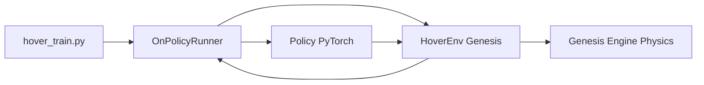
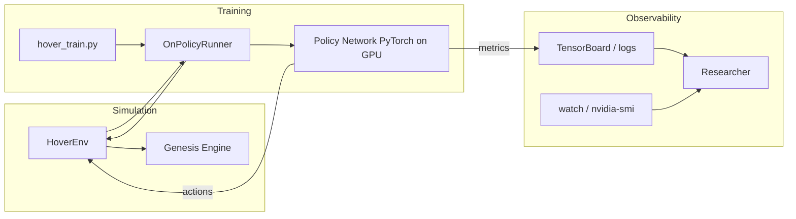

# Drone Working Principles — How a Drone Learns to Hover (Genesis + PyTorch)

*Estimated read: 8–12 minutes · Skill level: Beginner → Intermediate*

This hands-on article shows how to train a simulated quadcopter to hover using the Genesis physics engine and PyTorch. It includes a 15-minute quick start you can run locally, a concise mental model of how training works, practical tips for running on constrained GPUs, and debugging suggestions.

Jump to:

- [Try the demo (15-minute quick start)](#15-minute-quick-start)
- [How it works — the mental model](#how-it-works-non-technical-visual)
- [Developer quick reference](#for-developers-quick-reference)
- [Practical tips & troubleshooting](#practical-tips-to-speed-up-and-stabilize-training)
- [Profiling & experiments](#profiling-and-experiments)

---

## TL;DR

We use Genesis to simulate the drone, PyTorch to learn a control policy (PPO by default), and GPU-accelerated parallel simulation to generate training data quickly and reproducibly. Run a short demo below to see it in action.

Why this matters:

- Safe, fast iteration without risking hardware.
- Reproducible experiments and easy parameter sweeps.
- Single-GPU setups can scale with parallel environments.

---

## 15-minute quick start

Want to verify everything works quickly? The commands below assume you're in the project root and using the included virtualenv `venv310`.

1) Activate the environment and confirm GPU is visible

```bash
source venv310/bin/activate
./venv310/bin/python check_cuda.py
nvidia-smi
```

2) Run a tiny training job (safe defaults for ~4GB GPU)

```bash
export TI_ARCH=cuda
export TI_DEVICE_MEMORY_GB=4
export PYTORCH_CUDA_ALLOC_CONF=max_split_size_mb:64
./venv310/bin/python hover_train.py -B 512 --max_iterations 10
```

3) (Optional) Monitor GPU usage in another terminal

```bash
watch -n 1 nvidia-smi
```

What you should see:

- The training script prints iterations with basic metrics (rewards, steps/s).
- `nvidia-smi` shows a Python process with GPU memory used.

If something fails, check the Troubleshooting section below. When the small run succeeds, increase `-B` (num_envs) to speed up sampling.

---

## How it works (non-technical, visual)

High-level loop:

1. Trainer requests observations (position, velocity, orientation).
2. Policy (neural network) returns actions (motor commands).
3. Simulator applies physics and returns new observations + reward.
4. Trainer updates the policy to maximize expected reward.

Repeat until the policy consistently keeps the drone near the target.

System diagram



---

### Architecture (detailed)

Below is a slightly more detailed view showing where the simulator, trainer, policy and monitoring components sit. This is useful when deciding where to profile or add logging.




## For developers: quick reference

- Entry points: `hover_train.py` (training), `hover_env.py` (environment implementation)
- Key CLI flags: `--num_envs` (`-B`), `--max_iterations`
- Train config knobs: `num_steps_per_env`, `num_mini_batches` (see `get_train_cfg` in the repo)

Safe starting values for ~4GB GPU:

- `num_envs`: start at 512 and increase toward 4096 until you hit memory limits
- `num_steps_per_env`: 100
- `num_mini_batches`: 4

If you get `RuntimeError: CUDA out of memory`, reduce `num_envs` first.

---

## Practical tips to speed up and stabilize training

- Keep tensors on GPU; avoid frequent `.cpu()` / `.numpy()` conversions in the hot loop.
- Use `PYTORCH_CUDA_ALLOC_CONF=max_split_size_mb:64` to reduce fragmentation.
- Try Automatic Mixed Precision (AMP) to save memory and improve throughput.
- Profile with `torch.profiler` when you suspect CPU-GPU synchronization issues.

Set environment variables once in your shell:

```bash
export TI_ARCH=cuda
export TI_DEVICE_MEMORY_GB=4
export PYTORCH_CUDA_ALLOC_CONF=max_split_size_mb:64
```

---

## Troubleshooting (common issues)

- No GPU activity: ensure you used `./venv310/bin/python` and confirm log lines about `TI_ARCH=cuda`.
- CUDA OOM: halve `--num_envs` or reduce `num_steps_per_env`. Enable AMP.
- Slow training despite GPU usage: profile with `torch.profiler` and check for data-copy hotspots.

Short checklist when something breaks:

1. Confirm virtualenv Python is used (`which python` inside venv).
2. Confirm `nvidia-smi` sees a Python process.
3. Lower `--num_envs` and retry.

---

## A few technical nuggets

- Observations: vectors of position, velocity, orientation, and a few auxiliary values (~16–20 dims).
- Actions: 4-D motor commands mapped to thrust.
- Reward: weighted sum of distance-to-target, smoothness, and big negative on crash.

Pseudo reward:

```python
r_target = -k_pos * np.linalg.norm(pos - target_pos)
r_smooth = -k_act * np.linalg.norm(action - prev_action)
r_crash = -100.0 if collision else 0.0
reward = w1*r_target + w2*r_smooth + r_crash
```

---

## Profiling and experiments

- Use `watch -n 1 nvidia-smi` to observe memory and utilization.
- Call `torch.cuda.memory_summary()` for a memory snapshot.
- Sweep grid: `num_envs` ∈ {512,1024,2048,4096}, `num_steps_per_env` ∈ {50,100}, `num_mini_batches` ∈ {2,4,8}.

Record: `steps_per_sec`, `avg_reward`, `gpu_mem_mb`, `wall_time_s`.

---

## Get involved / next steps

Interested in follow-ups I can implement and validate for you:

- Integrate AMP into `hover_train.py` and run a short validation (`num_envs=512`).
- Add `scripts/profile_run.sh` that runs a short job and captures `nvidia-smi` + profiler traces.
- Split long content into `docs/quick_start.md` and `docs/troubleshooting.md` for clearer onboarding.

Tell me which option you prefer and I will implement and validate it.

---

This article was added on 2025-08-30. Run the JSON generator (`npm run generate-json`) if you edit the file to refresh `/data/talks.json`.

