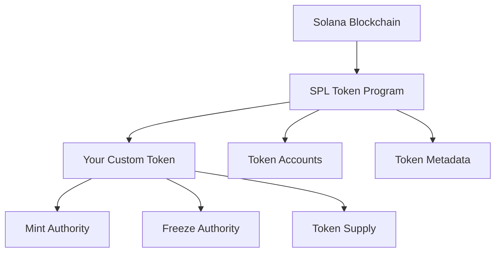
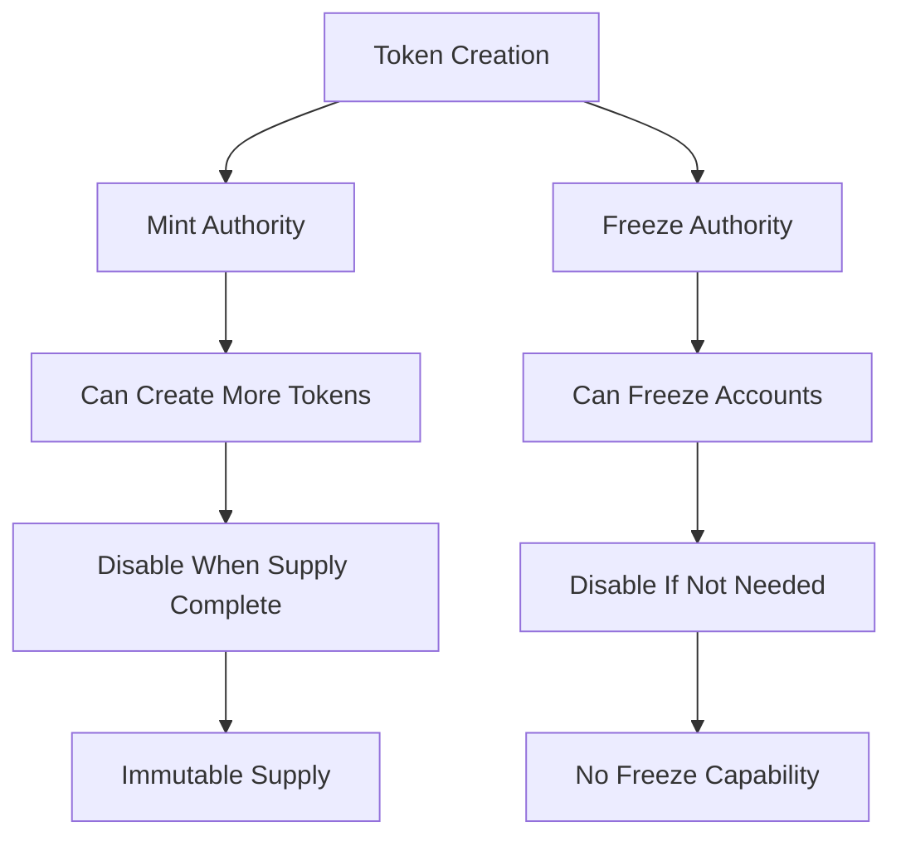

# Step by Step Create Your Own Coin on Solana

*Estimated read: 15–20 minutes · Skill level: Beginner to Intermediate*

Creating your own cryptocurrency token has never been more accessible than it is today on the Solana blockchain. With its high performance, low fees, and robust ecosystem, Solana provides an excellent platform for launching custom tokens. This comprehensive guide will walk you through the entire process of creating your own SPL (Solana Program Library) token from scratch.

---

## Table of Contents

- [Prerequisites](#prerequisites)
- [Understanding Solana and SPL Tokens](#understanding-solana-and-spl-tokens)
- [Environment Setup](#environment-setup)
- [Creating Your Token](#creating-your-token)
- [Token Management](#token-management)
- [Advanced Features](#advanced-features)
- [Best Practices and Security](#best-practices-and-security)
- [Deployment and Distribution](#deployment-and-distribution)
- [Troubleshooting](#troubleshooting)

---

## Prerequisites

Before we dive into token creation, ensure you have:

- Basic understanding of blockchain concepts
- Familiarity with command line interfaces
- Node.js (v16 or higher) installed
- Some SOL tokens for transaction fees (can be obtained from faucets on devnet)
- A text editor or IDE of your choice

**Estimated setup time**: 10-15 minutes

---

## Understanding Solana and SPL Tokens

### What is Solana?

Solana is a high-performance blockchain that supports smart contracts and decentralized applications (dApps). It's known for:

- **High throughput**: Up to 65,000 transactions per second
- **Low fees**: Typically less than $0.001 per transaction
- **Fast confirmation**: Sub-second finality
- **Developer-friendly**: Rich tooling and documentation

### SPL Tokens Explained

SPL (Solana Program Library) tokens are the standard for fungible and non-fungible tokens on Solana, similar to ERC-20 tokens on Ethereum. Key characteristics:

- Built on the SPL Token Program
- Standardized interface for token operations
- Support for token metadata and advanced features
- Integration with Solana's ecosystem



---

## Environment Setup

### 1. Install Solana CLI

First, install the Solana Command Line Interface:

```bash
# For macOS and Linux
sh -c "$(curl -sSfL https://release.solana.com/v1.16.0/install)"

# For Windows (using PowerShell)
cmd /c "curl https://release.solana.com/v1.16.0/solana-install-init-x86_64-pc-windows-msvc.exe --output C:\solana-install-tmp\solana-install-init.exe --create-dirs"
```

Add Solana to your PATH and verify installation:

```bash
export PATH="/home/$(whoami)/.local/share/solana/install/active_release/bin:$PATH"
solana --version
```

### 2. Configure Solana CLI

Set up your Solana configuration for development:

```bash
# Configure to use devnet (recommended for testing)
solana config set --url https://api.devnet.solana.com

# Generate a new keypair (wallet)
solana-keygen new --outfile ~/.config/solana/devnet.json

# Set the keypair as default
solana config set --keypair ~/.config/solana/devnet.json

# Check your configuration
solana config get
```

### 3. Fund Your Wallet

Get some SOL tokens for transaction fees:

```bash
# Request SOL from the devnet faucet
solana airdrop 2

# Check your balance
solana balance
```

### 4. Install SPL Token CLI

```bash
# Install the SPL Token command line tool
cargo install spl-token-cli
```

---

## Creating Your Token

### Step 1: Create a New Token

Let's create our token. We'll call it "MyAwesomeCoin" (MAC):

```bash
# Create a new token
spl-token create-token

# You'll see output like:
# Creating token 7xKXtg2CW87d97TXJSDpbD5jBkheTqA83TZRuJosgAsU
# 
# Address:  7xKXtg2CW87d97TXJSDpbD5jBkheTqA83TZRuJosgAsU
# Decimals: 9
```

**Important**: Save the token address! You'll need it for all subsequent operations.

Let's store it in an environment variable for convenience:

```bash
# Replace with your actual token address
export TOKEN_ADDRESS=7xKXtg2CW87d97TXJSDpbD5jBkheTqA83TZRuJosgAsU
```

### Step 2: Create a Token Account

Before you can mint tokens, you need a token account to hold them:

```bash
# Create a token account for your wallet
spl-token create-account $TOKEN_ADDRESS

# You'll see output like:
# Creating account 8rKXtg2CW87d97TXJSDpbD5jBkheTqA83TZRuJosgGhY
```

### Step 3: Mint Initial Supply

Now let's mint some tokens to your account:

```bash
# Mint 1,000,000 tokens (remember, default is 9 decimals)
spl-token mint $TOKEN_ADDRESS 1000000

# Check your token balance
spl-token balance $TOKEN_ADDRESS
```

### Step 4: Create Token Metadata

To make your token more professional, add metadata:

```bash
# Install Metaplex CLI
npm install -g @metaplex/js @metaplex-foundation/mpl-token-metadata

# Create metadata JSON file
cat > token-metadata.json << EOL
{
  "name": "MyAwesome Coin",
  "symbol": "MAC",
  "description": "A revolutionary token built on Solana",
  "image": "https://raw.githubusercontent.com/solana-labs/token-list/main/assets/mainnet/So11111111111111111111111111111111111111112/logo.png",
  "attributes": [],
  "properties": {
    "files": [
      {
        "uri": "https://raw.githubusercontent.com/solana-labs/token-list/main/assets/mainnet/So11111111111111111111111111111111111111112/logo.png",
        "type": "image/png"
      }
    ],
    "category": "image"
  }
}
EOL
```

---

## Token Management

### Checking Token Information

```bash
# Get detailed token information
spl-token display $TOKEN_ADDRESS

# Check total supply
spl-token supply $TOKEN_ADDRESS

# List all your token accounts
spl-token accounts
```

### Transferring Tokens

```bash
# Transfer tokens to another wallet
spl-token transfer $TOKEN_ADDRESS 100 <recipient_address>

# Transfer with creating a recipient account if needed
spl-token transfer $TOKEN_ADDRESS 100 <recipient_address> --fund-recipient
```

### Managing Token Accounts

```bash
# Create an associated token account for someone else
spl-token create-account $TOKEN_ADDRESS --owner <owner_public_key>

# Close an empty token account (get SOL back)
spl-token close <token_account_address>
```

---

## Advanced Features

### 1. Disable Minting

Once you've minted your desired supply, you can disable further minting:

```bash
# Disable minting permanently
spl-token authorize $TOKEN_ADDRESS mint --disable
```

**Warning**: This action is irreversible!

### 2. Freeze/Unfreeze Accounts

If you need moderation capabilities:

```bash
# Freeze a token account
spl-token freeze <token_account_address>

# Unfreeze a token account
spl-token thaw <token_account_address>

# Disable freeze authority permanently
spl-token authorize $TOKEN_ADDRESS freeze --disable
```

### 3. Multisig Setup

For enhanced security, set up multisig authority:

```bash
# Create a multisig account
spl-token create-multisig 2 <pubkey1> <pubkey2> <pubkey3>

# Set multisig as token authority
spl-token authorize $TOKEN_ADDRESS mint <multisig_address>
```

---

## Best Practices and Security

### 1. Authority Management



### 2. Security Checklist

- [ ] Use hardware wallets for mainnet deployment
- [ ] Test thoroughly on devnet before mainnet
- [ ] Consider multisig for important authorities
- [ ] Plan your tokenomics carefully
- [ ] Audit smart contracts if using custom programs
- [ ] Keep private keys secure and backed up

### 3. Token Distribution Strategy

```bash
# Example: Distribute tokens to multiple addresses
RECIPIENTS=(
  "address1"
  "address2" 
  "address3"
)

AMOUNT=1000

for recipient in "${RECIPIENTS[@]}"; do
  echo "Sending $AMOUNT tokens to $recipient"
  spl-token transfer $TOKEN_ADDRESS $AMOUNT $recipient --fund-recipient
done
```

---

## Deployment and Distribution

### Moving to Mainnet

When you're ready to deploy to mainnet:

```bash
# Switch to mainnet
solana config set --url https://api.mainnet-beta.solana.com

# Create a new mainnet wallet (keep it secure!)
solana-keygen new --outfile ~/.config/solana/mainnet.json
solana config set --keypair ~/.config/solana/mainnet.json

# Fund your mainnet wallet (buy SOL from exchanges)
# Then repeat the token creation process
```

### Token Distribution Options

1. **Airdrop**: Distribute tokens to existing wallet holders
2. **DEX Listing**: List on decentralized exchanges like Raydium or Orca
3. **Liquidity Pools**: Provide liquidity for trading
4. **ICO/IDO**: Initial coin/DEX offerings
5. **Staking Rewards**: Distribute as rewards for participation

### Integration with Wallets and Exchanges

To get your token recognized by wallets and exchanges:

1. **Submit to Solana Token List**:
   ```bash
   # Fork the official token list repository
   git clone https://github.com/solana-labs/token-list.git
   
   # Add your token to the appropriate network file
   # Submit a pull request
   ```

2. **Create a Token Registry Entry**:
   ```json
   {
     "chainId": 101,
     "address": "your_token_address",
     "symbol": "MAC",
     "name": "MyAwesome Coin",
     "decimals": 9,
     "logoURI": "https://your-domain.com/logo.png",
     "tags": ["utility-token"]
   }
   ```

---

## Troubleshooting

### Common Issues and Solutions

#### 1. "Insufficient SOL" Error
```bash
# Solution: Get more SOL
solana airdrop 2  # For devnet
# Or buy SOL for mainnet
```

#### 2. Token Account Already Exists
```bash
# Check existing accounts
spl-token accounts
# Use existing account or close and recreate
```

#### 3. Authority Issues
```bash
# Check current authorities
spl-token display $TOKEN_ADDRESS
# Update authorities if needed
spl-token authorize $TOKEN_ADDRESS mint <new_authority>
```

#### 4. Network Connection Issues
```bash
# Check network configuration
solana config get
# Try different RPC endpoints
solana config set --url https://solana-api.projectserum.com
```

### Debugging Commands

```bash
# Check transaction details
solana confirm <transaction_signature>

# Get recent block hash
solana get-block-height

# Check network status
solana cluster-version

# View transaction logs
solana logs --commitment confirmed
```

---

## Real-World Example: Complete Token Creation

Let's put it all together with a complete example:

```bash
#!/bin/bash
# complete-token-creation.sh

set -e  # Exit on any error

echo "🚀 Creating MyAwesome Coin (MAC) on Solana..."

# Configuration
TOKEN_NAME="MyAwesome Coin"
TOKEN_SYMBOL="MAC"
INITIAL_SUPPLY=1000000
DECIMALS=9

echo "📋 Configuration:"
echo "Name: $TOKEN_NAME"
echo "Symbol: $TOKEN_SYMBOL"
echo "Initial Supply: $INITIAL_SUPPLY"
echo "Decimals: $DECIMALS"
echo ""

# Create token
echo "🪙 Creating token..."
TOKEN_ADDRESS=$(spl-token create-token --decimals $DECIMALS | grep "Address:" | awk '{print $2}')
echo "Token Address: $TOKEN_ADDRESS"
echo ""

# Create token account
echo "💳 Creating token account..."
TOKEN_ACCOUNT=$(spl-token create-account $TOKEN_ADDRESS | grep "Creating account" | awk '{print $3}')
echo "Token Account: $TOKEN_ACCOUNT"
echo ""

# Mint initial supply
echo "🏭 Minting initial supply..."
spl-token mint $TOKEN_ADDRESS $INITIAL_SUPPLY
echo ""

# Check balance
echo "💰 Checking balance..."
BALANCE=$(spl-token balance $TOKEN_ADDRESS)
echo "Current Balance: $BALANCE $TOKEN_SYMBOL"
echo ""

# Display token info
echo "ℹ️ Token Information:"
spl-token display $TOKEN_ADDRESS
echo ""

# Disable minting (optional)
read -p "❓ Disable minting permanently? (y/N): " DISABLE_MINT
if [[ $DISABLE_MINT =~ ^[Yy]$ ]]; then
    echo "🔒 Disabling mint authority..."
    spl-token authorize $TOKEN_ADDRESS mint --disable
    echo "Minting disabled permanently!"
fi

echo ""
echo "✅ Token creation complete!"
echo "Token Address: $TOKEN_ADDRESS"
echo "Save this address - you'll need it for all future operations!"
```

Run the script:
```bash
chmod +x complete-token-creation.sh
./complete-token-creation.sh
```

---

## Conclusion

Congratulations! You've successfully learned how to create your own token on Solana. Here's what we covered:

1. **Environment Setup**: Installed and configured Solana CLI tools
2. **Token Creation**: Created an SPL token with custom parameters
3. **Token Management**: Learned how to mint, transfer, and manage tokens
4. **Advanced Features**: Explored multisig, freezing, and authority management
5. **Security Best Practices**: Implemented proper security measures
6. **Deployment Strategy**: Planned for mainnet deployment and distribution

### Next Steps

- **Build a Community**: Create social media presence and engage users
- **Develop Utility**: Design use cases and functionality for your token
- **Create Liquidity**: Establish trading pairs on DEXs
- **Partner with Projects**: Integrate with other Solana ecosystem projects
- **Continuous Development**: Keep improving and adding features

### Additional Resources

- [Solana Documentation](https://docs.solana.com/)
- [SPL Token Program](https://spl.solana.com/token)
- [Metaplex Documentation](https://docs.metaplex.com/)
- [Solana Developer Resources](https://solana.com/developers)
- [Solana Cookbook](https://solanacookbook.com/)

### Community and Support

- [Solana Discord](https://discord.gg/solana)
- [Solana Stack Exchange](https://solana.stackexchange.com/)
- [r/solana Reddit](https://reddit.com/r/solana)
- [Solana Twitter](https://twitter.com/solana)

Remember: Creating a token is just the beginning. The real value comes from building a strong community, providing utility, and creating real-world use cases. Good luck with your Solana token journey!

---

*This guide was written on 2025-09-03. Solana tooling and best practices evolve rapidly, so always check the official documentation for the latest information.*