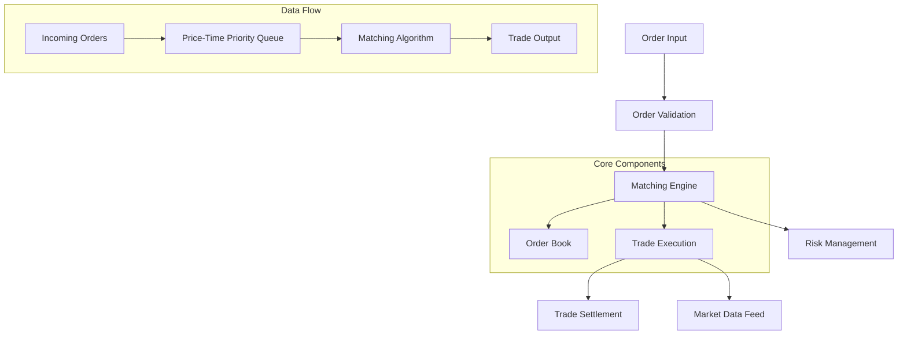
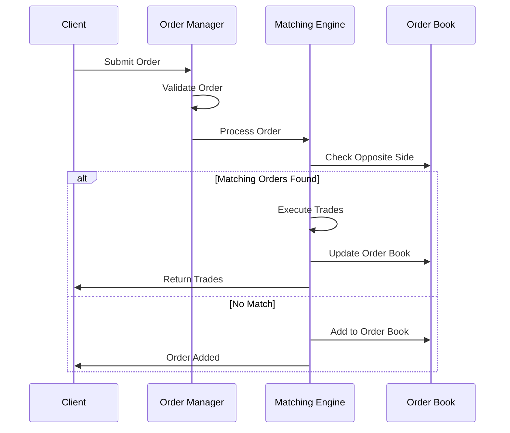
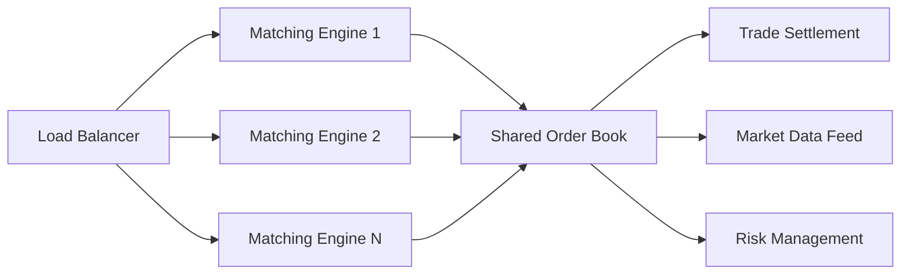

# Step by Step Making a CEX Match Engine in 10mins

*Estimated read: 8–10 minutes · Skill level: Intermediate → Advanced*

Building a centralized exchange (CEX) matching engine is one of the most challenging aspects of creating a trading platform. This hands-on guide walks you through creating a high-performance matching engine from scratch, covering order book management, trade execution algorithms, and optimization techniques.

Jump to:

- [Quick Start (10-minute implementation)](#10-minute-quick-start)
- [Architecture Overview](#architecture-overview)
- [Core Components](#core-components)
- [Order Matching Algorithm](#order-matching-algorithm)
- [Performance Optimization](#performance-optimization)
- [Testing & Validation](#testing--validation)

---

## TL;DR

We'll build a matching engine that handles buy/sell orders, maintains an order book, executes trades using price-time priority, and processes thousands of orders per second. The implementation uses in-memory data structures optimized for low-latency trading.

Key features:
- Real-time order book management
- Price-time priority matching
- Atomic trade execution
- Market and limit order support
- Comprehensive logging and metrics

---

## 10-minute Quick Start

Let's build the core matching engine step by step. Start with the basic structure:

### Step 1: Order Data Structure (2 minutes)

```javascript
class Order {
    constructor(id, type, side, quantity, price, timestamp) {
        this.id = id;
        this.type = type; // 'market' or 'limit'
        this.side = side; // 'buy' or 'sell'
        this.quantity = quantity;
        this.price = price;
        this.timestamp = timestamp;
        this.remainingQuantity = quantity;
    }
}

class Trade {
    constructor(buyOrderId, sellOrderId, price, quantity, timestamp) {
        this.buyOrderId = buyOrderId;
        this.sellOrderId = sellOrderId;
        this.price = price;
        this.quantity = quantity;
        this.timestamp = timestamp;
    }
}
```

### Step 2: Order Book Implementation (3 minutes)

```javascript
class OrderBook {
    constructor() {
        // Using Maps for O(1) lookup and maintaining insertion order
        this.buyOrders = new Map(); // price -> orders[]
        this.sellOrders = new Map(); // price -> orders[]
        this.allOrders = new Map(); // orderId -> order
        this.trades = [];
    }

    addOrder(order) {
        this.allOrders.set(order.id, order);
        
        const book = order.side === 'buy' ? this.buyOrders : this.sellOrders;
        if (!book.has(order.price)) {
            book.set(order.price, []);
        }
        book.get(order.price).push(order);
        
        // Sort order book for optimal matching
        this.sortOrderBook();
    }

    sortOrderBook() {
        // Buy orders: highest price first
        this.buyOrders = new Map([...this.buyOrders.entries()].sort((a, b) => b[0] - a[0]));
        // Sell orders: lowest price first
        this.sellOrders = new Map([...this.sellOrders.entries()].sort((a, b) => a[0] - b[0]));
    }

    getBestBid() {
        return this.buyOrders.size > 0 ? Math.max(...this.buyOrders.keys()) : null;
    }

    getBestAsk() {
        return this.sellOrders.size > 0 ? Math.min(...this.sellOrders.keys()) : null;
    }
}
```

### Step 3: Matching Engine Core (3 minutes)

```javascript
class MatchingEngine {
    constructor() {
        this.orderBook = new OrderBook();
        this.trades = [];
        this.orderIdCounter = 1;
    }

    submitOrder(type, side, quantity, price = null) {
        const order = new Order(
            this.orderIdCounter++,
            type,
            side,
            quantity,
            price,
            Date.now()
        );

        if (type === 'market') {
            return this.processMarketOrder(order);
        } else {
            return this.processLimitOrder(order);
        }
    }

    processLimitOrder(order) {
        const trades = this.matchOrder(order);
        
        // Add remaining quantity to order book
        if (order.remainingQuantity > 0) {
            this.orderBook.addOrder(order);
        }
        
        return { order, trades };
    }

    processMarketOrder(order) {
        return { order, trades: this.matchOrder(order) };
    }

    matchOrder(incomingOrder) {
        const trades = [];
        const oppositeBook = incomingOrder.side === 'buy' ? 
            this.orderBook.sellOrders : this.orderBook.buyOrders;

        for (const [price, orders] of oppositeBook) {
            if (incomingOrder.remainingQuantity === 0) break;
            
            // Check if prices can match
            if (!this.canMatch(incomingOrder, price)) break;

            // Process orders at this price level
            for (let i = 0; i < orders.length && incomingOrder.remainingQuantity > 0; i++) {
                const bookOrder = orders[i];
                const trade = this.executeTrade(incomingOrder, bookOrder);
                
                if (trade) {
                    trades.push(trade);
                    this.trades.push(trade);
                }

                // Remove filled orders
                if (bookOrder.remainingQuantity === 0) {
                    orders.splice(i, 1);
                    i--; // Adjust index after removal
                }
            }

            // Remove empty price levels
            if (orders.length === 0) {
                oppositeBook.delete(price);
            }
        }

        return trades;
    }

    canMatch(order, bookPrice) {
        if (order.type === 'market') return true;
        
        return order.side === 'buy' ? 
            order.price >= bookPrice : 
            order.price <= bookPrice;
    }

    executeTrade(incomingOrder, bookOrder) {
        const tradeQuantity = Math.min(
            incomingOrder.remainingQuantity,
            bookOrder.remainingQuantity
        );

        if (tradeQuantity === 0) return null;

        // Price priority: existing book order price takes precedence
        const tradePrice = bookOrder.price;

        // Update quantities
        incomingOrder.remainingQuantity -= tradeQuantity;
        bookOrder.remainingQuantity -= tradeQuantity;

        return new Trade(
            incomingOrder.side === 'buy' ? incomingOrder.id : bookOrder.id,
            incomingOrder.side === 'sell' ? incomingOrder.id : bookOrder.id,
            tradePrice,
            tradeQuantity,
            Date.now()
        );
    }
}
```

### Step 4: Quick Test (2 minutes)

```javascript
// Initialize the engine
const engine = new MatchingEngine();

// Add some orders
console.log('=== Adding Orders ===');
engine.submitOrder('limit', 'buy', 100, 50.00);
engine.submitOrder('limit', 'buy', 200, 49.50);
engine.submitOrder('limit', 'sell', 150, 50.50);

console.log('Best Bid:', engine.orderBook.getBestBid());
console.log('Best Ask:', engine.orderBook.getBestAsk());

// Execute a trade
console.log('\n=== Executing Market Order ===');
const result = engine.submitOrder('market', 'sell', 80);
console.log('Trades executed:', result.trades.length);
console.log('Trade details:', result.trades);

console.log('\nUpdated Best Bid:', engine.orderBook.getBestBid());
console.log('Updated Best Ask:', engine.orderBook.getBestAsk());
```

---

## Architecture Overview

The matching engine follows a modular architecture optimized for performance and maintainability:



### Key Design Principles

1. **Low Latency**: In-memory data structures with O(1) operations where possible
2. **Deterministic**: Price-time priority ensures fair and predictable execution
3. **Atomic Operations**: Trades execute completely or not at all
4. **Scalable**: Modular design supports horizontal scaling

---

## Core Components

### Order Management System

The order management handles lifecycle events:

```javascript
class OrderManager {
    constructor(matchingEngine) {
        this.engine = matchingEngine;
        this.orderHistory = new Map();
    }

    submitOrder(orderData) {
        // Validate order
        const validation = this.validateOrder(orderData);
        if (!validation.valid) {
            return { success: false, error: validation.error };
        }

        // Process order
        const result = this.engine.submitOrder(
            orderData.type,
            orderData.side,
            orderData.quantity,
            orderData.price
        );

        // Store in history
        this.orderHistory.set(result.order.id, result.order);

        return { success: true, ...result };
    }

    validateOrder(orderData) {
        if (orderData.quantity <= 0) {
            return { valid: false, error: 'Invalid quantity' };
        }
        
        if (orderData.type === 'limit' && (!orderData.price || orderData.price <= 0)) {
            return { valid: false, error: 'Invalid price for limit order' };
        }

        return { valid: true };
    }

    cancelOrder(orderId) {
        const order = this.engine.orderBook.allOrders.get(orderId);
        if (!order) {
            return { success: false, error: 'Order not found' };
        }

        // Remove from order book
        const book = order.side === 'buy' ? 
            this.engine.orderBook.buyOrders : 
            this.engine.orderBook.sellOrders;
            
        const orders = book.get(order.price);
        if (orders) {
            const index = orders.findIndex(o => o.id === orderId);
            if (index !== -1) {
                orders.splice(index, 1);
                if (orders.length === 0) {
                    book.delete(order.price);
                }
            }
        }

        this.engine.orderBook.allOrders.delete(orderId);
        return { success: true, cancelledOrder: order };
    }
}
```

---

## Order Matching Algorithm

The heart of the matching engine implements **price-time priority**:

### Matching Flow



### Priority Rules

1. **Price Priority**: Better prices execute first
   - Buy orders: highest price first
   - Sell orders: lowest price first

2. **Time Priority**: Earlier orders execute first at the same price level

3. **Order Types**:
   - **Limit Orders**: Execute at specified price or better
   - **Market Orders**: Execute immediately at best available price

---

## Performance Optimization

### Memory Management

```javascript
class OptimizedOrderBook {
    constructor() {
        // Use binary heaps for faster price level operations
        this.buyPrices = new MaxHeap(); // Highest price first
        this.sellPrices = new MinHeap(); // Lowest price first
        
        // Price level -> orders mapping
        this.buyLevels = new Map();
        this.sellLevels = new Map();
        
        // Fast order lookup
        this.orders = new Map();
    }

    // Custom heap implementations for price levels
    addBuyOrder(order) {
        if (!this.buyLevels.has(order.price)) {
            this.buyLevels.set(order.price, []);
            this.buyPrices.insert(order.price);
        }
        this.buyLevels.get(order.price).push(order);
        this.orders.set(order.id, order);
    }

    getBestBid() {
        return this.buyPrices.peek();
    }

    getBestAsk() {
        return this.sellPrices.peek();
    }
}
```

### Batch Processing

For high-throughput scenarios:

```javascript
class BatchProcessor {
    constructor(matchingEngine, batchSize = 1000) {
        this.engine = matchingEngine;
        this.batchSize = batchSize;
        this.orderQueue = [];
        this.processing = false;
    }

    async submitOrder(orderData) {
        return new Promise((resolve) => {
            this.orderQueue.push({ orderData, resolve });
            this.processBatch();
        });
    }

    async processBatch() {
        if (this.processing || this.orderQueue.length === 0) return;
        
        this.processing = true;
        
        const batch = this.orderQueue.splice(0, this.batchSize);
        const results = [];

        // Process batch atomically
        for (const { orderData, resolve } of batch) {
            const result = this.engine.submitOrder(
                orderData.type,
                orderData.side,
                orderData.quantity,
                orderData.price
            );
            results.push(result);
            resolve(result);
        }

        this.processing = false;
        
        // Process remaining orders
        if (this.orderQueue.length > 0) {
            setImmediate(() => this.processBatch());
        }
    }
}
```

---

## Testing & Validation

### Unit Tests

```javascript
class MatchingEngineTests {
    static runTests() {
        console.log('Running Matching Engine Tests...');
        
        this.testBasicMatching();
        this.testPriceTimePriority();
        this.testPartialFills();
        this.testMarketOrders();
        
        console.log('All tests passed!');
    }

    static testBasicMatching() {
        const engine = new MatchingEngine();
        
        // Add buy order
        engine.submitOrder('limit', 'buy', 100, 50.00);
        
        // Add matching sell order
        const result = engine.submitOrder('limit', 'sell', 100, 50.00);
        
        console.assert(result.trades.length === 1, 'Should execute one trade');
        console.assert(result.trades[0].quantity === 100, 'Should trade full quantity');
        console.assert(result.trades[0].price === 50.00, 'Should trade at correct price');
    }

    static testPriceTimePriority() {
        const engine = new MatchingEngine();
        
        // Add orders with different prices and times
        engine.submitOrder('limit', 'buy', 100, 50.00); // First at price
        engine.submitOrder('limit', 'buy', 100, 51.00); // Higher price
        engine.submitOrder('limit', 'buy', 100, 50.00); // Second at same price
        
        // Sell should match highest price first
        const result = engine.submitOrder('limit', 'sell', 100, 50.00);
        
        console.assert(result.trades[0].price === 51.00, 'Should match highest price first');
    }

    static testPartialFills() {
        const engine = new MatchingEngine();
        
        engine.submitOrder('limit', 'buy', 50, 50.00);
        const result = engine.submitOrder('limit', 'sell', 100, 50.00);
        
        console.assert(result.trades[0].quantity === 50, 'Should partially fill');
        console.assert(result.order.remainingQuantity === 50, 'Should have remaining quantity');
    }

    static testMarketOrders() {
        const engine = new MatchingEngine();
        
        engine.submitOrder('limit', 'buy', 100, 50.00);
        engine.submitOrder('limit', 'buy', 100, 49.00);
        
        const result = engine.submitOrder('market', 'sell', 150);
        
        console.assert(result.trades.length === 2, 'Should match multiple levels');
        console.assert(result.trades[0].price === 50.00, 'Should match best price first');
    }
}

// Run tests
MatchingEngineTests.runTests();
```

### Performance Benchmarks

```javascript
class PerformanceBenchmark {
    static benchmark() {
        const engine = new MatchingEngine();
        const orderCount = 10000;
        
        console.log(`Benchmarking ${orderCount} orders...`);
        
        const startTime = Date.now();
        
        // Add orders
        for (let i = 0; i < orderCount; i++) {
            const side = i % 2 === 0 ? 'buy' : 'sell';
            const price = 50 + (Math.random() - 0.5) * 10;
            engine.submitOrder('limit', side, 100, price);
        }
        
        const endTime = Date.now();
        const duration = endTime - startTime;
        const ordersPerSecond = (orderCount / duration) * 1000;
        
        console.log(`Processed ${orderCount} orders in ${duration}ms`);
        console.log(`Performance: ${ordersPerSecond.toFixed(0)} orders/second`);
        console.log(`Total trades executed: ${engine.trades.length}`);
    }
}

PerformanceBenchmark.benchmark();
```

---

## Real-World Considerations

### Production Enhancements

1. **Persistence**: Add database integration for order and trade history
2. **Risk Management**: Implement position limits and margin requirements
3. **Market Data**: Real-time order book and trade feeds
4. **Order Types**: Stop orders, iceberg orders, time-in-force options
5. **Settlement**: Integration with clearing and settlement systems

### Scaling Strategies



---

## Conclusion

Building a CEX matching engine involves careful consideration of data structures, algorithms, and performance optimization. This implementation provides a solid foundation that can be extended with additional features like advanced order types, risk management, and horizontal scaling capabilities.

The key to success is maintaining simplicity in the core matching logic while ensuring the system can handle high throughput and low latency requirements of modern trading environments.

## Next Steps

- Implement advanced order types (stop-loss, take-profit)
- Add comprehensive logging and monitoring
- Integrate with market data feeds
- Implement clustering for horizontal scaling
- Add regulatory compliance features

---

This article was added on 2025-09-07. Run the JSON generator (`npm run generate-json`) if you edit the file to refresh `/data/talks.json`.