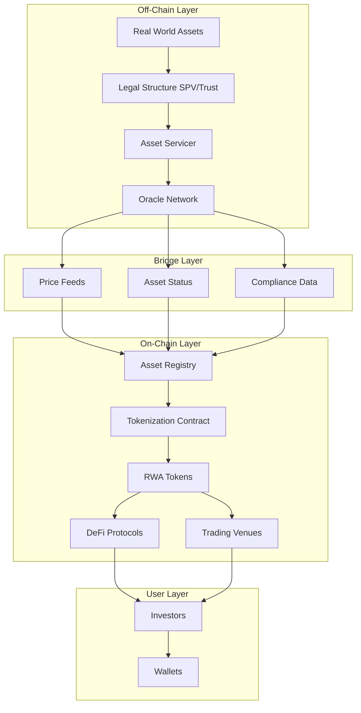
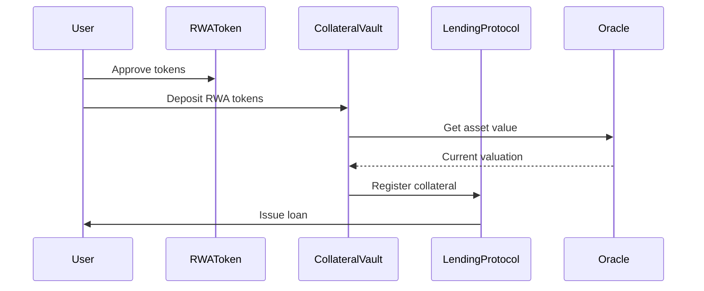
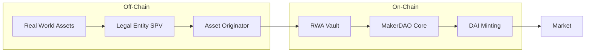
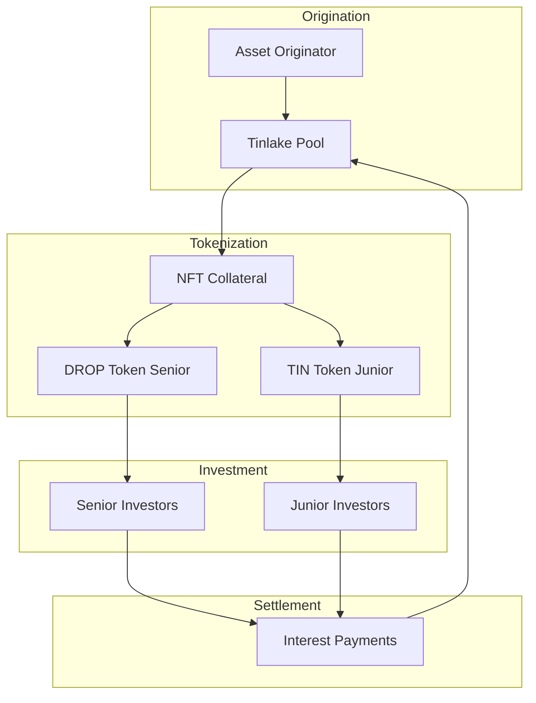
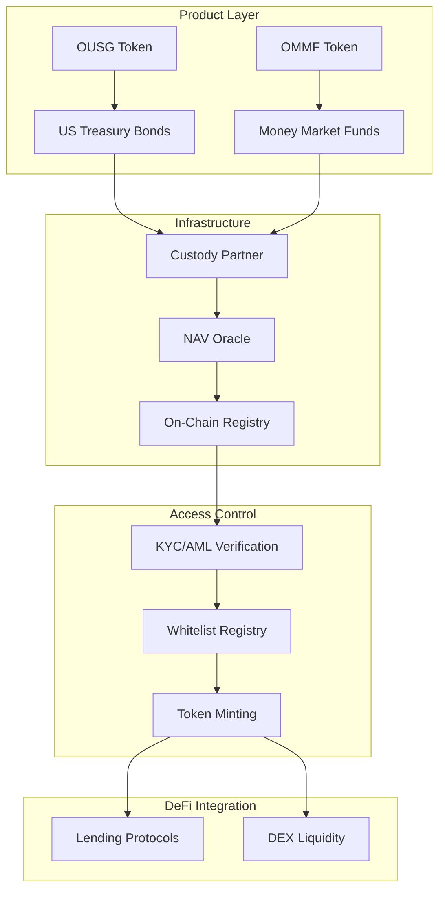
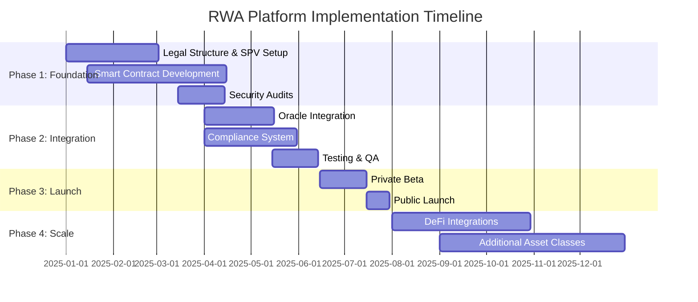

# RWA Tech Architecture and Design: Building Real World Asset Tokenization Platforms

*Estimated read: 20–25 minutes · Skill level: Intermediate to Advanced*

Real World Asset (RWA) tokenization is revolutionizing how traditional financial assets interact with blockchain technology. This comprehensive guide explores the technical architecture and design patterns used in successful RWA platforms, providing insights from industry leaders like MakerDAO, Centrifuge, and Ondo Finance.

---

## Table of Contents

- [What is RWA Tokenization?](#what-is-rwa-tokenization)
- [Core Technical Architecture](#core-technical-architecture)
- [Smart Contract Design Patterns](#smart-contract-design-patterns)
- [Case Study: MakerDAO RWA Integration](#case-study-makerdao-rwa-integration)
- [Case Study: Centrifuge Protocol](#case-study-centrifuge-protocol)
- [Case Study: Ondo Finance](#case-study-ondo-finance)
- [Security Considerations](#security-considerations)
- [Compliance and Regulatory Tech](#compliance-and-regulatory-tech)
- [Implementation Best Practices](#implementation-best-practices)
- [Future Trends](#future-trends)

---

## What is RWA Tokenization?

Real World Asset tokenization is the process of creating digital tokens on a blockchain that represent ownership or claims to physical or traditional financial assets. These assets can include:

- **Real Estate**: Property ownership, REITs
- **Debt Instruments**: Loans, bonds, treasury bills
- **Commodities**: Gold, oil, agricultural products
- **Equity**: Private company shares, fund interests
- **Intellectual Property**: Patents, copyrights, royalties

### Key Benefits

1. **Liquidity**: 24/7 trading, fractional ownership
2. **Transparency**: On-chain audit trails
3. **Efficiency**: Reduced intermediaries, faster settlement
4. **Accessibility**: Lower barriers to entry for investors
5. **Composability**: Integration with DeFi protocols

### Technical Challenges

- Asset verification and valuation
- Legal compliance and regulatory frameworks
- Oracle integration for off-chain data
- Identity and access management
- Collateral management and liquidation

---

## Core Technical Architecture

### High-Level System Architecture



### Core Components Breakdown

#### 1. Asset Registry Contract

The asset registry maintains on-chain records of all tokenized assets:

```solidity
// Simplified Asset Registry Contract
pragma solidity ^0.8.20;

import "@openzeppelin/contracts/access/AccessControl.sol";
import "@openzeppelin/contracts/security/ReentrancyGuard.sol";

contract AssetRegistry is AccessControl, ReentrancyGuard {
    bytes32 public constant ASSET_MANAGER_ROLE = keccak256("ASSET_MANAGER_ROLE");
    
    struct Asset {
        string assetType;        // "RealEstate", "Bond", "Loan", etc.
        string identifier;       // Unique off-chain identifier
        uint256 totalValue;      // Total asset value in base currency
        uint256 tokenizedAmount; // Amount represented by tokens
        address tokenContract;   // Associated token contract
        bool isActive;          // Asset status
        uint256 lastUpdated;    // Timestamp of last update
        string metadataURI;     // IPFS or similar URI for details
    }
    
    mapping(bytes32 => Asset) public assets;
    mapping(address => bytes32[]) public assetsByToken;
    
    event AssetRegistered(
        bytes32 indexed assetId,
        string assetType,
        address tokenContract
    );
    
    event AssetUpdated(
        bytes32 indexed assetId,
        uint256 newValue,
        uint256 timestamp
    );
    
    constructor() {
        _grantRole(DEFAULT_ADMIN_ROLE, msg.sender);
        _grantRole(ASSET_MANAGER_ROLE, msg.sender);
    }
    
    function registerAsset(
        bytes32 assetId,
        string memory assetType,
        string memory identifier,
        uint256 totalValue,
        uint256 tokenizedAmount,
        address tokenContract,
        string memory metadataURI
    ) external onlyRole(ASSET_MANAGER_ROLE) {
        require(assets[assetId].lastUpdated == 0, "Asset already registered");
        
        assets[assetId] = Asset({
            assetType: assetType,
            identifier: identifier,
            totalValue: totalValue,
            tokenizedAmount: tokenizedAmount,
            tokenContract: tokenContract,
            isActive: true,
            lastUpdated: block.timestamp,
            metadataURI: metadataURI
        });
        
        assetsByToken[tokenContract].push(assetId);
        
        emit AssetRegistered(assetId, assetType, tokenContract);
    }
    
    function updateAssetValue(
        bytes32 assetId,
        uint256 newValue
    ) external onlyRole(ASSET_MANAGER_ROLE) {
        require(assets[assetId].isActive, "Asset not active");
        
        assets[assetId].totalValue = newValue;
        assets[assetId].lastUpdated = block.timestamp;
        
        emit AssetUpdated(assetId, newValue, block.timestamp);
    }
    
    function getAssetInfo(bytes32 assetId) 
        external 
        view 
        returns (Asset memory) 
    {
        return assets[assetId];
    }
}
```

#### 2. Token Contract with Compliance

RWA tokens typically need compliance features:

```solidity
// RWA Token with Transfer Restrictions
pragma solidity ^0.8.20;

import "@openzeppelin/contracts/token/ERC20/ERC20.sol";
import "@openzeppelin/contracts/access/AccessControl.sol";
import "@openzeppelin/contracts/security/Pausable.sol";

interface IComplianceRegistry {
    function isWhitelisted(address account) external view returns (bool);
    function hasValidKYC(address account) external view returns (bool);
}

contract RWAToken is ERC20, AccessControl, Pausable {
    bytes32 public constant MINTER_ROLE = keccak256("MINTER_ROLE");
    bytes32 public constant BURNER_ROLE = keccak256("BURNER_ROLE");
    
    IComplianceRegistry public complianceRegistry;
    bytes32 public assetId;
    
    event ComplianceRegistryUpdated(address indexed newRegistry);
    
    constructor(
        string memory name,
        string memory symbol,
        bytes32 _assetId,
        address _complianceRegistry
    ) ERC20(name, symbol) {
        _grantRole(DEFAULT_ADMIN_ROLE, msg.sender);
        _grantRole(MINTER_ROLE, msg.sender);
        _grantRole(BURNER_ROLE, msg.sender);
        
        assetId = _assetId;
        complianceRegistry = IComplianceRegistry(_complianceRegistry);
    }
    
    function mint(address to, uint256 amount) 
        external 
        onlyRole(MINTER_ROLE) 
    {
        require(
            complianceRegistry.isWhitelisted(to) && 
            complianceRegistry.hasValidKYC(to),
            "Recipient not compliant"
        );
        _mint(to, amount);
    }
    
    function burn(address from, uint256 amount) 
        external 
        onlyRole(BURNER_ROLE) 
    {
        _burn(from, amount);
    }
    
    function _beforeTokenTransfer(
        address from,
        address to,
        uint256 amount
    ) internal virtual override {
        super._beforeTokenTransfer(from, to, amount);
        
        require(!paused(), "Token transfers paused");
        
        // Skip compliance checks for minting and burning
        if (from != address(0) && to != address(0)) {
            require(
                complianceRegistry.isWhitelisted(from) &&
                complianceRegistry.isWhitelisted(to),
                "Transfer not compliant"
            );
        }
    }
    
    function pause() external onlyRole(DEFAULT_ADMIN_ROLE) {
        _pause();
    }
    
    function unpause() external onlyRole(DEFAULT_ADMIN_ROLE) {
        _unpause();
    }
    
    function updateComplianceRegistry(address newRegistry) 
        external 
        onlyRole(DEFAULT_ADMIN_ROLE) 
    {
        complianceRegistry = IComplianceRegistry(newRegistry);
        emit ComplianceRegistryUpdated(newRegistry);
    }
}
```

#### 3. Oracle Integration

Oracles bridge off-chain asset data to on-chain contracts:

```solidity
// Asset Oracle for Price Feeds
pragma solidity ^0.8.20;

import "@chainlink/contracts/src/v0.8/interfaces/AggregatorV3Interface.sol";
import "@openzeppelin/contracts/access/AccessControl.sol";

contract AssetOracle is AccessControl {
    bytes32 public constant ORACLE_UPDATER_ROLE = keccak256("ORACLE_UPDATER_ROLE");
    
    struct AssetData {
        uint256 value;
        uint256 timestamp;
        uint8 decimals;
        bool isValid;
    }
    
    mapping(bytes32 => AssetData) public assetValues;
    mapping(bytes32 => address) public chainlinkFeeds;
    
    event ValueUpdated(
        bytes32 indexed assetId,
        uint256 value,
        uint256 timestamp
    );
    
    constructor() {
        _grantRole(DEFAULT_ADMIN_ROLE, msg.sender);
        _grantRole(ORACLE_UPDATER_ROLE, msg.sender);
    }
    
    function updateAssetValue(
        bytes32 assetId,
        uint256 value,
        uint8 decimals
    ) external onlyRole(ORACLE_UPDATER_ROLE) {
        assetValues[assetId] = AssetData({
            value: value,
            timestamp: block.timestamp,
            decimals: decimals,
            isValid: true
        });
        
        emit ValueUpdated(assetId, value, block.timestamp);
    }
    
    function getAssetValue(bytes32 assetId) 
        external 
        view 
        returns (uint256, uint256, bool) 
    {
        AssetData memory data = assetValues[assetId];
        return (data.value, data.timestamp, data.isValid);
    }
    
    function setChainlinkFeed(bytes32 assetId, address feedAddress) 
        external 
        onlyRole(DEFAULT_ADMIN_ROLE) 
    {
        chainlinkFeeds[assetId] = feedAddress;
    }
    
    function getChainlinkPrice(bytes32 assetId) 
        external 
        view 
        returns (uint256) 
    {
        address feedAddress = chainlinkFeeds[assetId];
        require(feedAddress != address(0), "No Chainlink feed");
        
        AggregatorV3Interface priceFeed = AggregatorV3Interface(feedAddress);
        (, int256 price, , , ) = priceFeed.latestRoundData();
        
        return uint256(price);
    }
}
```

---

## Smart Contract Design Patterns

### 1. Fractional Ownership Pattern

Enable multiple investors to own portions of high-value assets:

```solidity
contract FractionalRWA {
    struct Ownership {
        address owner;
        uint256 shares;
        uint256 totalShares;
    }
    
    mapping(bytes32 => Ownership[]) public assetOwnership;
    
    function fractionalize(
        bytes32 assetId,
        uint256 totalShares
    ) external {
        // Mint fractional tokens representing shares
    }
}
```

### 2. Collateralization Pattern

Use RWA tokens as collateral in lending protocols:



### 3. Redemption Mechanism Pattern

Allow token holders to redeem for underlying assets:

```solidity
contract RedemptionManager {
    function initiateRedemption(
        bytes32 assetId,
        uint256 tokenAmount
    ) external {
        // Burn tokens
        // Create redemption request
        // Notify asset servicer
    }
    
    function completeRedemption(
        bytes32 redemptionId
    ) external {
        // Verify off-chain transfer
        // Update records
    }
}
```

---

## Case Study: MakerDAO RWA Integration

### Overview

MakerDAO pioneered RWA integration into DeFi by accepting real-world collateral to mint DAI stablecoin. This increased capital efficiency and diversified risk.

### Technical Architecture



### Key Components

1. **RWA Vaults**: Smart contracts that hold tokenized claims to real-world assets
2. **Debt Ceiling**: Maximum DAI that can be minted against RWA collateral
3. **Stability Fee**: Interest rate charged on DAI generated from RWA
4. **Liquidation Oracle**: Monitors asset values and triggers liquidations if needed

### Example: Huntingdon Valley Bank (HVB) Vault

```solidity
// Simplified MakerDAO RWA Vault
contract RWAVault {
    address public gemJoin;  // Token adapter
    address public daiJoin;  // DAI adapter
    address public jug;      // Stability fee collector
    
    struct Vault {
        uint256 collateral;  // RWA tokens locked
        uint256 debt;        // DAI minted
    }
    
    mapping(address => Vault) public vaults;
    
    function lockAndDraw(
        uint256 collateralAmount,
        uint256 daiAmount
    ) external {
        // Lock RWA tokens as collateral
        // Calculate collateral ratio
        // Mint DAI if sufficient collateral
    }
    
    function wipeAndFree(
        uint256 daiAmount,
        uint256 collateralAmount
    ) external {
        // Repay DAI debt
        // Release RWA collateral
    }
}
```

### Lessons Learned

1. **Legal Framework is Critical**: Proper SPV structure ensures bankruptcy remoteness
2. **Oracle Dependency**: Reliable price feeds for illiquid assets are challenging
3. **Governance Overhead**: RWA decisions require significant community involvement
4. **Risk Management**: Conservative loan-to-value ratios protect protocol

---

## Case Study: Centrifuge Protocol

### Overview

Centrifuge is a decentralized asset financing protocol that connects DeFi with real-world assets through a structured credit marketplace.

### Technical Architecture



### Core Innovations

#### 1. Tinlake Smart Contract System

Tinlake is Centrifuge's dApp for asset financing:

```solidity
// Simplified Tinlake Pool Structure
contract TinlakePool {
    address public dropToken;  // Senior tranche
    address public tinToken;   // Junior tranche
    
    struct Loan {
        uint256 principal;
        uint256 interestRate;
        uint256 maturityDate;
        address nftAsset;
        uint256 nftTokenId;
    }
    
    mapping(uint256 => Loan) public loans;
    
    function fundLoan(uint256 loanId) external {
        // Verify NFT collateral
        // Disburse funds from pool
        // Update accounting
    }
    
    function repayLoan(uint256 loanId, uint256 amount) external {
        // Accept repayment
        // Update pool reserves
        // Distribute to tranches
    }
}
```

#### 2. Two-Tranche System

- **DROP (Senior)**: Lower risk, fixed return, first claim on repayments
- **TIN (Junior)**: Higher risk, variable return, absorbs first losses

```solidity
contract TrancheToken is ERC20 {
    enum Tranche { SENIOR, JUNIOR }
    
    Tranche public trancheType;
    uint256 public targetReturn;  // APY target
    
    function calculateReturns(uint256 poolValue) 
        external 
        view 
        returns (uint256) 
    {
        if (trancheType == Tranche.SENIOR) {
            return calculateSeniorReturns(poolValue);
        } else {
            return calculateJuniorReturns(poolValue);
        }
    }
}
```

#### 3. NFT-Based Collateral

Each financed asset is represented by an NFT:

```solidity
contract AssetNFT is ERC721 {
    struct AssetMetadata {
        string assetType;
        uint256 valuation;
        string documentHash;
        uint256 originationDate;
    }
    
    mapping(uint256 => AssetMetadata) public assetData;
    
    function mint(
        address to,
        uint256 tokenId,
        AssetMetadata memory metadata
    ) external {
        _safeMint(to, tokenId);
        assetData[tokenId] = metadata;
    }
}
```

### Key Features

1. **Decentralized Asset Verification**: Multi-party verification through governance
2. **Risk Stratification**: Tranching allows different risk appetites
3. **Automated Waterfall**: Smart contract-based payment distribution
4. **Real-Time NAV**: On-chain net asset value calculations

---

## Case Study: Ondo Finance

### Overview

Ondo Finance provides institutional-grade, tokenized financial products focusing on fixed income and US Treasuries.

### Technical Architecture



### Key Innovations

#### 1. Vault-Based Architecture

```solidity
contract OndoVault {
    address public underlyingAsset;  // Institutional fund
    address public vaultToken;       // OUSG or OMMF
    address public custodian;
    
    uint256 public totalDeposits;
    uint256 public navPerToken;
    
    event Deposit(address indexed user, uint256 amount, uint256 shares);
    event Withdrawal(address indexed user, uint256 shares, uint256 amount);
    event NAVUpdated(uint256 newNAV, uint256 timestamp);
    
    function deposit(uint256 amount) external returns (uint256 shares) {
        require(isWhitelisted(msg.sender), "Not whitelisted");
        
        // Transfer stablecoin to vault
        IERC20(underlyingAsset).transferFrom(msg.sender, address(this), amount);
        
        // Calculate shares based on current NAV
        shares = (amount * 1e18) / navPerToken;
        
        // Mint vault tokens
        IVaultToken(vaultToken).mint(msg.sender, shares);
        
        totalDeposits += amount;
        emit Deposit(msg.sender, amount, shares);
        
        return shares;
    }
    
    function withdraw(uint256 shares) external returns (uint256 amount) {
        require(balanceOf(msg.sender) >= shares, "Insufficient balance");
        
        // Calculate withdrawal amount based on NAV
        amount = (shares * navPerToken) / 1e18;
        
        // Burn vault tokens
        IVaultToken(vaultToken).burn(msg.sender, shares);
        
        // Process withdrawal (may have delay)
        _processWithdrawal(msg.sender, amount);
        
        emit Withdrawal(msg.sender, shares, amount);
        
        return amount;
    }
    
    function updateNAV(uint256 newNAV) external onlyRole(NAV_UPDATER_ROLE) {
        navPerToken = newNAV;
        emit NAVUpdated(newNAV, block.timestamp);
    }
}
```

#### 2. Instant vs Delayed Redemption

Ondo implements two redemption paths:

```solidity
contract RedemptionManager {
    struct WithdrawalRequest {
        address user;
        uint256 shares;
        uint256 requestTime;
        bool processed;
    }
    
    mapping(uint256 => WithdrawalRequest) public withdrawalQueue;
    uint256 public instantRedemptionLimit;
    
    function requestInstantRedemption(uint256 shares) external {
        uint256 amount = calculateRedemptionAmount(shares);
        require(amount <= instantRedemptionLimit, "Exceeds instant limit");
        
        // Process immediately
        _executeRedemption(msg.sender, shares, amount);
    }
    
    function requestDelayedRedemption(uint256 shares) external {
        // Queue for next processing window
        uint256 requestId = _createWithdrawalRequest(msg.sender, shares);
        // T+1 or T+2 settlement
    }
}
```

#### 3. Compliance Integration

Sophisticated compliance checks:

```solidity
contract ComplianceRegistry {
    enum InvestorType { RETAIL, ACCREDITED, INSTITUTIONAL, QUALIFIED_PURCHASER }
    
    struct InvestorProfile {
        InvestorType investorType;
        uint256 kycExpiry;
        uint256 investmentLimit;
        bool isBlacklisted;
        string jurisdiction;
    }
    
    mapping(address => InvestorProfile) public investors;
    
    function canInvest(
        address investor,
        uint256 amount,
        bytes32 productId
    ) external view returns (bool, string memory) {
        InvestorProfile memory profile = investors[investor];
        
        if (profile.isBlacklisted) {
            return (false, "Investor blacklisted");
        }
        
        if (block.timestamp > profile.kycExpiry) {
            return (false, "KYC expired");
        }
        
        if (amount > profile.investmentLimit) {
            return (false, "Exceeds investment limit");
        }
        
        // Additional product-specific checks
        return (true, "");
    }
}
```

### Success Factors

1. **Institutional Partnerships**: Strong relationships with traditional finance
2. **Regulatory Compliance**: Proactive approach to regulations
3. **User Experience**: Simple interface hiding complex operations
4. **Yield Optimization**: Competitive returns from treasury-backed products

---

## Security Considerations

### 1. Smart Contract Security

```solidity
// Security best practices for RWA contracts
contract SecureRWAToken {
    using SafeERC20 for IERC20;
    
    // Prevent reentrancy attacks
    modifier nonReentrant() {
        require(!locked, "Reentrant call");
        locked = true;
        _;
        locked = false;
    }
    
    // Time-lock for critical operations
    uint256 public constant TIMELOCK_DURATION = 2 days;
    mapping(bytes32 => uint256) public timelocks;
    
    function proposeAdminChange(address newAdmin) external {
        bytes32 proposalId = keccak256(abi.encode("ADMIN_CHANGE", newAdmin));
        timelocks[proposalId] = block.timestamp + TIMELOCK_DURATION;
    }
    
    function executeAdminChange(address newAdmin) external {
        bytes32 proposalId = keccak256(abi.encode("ADMIN_CHANGE", newAdmin));
        require(
            block.timestamp >= timelocks[proposalId],
            "Timelock not expired"
        );
        // Execute change
    }
}
```

### 2. Oracle Security

Multi-source oracle aggregation:

```solidity
contract AggregatedOracle {
    struct PriceFeed {
        address oracle;
        uint256 weight;
        bool active;
    }
    
    PriceFeed[] public priceFeeds;
    uint256 public minConfirmations = 3;
    
    function getAggregatedPrice(bytes32 assetId) 
        external 
        view 
        returns (uint256) 
    {
        uint256 totalWeight;
        uint256 weightedSum;
        uint256 confirmations;
        
        for (uint i = 0; i < priceFeeds.length; i++) {
            if (!priceFeeds[i].active) continue;
            
            uint256 price = IOracle(priceFeeds[i].oracle).getPrice(assetId);
            weightedSum += price * priceFeeds[i].weight;
            totalWeight += priceFeeds[i].weight;
            confirmations++;
        }
        
        require(confirmations >= minConfirmations, "Insufficient confirmations");
        return weightedSum / totalWeight;
    }
}
```

### 3. Access Control Patterns

Multi-signature governance:

```solidity
contract MultiSigGovernance {
    mapping(address => bool) public signers;
    uint256 public requiredSignatures;
    
    struct Proposal {
        address target;
        bytes data;
        uint256 value;
        uint256 signatures;
        mapping(address => bool) hasSigned;
        bool executed;
    }
    
    mapping(bytes32 => Proposal) public proposals;
    
    function signProposal(bytes32 proposalId) external {
        require(signers[msg.sender], "Not a signer");
        Proposal storage prop = proposals[proposalId];
        require(!prop.hasSigned[msg.sender], "Already signed");
        
        prop.hasSigned[msg.sender] = true;
        prop.signatures++;
        
        if (prop.signatures >= requiredSignatures && !prop.executed) {
            _executeProposal(proposalId);
        }
    }
}
```

---

## Compliance and Regulatory Tech

### KYC/AML Integration

```javascript
// Off-chain compliance service integration
class ComplianceService {
    constructor(provider) {
        this.provider = provider; // e.g., Chainalysis, Elliptic
    }
    
    async verifyInvestor(address, documents) {
        // 1. Identity verification
        const kycResult = await this.provider.verifyKYC(documents);
        
        // 2. Sanctions screening
        const sanctionsCheck = await this.provider.checkSanctions(address);
        
        // 3. Source of funds
        const amlCheck = await this.provider.analyzeTransactionHistory(address);
        
        // 4. Accreditation verification (if applicable)
        const accreditationStatus = await this.verifyAccreditation(documents);
        
        return {
            isCompliant: kycResult.passed && !sanctionsCheck.flagged,
            riskScore: amlCheck.riskScore,
            investorType: accreditationStatus.type
        };
    }
    
    async updateOnChainStatus(address, complianceData) {
        // Update whitelist contract
        await this.complianceContract.updateInvestor(
            address,
            complianceData.investorType,
            complianceData.investmentLimit,
            complianceData.kycExpiry
        );
    }
}
```

### Regulatory Reporting

```javascript
// Automated regulatory reporting
class RegulatoryReporter {
    async generateReport(period) {
        const data = {
            totalIssuance: await this.getTotalTokenSupply(),
            activeInvestors: await this.getUniqueHolders(),
            transactionVolume: await this.getTransactionVolume(period),
            largeTransfers: await this.getLargeTransfers(period),
            geographicDistribution: await this.getInvestorGeography()
        };
        
        // Generate reports for different jurisdictions
        const secReport = this.formatForSEC(data);
        const mifidReport = this.formatForMiFID(data);
        
        return { secReport, mifidReport };
    }
}
```

---

## Implementation Best Practices

### 1. Phased Rollout Strategy



### 2. Testing Strategy

```javascript
// Comprehensive testing suite
describe("RWA Token System", () => {
    describe("Tokenization", () => {
        it("should mint tokens with proper collateral", async () => {
            // Test minting process
        });
        
        it("should enforce transfer restrictions", async () => {
            // Test compliance checks
        });
    });
    
    describe("Oracle Integration", () => {
        it("should update asset values correctly", async () => {
            // Test oracle updates
        });
        
        it("should handle oracle failures gracefully", async () => {
            // Test failure scenarios
        });
    });
    
    describe("Compliance", () => {
        it("should prevent non-whitelisted transfers", async () => {
            // Test whitelist enforcement
        });
        
        it("should update KYC status correctly", async () => {
            // Test KYC updates
        });
    });
});
```

### 3. Monitoring and Analytics

```javascript
// Real-time monitoring dashboard
class RWAMonitoring {
    async getSystemHealth() {
        return {
            totalValueLocked: await this.getTVL(),
            activeAssets: await this.getActiveAssetCount(),
            oracleStatus: await this.checkOracleHealth(),
            complianceStatus: await this.getComplianceMetrics(),
            gasUsage: await this.getGasAnalytics()
        };
    }
    
    async checkAlerts() {
        const alerts = [];
        
        // Check for stale oracle prices
        const stalePrices = await this.detectStalePrices();
        if (stalePrices.length > 0) {
            alerts.push({ type: "STALE_ORACLE", assets: stalePrices });
        }
        
        // Check for unusual transfer patterns
        const suspiciousTransfers = await this.detectAnomalies();
        if (suspiciousTransfers.length > 0) {
            alerts.push({ type: "SUSPICIOUS_ACTIVITY", transfers: suspiciousTransfers });
        }
        
        return alerts;
    }
}
```

---

## Future Trends

### 1. Cross-Chain RWA

Enabling RWA tokens to move across multiple blockchains:

```solidity
// Cross-chain bridge for RWA tokens
contract RWABridge {
    mapping(uint256 => bool) public supportedChains;
    
    function bridgeToChain(
        bytes32 assetId,
        uint256 amount,
        uint256 destinationChain,
        address recipient
    ) external {
        // Lock tokens on source chain
        // Emit bridge event
        // Mint on destination chain (via relayer)
    }
}
```

### 2. AI-Powered Valuation

Machine learning for real-time asset valuation:

```javascript
class AIValuationOracle {
    async predictAssetValue(assetId, marketData) {
        // Use ML model for valuation
        const features = this.extractFeatures(marketData);
        const prediction = await this.model.predict(features);
        
        return {
            estimatedValue: prediction.value,
            confidence: prediction.confidence,
            factors: prediction.importantFeatures
        };
    }
}
```

### 3. Programmable Compliance

Smart contracts that adapt to regulatory changes:

```solidity
contract AdaptiveCompliance {
    struct ComplianceRule {
        bytes32 ruleId;
        bytes ruleLogic;
        uint256 effectiveDate;
        bool active;
    }
    
    mapping(bytes32 => ComplianceRule) public rules;
    
    function evaluateCompliance(
        address investor,
        uint256 amount,
        bytes32[] memory applicableRules
    ) external view returns (bool) {
        for (uint i = 0; i < applicableRules.length; i++) {
            if (!_executeRule(applicableRules[i], investor, amount)) {
                return false;
            }
        }
        return true;
    }
}
```

---

## Conclusion

Real World Asset tokenization represents a significant opportunity to bridge traditional and decentralized finance. Success requires careful attention to:

1. **Technical Architecture**: Robust smart contracts with proper security measures
2. **Legal Structure**: Bankruptcy-remote SPVs and clear ownership rights
3. **Compliance**: Comprehensive KYC/AML and regulatory reporting
4. **Oracle Reliability**: Accurate and tamper-resistant price feeds
5. **User Experience**: Simple interfaces for complex operations

Learning from successful projects like MakerDAO, Centrifuge, and Ondo Finance shows that a methodical, compliance-first approach combined with technical excellence is key to building sustainable RWA platforms.

### Key Takeaways

- RWA tokenization is technically feasible but requires strong off-chain partnerships
- Security and compliance must be built-in from day one
- Multi-signature governance and time-locks protect against exploits
- Oracle design is critical for accurate asset valuation
- Regulatory engagement is essential for long-term success

### Resources

- [MakerDAO RWA Documentation](https://docs.makerdao.com/)
- [Centrifuge Developer Portal](https://developer.centrifuge.io/)
- [Ondo Finance Whitepaper](https://docs.ondo.finance/)
- [ERC-3643 Token Standard for RWAs](https://eips.ethereum.org/EIPS/eip-3643)
- [Chainlink RWA Integration Guide](https://chain.link/education-hub/real-world-assets)

---

*This guide was written on 2025-11-17. RWA standards and best practices continue to evolve. Always verify current regulatory requirements and technical specifications.*
