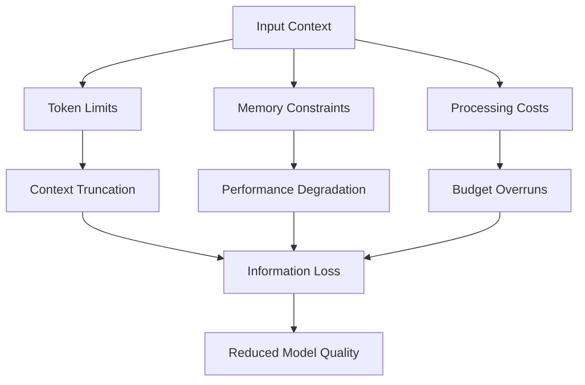
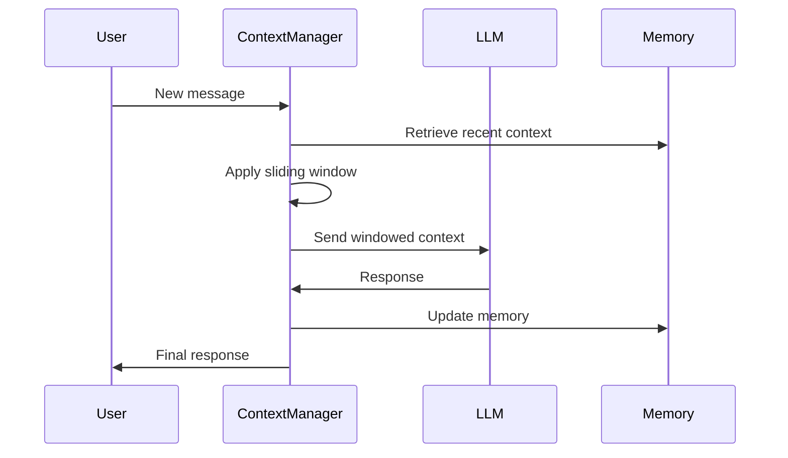
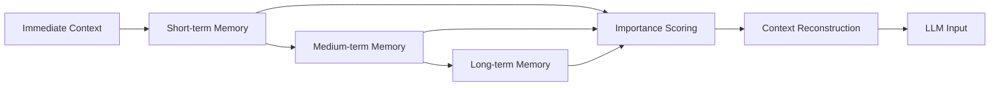
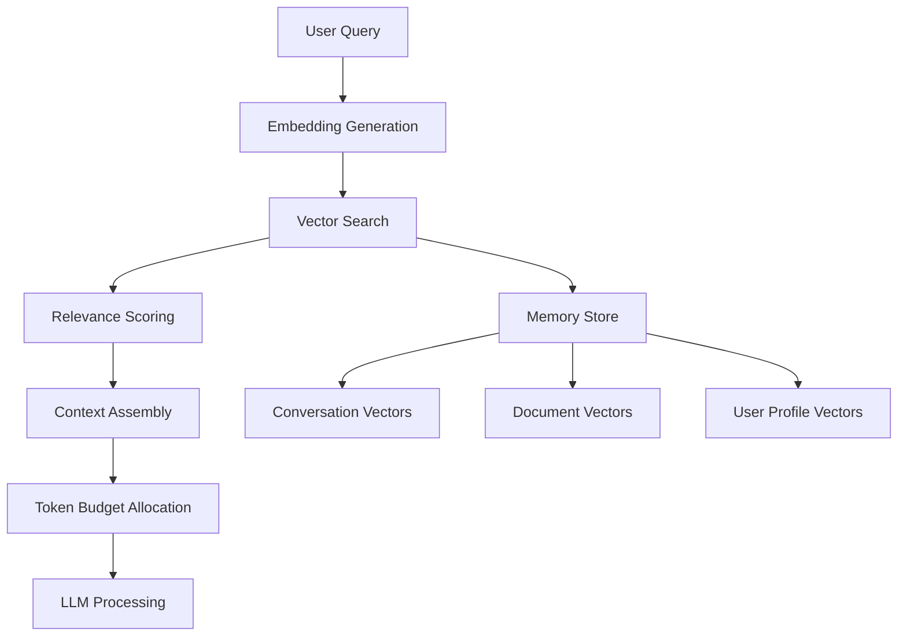
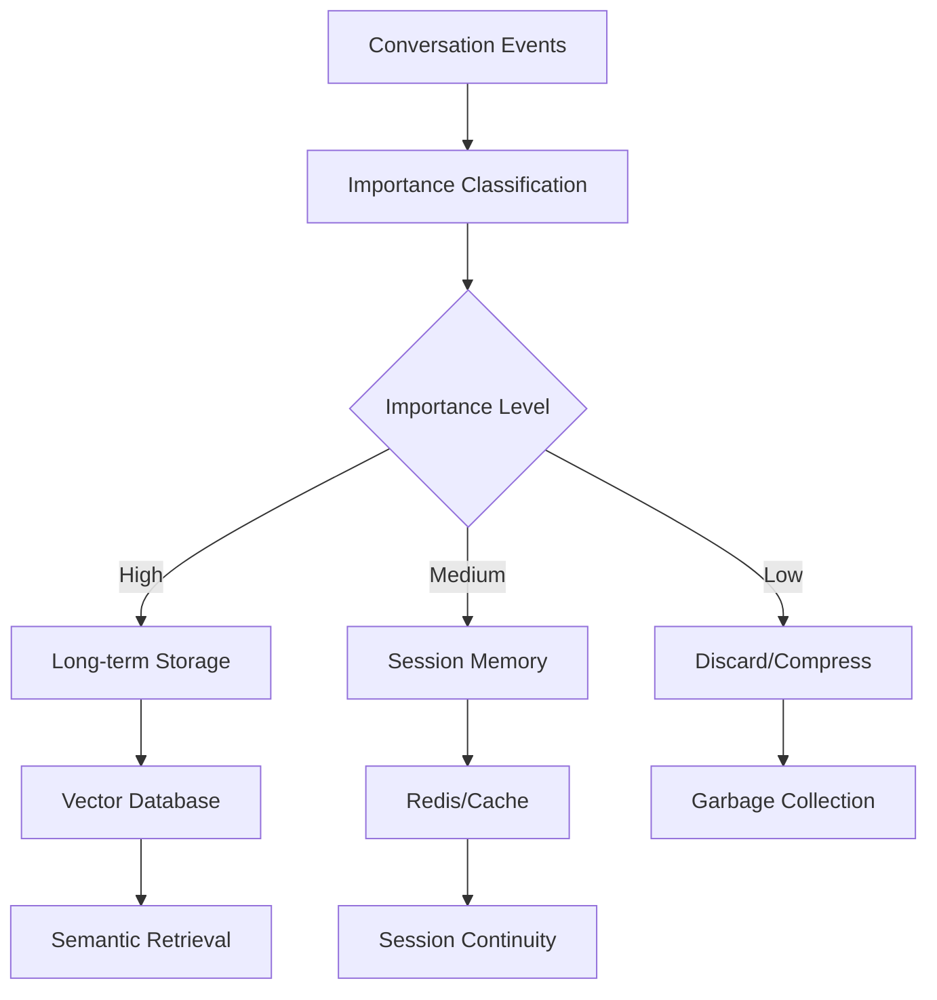
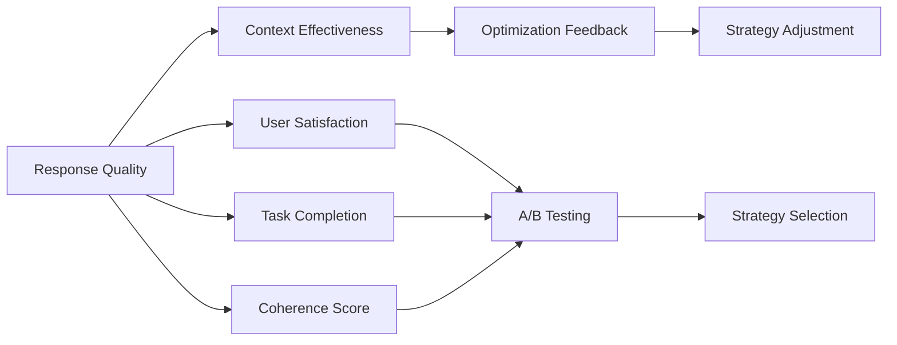
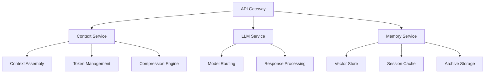
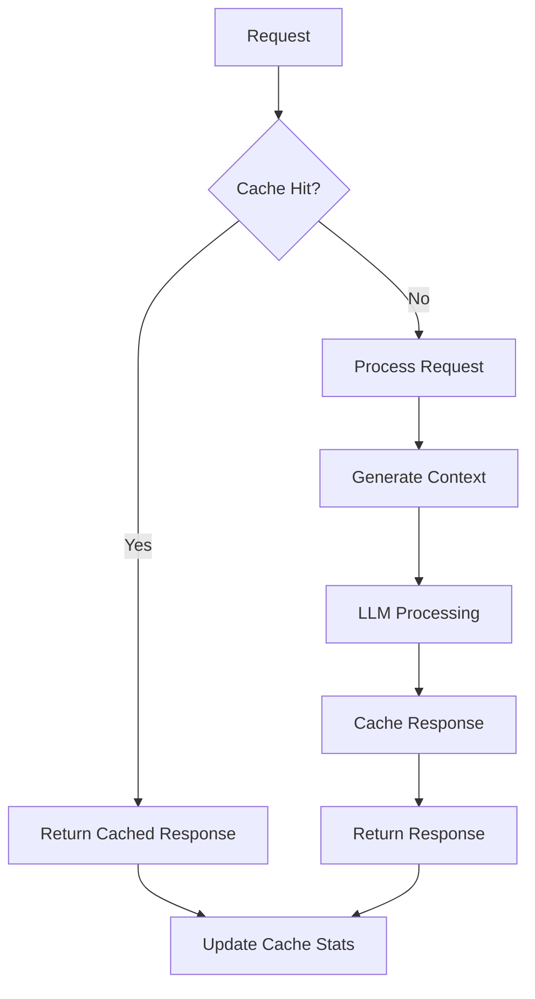
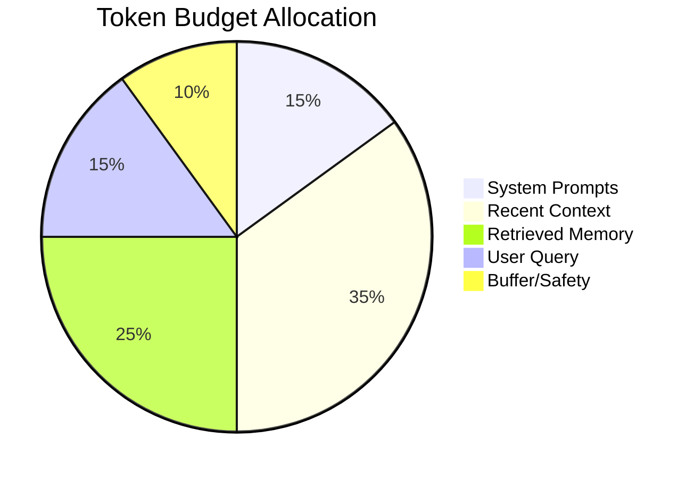
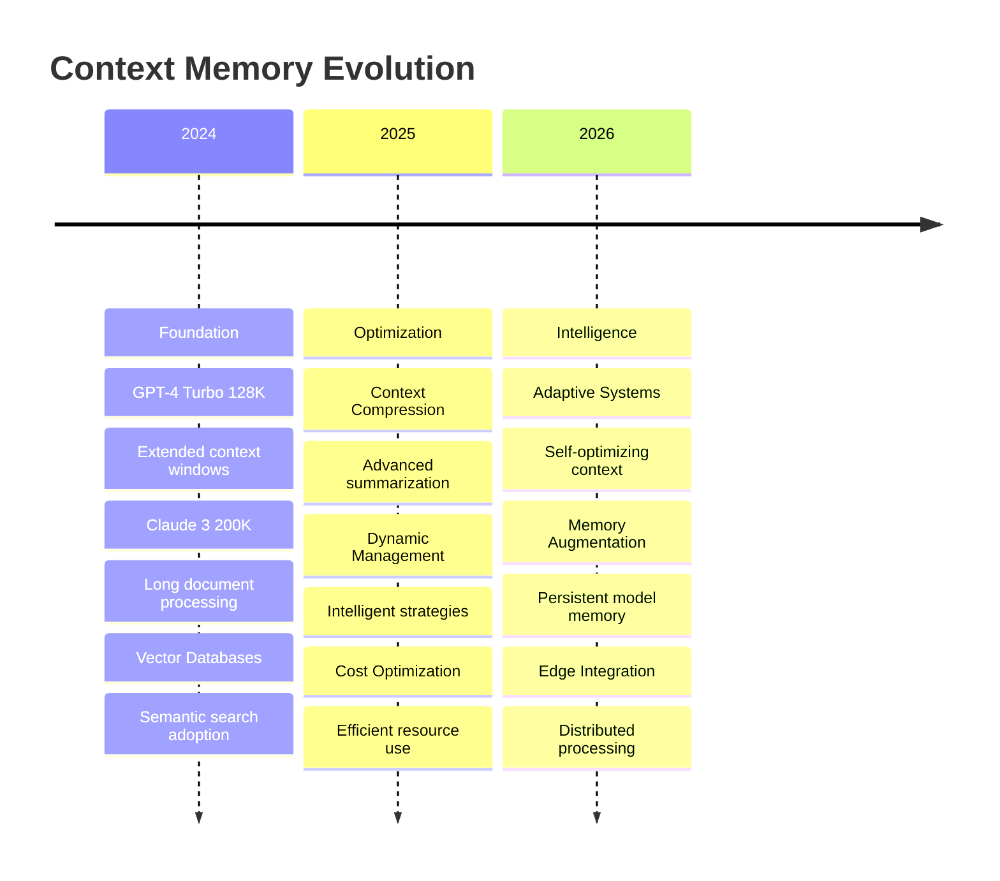

# Best Practices for Managing LLM Context Memory

## Introduction

As Large Language Models (LLMs) become increasingly powerful and widely deployed, one of the most critical challenges developers face is effectively managing context memory. Context windows, while larger than ever, are still finite resources that require careful optimization to maintain performance, reduce costs, and ensure reliable outputs.

This talk explores proven strategies, architectural patterns, and practical techniques for managing LLM context memory in production environments.

## The Context Memory Challenge



### Core Challenges

**Token Limitations**
- Current models range from 4K to 2M+ tokens
- Context window utilization directly impacts cost
- Long conversations quickly exhaust available space
- Complex documents require strategic summarization

**Memory Management**
- Conversational state persistence across sessions
- Relevance scoring for context prioritization
- Dynamic context compression and expansion
- Multi-turn dialogue coherence maintenance

**Cost Optimization**
- Token usage directly correlates with API costs
- Inefficient context management can 10x expenses
- Balancing quality vs. cost efficiency
- Resource allocation in multi-user environments

## Context Memory Architecture Patterns

### 1. Sliding Window Approach



**Implementation Strategy:**
- Maintain fixed-size context windows
- Preserve essential system prompts
- Keep recent conversation history
- Discard oldest interactions when limits reached

**Benefits:**
- Predictable memory usage
- Consistent response times
- Simple implementation
- Cost control

**Trade-offs:**
- Potential loss of important historical context
- May break long-form reasoning chains
- Limited for complex multi-step tasks

### 2. Hierarchical Memory System



**Multi-tier Storage:**
- **Immediate**: Current conversation (last 5-10 exchanges)
- **Short-term**: Recent session context (vectorized summaries)
- **Medium-term**: Topic-based memory clusters
- **Long-term**: User profile and preferences

**Retrieval Strategy:**
- Semantic search across memory tiers
- Relevance scoring based on current context
- Dynamic memory allocation based on query complexity
- Intelligent summarization of historical context

### 3. Vector-Based Context Management



**Core Components:**
- Conversation embedding and storage
- Semantic similarity matching
- Dynamic context reconstruction
- Relevance-based token allocation

**Advantages:**
- Semantic understanding of context relevance
- Efficient retrieval of related information
- Scalable to large conversation histories
- Support for multi-modal context

## Implementation Strategies

### Token Budget Management

```python
class ContextBudgetManager:
    def __init__(self, max_tokens=4096, system_reserve=500):
        self.max_tokens = max_tokens
        self.system_reserve = system_reserve
        self.available_tokens = max_tokens - system_reserve
    
    def allocate_context(self, priorities):
        """
        Allocate tokens based on content priority
        """
        allocation = {}
        remaining = self.available_tokens
        
        for item, priority in sorted(priorities.items(), 
                                   key=lambda x: x[1], reverse=True):
            allocated = min(item.token_count, 
                          remaining * priority / sum(priorities.values()))
            allocation[item] = allocated
            remaining -= allocated
            
        return allocation
```

### Context Compression Techniques

**Summarization-Based Compression:**
- Extract key points from conversation history
- Maintain semantic meaning while reducing tokens
- Preserve user preferences and important decisions
- Use specialized summarization models

**Template-Based Compression:**
- Convert conversations to structured formats
- Use shorthand notation for common patterns
- Implement domain-specific compression schemes
- Maintain reversibility where possible

**Hybrid Approaches:**
- Combine multiple compression techniques
- Adaptive compression based on content type
- Quality-aware compression with fallbacks
- Real-time compression quality assessment

### Memory Persistence Strategies



**Storage Tiers:**
- **Hot Storage**: Redis/memory for active sessions
- **Warm Storage**: Vector databases for semantic search
- **Cold Storage**: Traditional databases for archival
- **Computed Storage**: On-demand summary generation

**Retention Policies:**
- Automatic aging and compression
- User-defined importance markers
- Privacy-compliant data handling
- Cost-optimized storage strategies

## Advanced Optimization Techniques

### Dynamic Context Switching

```javascript
class DynamicContextManager {
  async optimizeContext(query, history, userProfile) {
    const relevanceScores = await this.scoreRelevance(query, history);
    const contextBudget = this.calculateBudget(query.complexity);
    
    return this.assembleOptimalContext({
      query,
      relevantHistory: this.filterByRelevance(history, relevanceScores),
      userContext: this.extractUserContext(userProfile),
      budget: contextBudget
    });
  }
  
  async adaptContextStrategy(performance, costs, quality) {
    if (costs > threshold && quality > baseline) {
      return this.enableAggressiveCompression();
    } else if (quality < baseline) {
      return this.expandContextWindow();
    }
    return this.maintainCurrentStrategy();
  }
}
```

### Intelligent Pre-loading

- **Predictive Context Loading**: Anticipate user needs based on conversation patterns
- **Background Processing**: Prepare context summaries during idle time
- **Speculative Execution**: Generate multiple context scenarios
- **Cache Optimization**: Smart caching of frequently accessed context

### Quality Monitoring



**Metrics to Track:**
- Response relevance and accuracy
- Context utilization efficiency
- User satisfaction scores
- Task completion rates
- Cost per successful interaction

## Production Deployment Patterns

### Microservices Architecture



**Service Responsibilities:**
- **Context Service**: Manages context assembly and optimization
- **Memory Service**: Handles storage, retrieval, and archival
- **LLM Service**: Routes requests to appropriate models
- **Monitoring Service**: Tracks performance and costs

### Scaling Considerations

**Horizontal Scaling:**
- Stateless context services
- Distributed memory storage
- Load balancing strategies
- Cache coordination

**Vertical Optimization:**
- Memory-efficient data structures
- Optimized vector operations
- Efficient serialization formats
- Garbage collection tuning

## Real-World Case Studies

### Case Study 1: Customer Support Chatbot

**Challenge**: Maintaining context across long support sessions while minimizing costs

**Solution Architecture:**
- Sliding window with smart boundary detection
- Issue-specific context prioritization
- Automated escalation with context transfer
- Knowledge base integration

**Results:**
- 40% reduction in average resolution time
- 60% decrease in context-related costs
- 25% improvement in customer satisfaction
- 50% reduction in human escalations

### Case Study 2: Document Analysis Platform

**Challenge**: Processing large documents with complex cross-references

**Solution Approach:**
- Hierarchical document chunking
- Semantic section linking
- Progressive detail loading
- Context-aware summarization

**Outcomes:**
- Support for documents up to 1M tokens
- 70% improvement in analysis accuracy
- 80% reduction in processing time
- 90% cost optimization

### Case Study 3: Multi-user Collaborative AI

**Challenge**: Managing context for concurrent users in shared sessions

**Implementation:**
- User-specific context isolation
- Shared knowledge base integration
- Real-time context synchronization
- Conflict resolution mechanisms

**Benefits:**
- Linear scaling with user count
- Consistent experience across users
- Efficient resource utilization
- Robust conflict handling

## Performance Optimization Strategies

### Caching Strategies



**Multi-level Caching:**
- **L1**: In-memory response cache
- **L2**: Processed context cache
- **L3**: Vector embedding cache
- **L4**: Persistent conversation cache

**Cache Invalidation:**
- Time-based expiration
- Context change detection
- User preference updates
- Model version changes

### Batch Processing Optimization

- **Context Batch Assembly**: Group similar requests for efficient processing
- **Parallel Context Generation**: Concurrent context preparation
- **Pipeline Optimization**: Streamlined processing workflows
- **Resource Pooling**: Shared computational resources

## Cost Management Framework

### Token Economics



**Budget Allocation Strategy:**
- Fixed allocation for system prompts
- Dynamic allocation based on query complexity
- Reserved buffer for unexpected expansion
- Cost tracking and optimization alerts

### Cost Monitoring and Alerting

```javascript
class CostMonitor {
  calculateContextCost(tokens, model, userTier) {
    const baseCost = tokens * model.costPerToken;
    const tierMultiplier = this.getTierMultiplier(userTier);
    return baseCost * tierMultiplier;
  }
  
  checkBudgetThresholds(currentCost, dailyBudget) {
    const thresholds = [0.5, 0.75, 0.9, 1.0];
    const currentRatio = currentCost / dailyBudget;
    
    return thresholds.find(threshold => 
      currentRatio >= threshold && !this.alerted[threshold]
    );
  }
}
```

## Future Trends and Considerations

### Emerging Technologies

**Adaptive Context Windows:**
- Dynamic context expansion based on task complexity
- Model-aware context optimization
- Real-time context quality assessment
- Automated context strategy selection

**Memory-Augmented Models:**
- External memory integration
- Persistent model state
- Learned memory management
- Context-aware model fine-tuning

**Edge Computing Integration:**
- Local context processing
- Hybrid cloud-edge deployments
- Privacy-preserving context management
- Latency-optimized architectures

### Industry Developments



## Best Practices Summary

### Do's:
✅ **Implement layered memory architecture** for scalable context management
✅ **Monitor token usage** and implement budget controls
✅ **Use semantic search** for intelligent context retrieval
✅ **Cache frequently accessed** context patterns
✅ **Implement quality metrics** to measure context effectiveness
✅ **Design for scale** with stateless, distributed services
✅ **Plan for cost optimization** from the beginning

### Don'ts:
❌ **Don't ignore token limits** until you hit them
❌ **Don't use naive truncation** strategies
❌ **Don't store sensitive information** in long-term context
❌ **Don't ignore user privacy** in memory management
❌ **Don't optimize prematurely** without measuring impact
❌ **Don't neglect error handling** in context assembly
❌ **Don't forget to implement** proper cleanup mechanisms

## Practical Implementation Guide

### Getting Started Checklist

1. **Assess Current Context Usage**
   - Audit existing token consumption patterns
   - Identify context-heavy operations
   - Measure current costs and performance

2. **Design Memory Architecture**
   - Choose appropriate storage tiers
   - Plan for semantic search capabilities
   - Design context assembly pipelines

3. **Implement Core Components**
   - Build context budget management
   - Create summarization workflows
   - Establish quality monitoring

4. **Deploy and Monitor**
   - Roll out with comprehensive monitoring
   - Implement A/B testing for optimization
   - Establish feedback loops for improvement

### Code Templates and Resources

**Basic Context Manager:**
```python
class ContextManager:
    def __init__(self, max_tokens=4096):
        self.max_tokens = max_tokens
        self.memory_store = VectorMemoryStore()
        self.compressor = ContextCompressor()
    
    async def assemble_context(self, query, user_id):
        # Retrieve relevant memories
        memories = await self.memory_store.search(query, user_id)
        
        # Apply budget constraints
        budget = self.calculate_budget(query)
        
        # Compress and assemble
        context = self.compressor.compress_to_budget(
            memories, budget
        )
        
        return context
```

## Conclusion

Effective LLM context memory management is crucial for building scalable, cost-effective AI applications. By implementing the strategies and patterns discussed in this talk, developers can:

- **Optimize Costs**: Reduce token usage by 50-80% without sacrificing quality
- **Improve Performance**: Faster response times through intelligent caching
- **Scale Efficiently**: Handle growing user bases and conversation volumes
- **Maintain Quality**: Preserve context relevance and conversation coherence

The key is to start with solid architectural foundations, implement comprehensive monitoring, and continuously optimize based on real-world performance data.

**Key Takeaways:**
- Context memory management is a critical architectural decision
- Multiple strategies should be combined for optimal results
- Monitoring and optimization are ongoing processes
- Cost control must be designed into the system from the start
- Quality metrics should drive optimization decisions

As LLMs continue to evolve, context management will remain a fundamental challenge requiring thoughtful engineering and continuous adaptation to new capabilities and constraints.

## Q&A and Discussion

Thank you for your attention! I'm excited to discuss your specific context memory challenges and share experiences from production deployments.

---

*This talk covers practical strategies for managing LLM context memory in production environments, drawing from real-world experience with large-scale AI applications and the latest research in context optimization techniques.*
